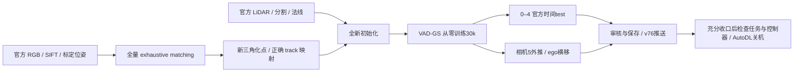

# V7.6 P0R1：修复后全新复现与自主收口

实验ID：`VADGS-P0R1-000`。上游 VAD-GS commit `77e27686d84b64be4643d518cea77b34bf9718bf`，加入 [V76-F01](../research_failures/entries/V76-F01.md) 的按图像名字映射修复。当前状态只见 [RESEARCH_STATUS](../RESEARCH_STATUS.md)。

## Architecture components



## 本次控制条件

- 使用官方样例 `000` 的帧0–60、相机0–4、230梯度训练视图及75官方时间test。相机5继续作为独立外推诊断。
- 只复用旧run中同一官方RGB的SIFT关键点/描述子和输入标定位姿。新数据库的 `matches`、`two_view_geometries` 初始行数均为0；原库不修改。复用输入模型的 `points3D.txt` 确认空文件，旧三角化、input_ply和任何checkpoint均不复用。
- 采用官方 `exhaustive_matcher` 与三角化参数；本机COLMAP为3.7无CUDA构建，CPU 12线程、seed0。匹配集合恢复为穷举，不冒称CPU与上游GPU的浮点实现完全相同。
- `cfg.resume=False`，训练前断言新run不存在 `trained_model`；训练、模型和先验相关超参数沿用官方样例。相机/帧映射采用已验证的名字连接，原P0被INVALIDATED标记保护。
- 这是联合纠正工程错误与匹配偏离的复现检查，不能单独分解两项变化的因果收益。官方时间test仍有初始化先验使用边界，见[审计报告](P0_REPRODUCTION_AUDIT.md)。

## 执行与证据

运行目录：`/root/autodl-tmp/runs/v76_ego_view/VADGS-P0R1-000`。配置：`/root/autodl-tmp/external/worldsim_v75/VAD-GS/configs/v76/nuscenes_000_repro_exhaustive.yaml`。

`run_p0r1_pipeline.py` 是有限顺序队列，运行状态写入 `pipeline_state.json`，包括阶段、PID、返回值、日志和完成阶段。队列依次执行全量匹配、三角化、30k全新训练、75视图官方test、61视图Camera5外推、帧20横移0/0.5/1/2/3.5m。任何阶段失败即记录并退出，交由research scaling law分类修复；不无限自动重试。4k检查点出现时由当前任务优先完成工程渲染与track/几何门禁；30k结果需人工任务审核后才能成为阶段结论。

配置、输入复用说明及控制器源码归档于 [p0r1_exhaustive](../autoresearch/worldsim_v76/p0r1_exhaustive/)。启动命令为：

```bash
cd /root/autodl-tmp/external/worldsim_v75/VAD-GS
/root/autodl-tmp/envs/vadgs-v76/bin/python script/v76/prepare_p0r1.py
nohup /root/autodl-tmp/envs/vadgs-v76/bin/python script/v76/run_p0r1_pipeline.py \
  > /root/autodl-tmp/runs/v76_ego_view/VADGS-P0R1-000/pipeline.log 2>&1 < /dev/null &
```

两入口均拒绝重复创建或重复启动。`prepare_p0r1.py` 已执行，不再重跑。代码编译检查通过，COLMAP三角化线程参数已由本机help验证；入口已实际执行，完整匹配与初始化结果如下。

## 全量匹配与实际初始化核验

2026-09-26已完成全量匹配和三角化，匹配耗时68.258分钟；03:01启动从零30k训练。没有读取旧P0或HUGSIM权重。匹配库逐表只读核验，305图像的全部46,360个无序图像对均有匹配尝试记录，有效几何对13,997。下表来自两run实际 `points3D.bin` 和保存的背景PLY/visibility，不是日志估计。

| 项目 | 旧P0：稀疏 + 错误映射 | P0R1：穷举 + 名字映射 |
|---|---:|---:|
| 匹配尝试对数 | 2,955 | 46,360 |
| 有观测的有效几何对 | 1,848 | 13,997 |
| 三角化点 | 138,944 | 145,690 |
| 严格error<0.6px保留点 | 33,930 | 34,822 |
| 点保留率 | 24.4199% | 23.9014% |
| 过滤后track观测边 | 114,694 | 110,872 |
| 空间过滤后进入背景的COLMAP点 | 15,756 | 15,475 |
| 其他背景点（LiDAR等） | 214,123 | 214,123 |
| 保存visibility与真实名字不一致的点行 | 15,754 | **0** |

新初始化的15,475个COLMAP点按float32坐标和顺序精确对应保存PLY尾部；其55,557条visibility边与图像名字恢复的真实track全部一致。305张图的新映射核验0错配。所有17份已保存背景/对象PLY坐标有限非空，visibility维度均为点数×305。`audit_colmap.py` 增加尾部对应断言，不能在无法对应时误报track检查通过。

JSON中的 `colmap_visibility_rows_mismatched=15464` 以及wrong_camera/wrong_frame仍是**旧ID算术的反例对照**；实际正确性字段 `colmap_visibility_rows_differ_from_name_mapping=0`。数据库原始ID仍有300/305不满足顺序假设，这是使用名字映射的必要性，不是新初始化再次错绑。

本场景的穷举匹配使误差过滤点数增加892（2.63%），实际进入背景的COLMAP点减少281（1.78%）；平均原始重投影误差由1.1207变为1.1549px。本次没有出现保留点数的大幅增长；这些数量也不能证明两种几何的空间覆盖或画质相同。新run还纠正了visibility/法线来源，后续画质变化不能单独归因于匹配器。下文给出4k中途检查；训练中瞬时PSNR不当作测试结果。

完整[新run审计](../autoresearch/worldsim_v76/p0r1_exhaustive/initialization_colmap_audit.json)与[两run只读比较](../autoresearch/worldsim_v76/p0r1_exhaustive/initialization_comparison.json)。这验证了V76-F01修复实际进入训练输入，没有新增方法结论。

## 4k工程渲染与官方时间test

`VADGS-P0R1-000-GATE-4000` 显式加载2026-09-26 04:27保存的 `iteration_4000.pth`（706,692,120字节），04:32完成检查，未恢复旧P0。一次性入口 `run_p0r1_4k_gate.py` 等待权重大小/mtime连续60秒不变及至少12GB空闲显存后，顺序执行横移、统计、75视图test和固定帧20作图；该队列已退出，不能重复启动。主训练继续。

帧20、相机0，指定0/0.5/1/2/3.5m及额外−3.5m对照全部渲染成功。RGB/depth/acc有限，c2w实际写入、横移/纵向/偏航断言通过。对渲染器实际scene graph中的32个actor逐一读取世界translation/quaternion，六个偏移中相对事实相机的最大变化均为0；原 `ego_pose` 和timestamp也保持不变。加载器采用帧号作timestamp，本例为20，**不是20秒**；没有把模型时标重采样为ego编辑后的时标。

| 横移 | 平均acc | 原始depth中位数 | acc>0.5处 depth/acc 中位数 |
|---|---:|---:|---:|
| −3.5m | 0.8159 | 12.203m | 18.063m |
| 0m | 0.8434 | 14.110m | 17.730m |
| +0.5m | 0.8480 | 14.181m | 17.508m |
| +1m | 0.8529 | 14.046m | 17.034m |
| +2m | 0.8660 | 12.105m | 14.688m |
| +3.5m | 0.9993 | 0.272m | 0.272m |

已查看[横移RGB/acc/depth图](../autoresearch/worldsim_v76/p0r1_exhaustive/engineering_4k/sweep.png)：+3.5m仍进入近处树木遮挡，−3.5m仍可看见街道。这是路径几何诊断，不能用正向近物图判断新视角质量退化。完整[逐actor世界变换](../autoresearch/worldsim_v76/p0r1_exhaustive/engineering_4k/sweep_manifest.json)和[数值摘要](../autoresearch/worldsim_v76/p0r1_exhaustive/engineering_4k/sweep_summary.json)保留。

独立75视图测试直接使用 `Scene.getTestCameras()`，5相机×15个帧4/8/.../60，保留is_val与actor插值，梯度训练交集0。全图PNG量化口径、官方PSNR/SSIM与LPIPS Alex v0.1：

| 相机 | 视图数 | PSNR ↑ | SSIM ↑ | LPIPS ↓ |
|---|---:|---:|---:|---:|
| 0 | 15 | 21.0898 | 0.7512 | 0.2340 |
| 1 | 15 | 19.4466 | 0.6717 | 0.3407 |
| 2 | 15 | 22.6551 | 0.7668 | 0.2240 |
| 3 | 15 | 22.2046 | 0.7042 | 0.3420 |
| 4 | 15 | 23.2997 | 0.7561 | 0.2230 |
| 全部 | 75 | **21.7392** | **0.7300** | **0.2727** |

浮点PSNR21.7401；白且acc<0.1的平均比例0.03127%。固定[帧20五相机对照](../autoresearch/worldsim_v76/p0r1_exhaustive/engineering_4k/official_test_frame20.png)已查看：道路、车辆和建筑已形成重建，仍有模糊与天空伪影，未见Camera5式大白块。完整[逐视图指标](../autoresearch/worldsim_v76/p0r1_exhaustive/engineering_4k/official_test_metrics.json)保留。该结果是4k工程门禁，不是30k收敛质量、完整论文复现或匹配器因果收益；旧P0的16k结果不能当同迭代对照。初始化仍含候选test帧先验，Camera5外推继续单列。

## 8k官方时间test：同一75视图中途检查

2026-09-26 05:51保存的全新8k权重由独立一次性入口显式加载，06:16前完成评估与固定帧20作图，返回值0。权重大小和SHA-256见[审核记录](../autoresearch/worldsim_v76/p0r1_exhaustive/official_test_8k/review.json)。与上文4k使用完全相同的75个相机/帧键、is_val、actor插值及PNG量化指标；全部指标有限，梯度训练视图交集0。

| 检查点 | PSNR ↑ | SSIM ↑ | LPIPS ↓ |
|---|---:|---:|---:|
| 4k | 21.7392 | 0.7300 | 0.2727 |
| 8k | **22.7086** | **0.7520** | **0.2348** |
| 8k减4k | +0.9694 | +0.0220 | −0.0379 |

75个同视图中，PSNR改善67个、SSIM改善60个、LPIPS改善75个；五个相机的均值三项均改善。8k按相机的完整分母均为15：

| 相机 | PSNR ↑ | SSIM ↑ | LPIPS ↓ |
|---|---:|---:|---:|
| 0 | 22.4817 | 0.7744 | 0.2099 |
| 1 | 19.9681 | 0.6762 | 0.3044 |
| 2 | 24.3217 | 0.8063 | 0.1832 |
| 3 | 22.3597 | 0.7152 | 0.2911 |
| 4 | 24.4115 | 0.7879 | 0.1853 |

浮点PSNR22.7097；白且acc<0.1的平均像素比例为0.00772%，4k为0.03127%。[逐视图指标](../autoresearch/worldsim_v76/p0r1_exhaustive/official_test_8k/metrics.json)与[固定帧20五相机图](../autoresearch/worldsim_v76/p0r1_exhaustive/official_test_8k/frame20.png)已保存并查看：道路、建筑和车辆持续重建，Camera1近处卡车、Camera3行人与店面仍有模糊、形变和暗色伪影，Camera2天空仍有伪影。已查看的五张图没有Camera5式大白洞；不据此声称所有测试视图无缺陷。

该结果支持本run在训练方向的时间留出质量继续改善；不是30k收敛结论、匹配器单因素收益或完整论文复现。初始化仍包含候选test帧先验，Camera5完全未见方向继续单列，旧P0的16k也不是同迭代有效控制。本次没有重复4k几何门禁或提前重复30k外推队列。

### 9k附近日志警告的有限排查

06:18快照训练已至9160/30000，最近记录loss有限，无Traceback、RuntimeError、CUDA OOM或loss nan/inf匹配。`need extension` 来自 `trellis.py` 的语义区域体素缺口分支；配置每5个view-stack epoch在24k前允许propagation，并有SSIM/覆盖条件，因此这行文字本身不是CUDA扩展缺失。传播轮次和同时进行的8k评估可能影响耗时，不能仅凭瞬时ETA判定卡死。

日志实际保留3条NumPy RuntimeWarning：空切片均值、均值中的无效标量运算及 `trellis.py:285` 基线比值中的无效标量运算。源代码存在空集合/零分母产生非有限候选分数的路径；当前证据没有证明其对后续传播无影响。没有因此改变训练算法或重启，新8k权重早于该阶段，也不能用8k通过证明9k之后没有风险。下个检查点需继续核验有限指标和图像；原始警告、源代码上下文、进程与资源见[运行快照](../autoresearch/worldsim_v76/p0r1_exhaustive/official_test_8k/runtime_snapshot.json)。本次没有新增已确认失败类型，failure ledger不增加ID。

## 16k官方时间test与非有限值检查

2026-09-26 08:38保存的 `iteration_16000.pth`（856,801,103字节）由一次性入口显式加载，评估/作图返回值0。CPU递归检查1,011个浮点张量、214,122,561个元素，包含实际保存的优化器张量，NaN/Inf元素为0。评估新增量化前的原始RGB/depth/acc有限性断言，75/75视图通过；指标计算和官方时间切分不变。完整[权重核验](../autoresearch/worldsim_v76/p0r1_exhaustive/official_test_16k/checkpoint_finite.json)含SHA-256及张量路径。

| 检查点 | PSNR ↑ | SSIM ↑ | LPIPS ↓ |
|---|---:|---:|---:|
| P0R1 4k | 21.7392 | 0.7300 | 0.2727 |
| P0R1 8k | 22.7086 | 0.7520 | 0.2348 |
| P0R1 16k | **22.8532** | **0.7496** | **0.2303** |

同一75视图的16k减8k为 **+0.1447 / -0.0024 / -0.0045**；逐视图PSNR改善43个、SSIM改善28个、LPIPS改善43个。每相机15视图：

| 相机 | PSNR ↑ | SSIM ↑ | LPIPS ↓ |
|---|---:|---:|---:|
| 0 | 22.6189 | 0.7701 | 0.2144 |
| 1 | 20.2610 | 0.6736 | 0.2940 |
| 2 | 24.3199 | 0.8076 | 0.1781 |
| 3 | 22.8523 | 0.7143 | 0.2761 |
| 4 | 24.2139 | 0.7824 | 0.1889 |

均值PSNR与LPIPS仅小幅改善，SSIM略降；Camera0与Camera4的LPIPS分别由0.2099/0.1853升至0.2144/0.1889，均变差。该结果显示中途收益变缓且不单调，不能写成所有方向、所有指标继续改善。本轮按原计划训练至30k，不以此进行阈值、loss或seed搜索。

白且acc<0.1的平均像素比例0.00237%。已查看[固定帧20五相机图](../autoresearch/worldsim_v76/p0r1_exhaustive/official_test_16k/frame20.png)，道路与建筑重建保持，近车、行人和店面细节仍有模糊/形变，天空仍有伪影。[逐视图指标](../autoresearch/worldsim_v76/p0r1_exhaustive/official_test_16k/metrics.json)完整保留，不用固定图替代75视图分母。

旧P0在同一16k/75视图下为22.7010 / 0.7486 / 0.2313；新减旧为+0.1522 / +0.0010 / -0.0010。旧run因V76-F01已失效，这只是相同迭代的诊断参照，不作为合格复现基线，也不能把差值单独归因于穷举匹配或track修复；两项输入设置及法线来源同时改变。

本次实际检查覆盖了9k警告之后的保存状态与渲染，未观察到非有限参数或输出；仍不能据此证明NumPy候选评分警告完全无害。09:18主训练已至17950/30000，未见异常退出或loss nan/inf；保持原训练算法和主控制器。完整[运行快照](../autoresearch/worldsim_v76/p0r1_exhaustive/official_test_16k/runtime_snapshot.json)及[审核记录](../autoresearch/worldsim_v76/p0r1_exhaustive/official_test_16k/review.json)保留。本次不新增失败ID，结论限于中途复现检查；最终30k、Camera5外推及ego横移仍待队列。初始化包含候选时间test先验的边界不变。

## 同场景准备与资源协调

CPU匹配期间已利用空闲GPU补齐scene-0230/0255各366张Depth Anything V2深度和366张DSINE法线。法线经固定官方六视图的轴/符号核验；SAM按真实投影框与原track ID准备。生成方法、数值核验、适配边界与证据见[同场景先验报告](MATCHED_SCENE_PRIORS.md)。P0R1继续使用原有官方样例先验，不受同场景适配影响。

官方VAD-GS的动态mask是三通道ID图，背景255，各channel可包含对象ID；背景SAM是uint8区域图。对象ID必须与 `instances_info.json` 的track一致。法线读取为RGB解码后整体取负并按c2w旋转，DSINE导出必须通过官方样例方向检查后使用。避免同时在单卡上执行主训练和重型SAM/DSINE推理。

## 停止与关机范围

2026-09-26用户最新明确授权：“我先睡了，你自己持续推进，如果都完成差不多就可以停下来，然后帮我autodl关机”。该授权适用于本任务的 `wm-3090-0811`，不需要再次确认；不延伸到其他主机，也不等于立即关机。

按原P0→同场景→ego stress顺序推进，根据有效证据与资源达到可交付阶段后可停止扩展，明确保留未解决范围。单个GPU空闲、训练退出、工程失败或checkpoint落盘都不是关机充分条件。收口时保存输入、关键权重、正反结果和报告，将小型证据取回本地并提交push v76；确认没有训练/评价/渲染/先验任务及会启动它们的控制器，再将当前heartbeat设为PAUSED，最后调用AutoDL官方 `/usr/bin/shutdown` 并检查结果。官方关机入口见[省钱说明](https://api.autodl.com/docs/save_money/)。不把“发出关机命令”写成已验证停机。

`failure_ledger_refs: [V76-F01]`；`failure_ledger_delta: none`。已有4k工程门禁和8k/16k官方时间test中途结果，不作方法成功或失败结论。
