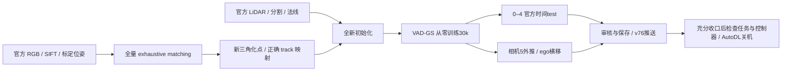

# V7.6 P0R1：修复后全新复现与自主收口

实验ID：`VADGS-P0R1-000`。上游 VAD-GS commit `77e27686d84b64be4643d518cea77b34bf9718bf`，加入 [V76-F01](../research_failures/entries/V76-F01.md) 的按图像名字映射修复。当前状态只见 [RESEARCH_STATUS](../RESEARCH_STATUS.md)。

## Architecture components



## 本次控制条件

- 使用官方样例 `000` 的帧0–60、相机0–4、230梯度训练视图及75官方时间test。相机5继续作为独立外推诊断。
- 只复用旧run中同一官方RGB的SIFT关键点/描述子和输入标定位姿。新数据库的 `matches`、`two_view_geometries` 初始行数均为0；原库不修改。复用输入模型的 `points3D.txt` 确认空文件，旧三角化、input_ply和任何checkpoint均不复用。
- 采用官方 `exhaustive_matcher` 与三角化参数；本机COLMAP为3.7无CUDA构建，CPU 12线程、seed0。匹配集合恢复为穷举，不冒称CPU与上游GPU的浮点实现完全相同。
- `cfg.resume=False`，训练前断言新run不存在 `trained_model`；训练、模型和先验相关超参数沿用官方样例。相机/帧映射采用已验证的名字连接，原P0被INVALIDATED标记保护。
- 这是联合纠正工程错误与匹配偏离的复现检查，不能单独分解两项变化的因果收益。官方时间test仍有初始化先验使用边界，见[审计报告](P0_REPRODUCTION_AUDIT.md)。

## 执行与证据

运行目录：`/root/autodl-tmp/runs/v76_ego_view/VADGS-P0R1-000`。配置：`/root/autodl-tmp/external/worldsim_v75/VAD-GS/configs/v76/nuscenes_000_repro_exhaustive.yaml`。

`run_p0r1_pipeline.py` 是有限顺序队列，运行状态写入 `pipeline_state.json`，包括阶段、PID、返回值、日志和完成阶段。队列依次执行全量匹配、三角化、30k全新训练、75视图官方test、61视图Camera5外推、帧20横移0/0.5/1/2/3.5m。任何阶段失败即记录并退出，交由research scaling law分类修复；不无限自动重试。4k检查点出现时由当前任务优先完成工程渲染与track/几何门禁；30k结果需人工任务审核后才能成为阶段结论。

配置、输入复用说明及控制器源码归档于 [p0r1_exhaustive](../autoresearch/worldsim_v76/p0r1_exhaustive/)。启动命令为：

```bash
cd /root/autodl-tmp/external/worldsim_v75/VAD-GS
/root/autodl-tmp/envs/vadgs-v76/bin/python script/v76/prepare_p0r1.py
nohup /root/autodl-tmp/envs/vadgs-v76/bin/python script/v76/run_p0r1_pipeline.py \
  > /root/autodl-tmp/runs/v76_ego_view/VADGS-P0R1-000/pipeline.log 2>&1 < /dev/null &
```

两入口均拒绝重复创建或重复启动。`prepare_p0r1.py` 已执行，不再重跑。代码编译检查通过，COLMAP三角化线程参数已由本机help验证；实际全量匹配已启动并完成初始区块。

## 全量匹配与实际初始化核验

2026-09-26已完成全量匹配和三角化，匹配耗时68.258分钟；03:01启动从零30k训练。没有读取旧P0或HUGSIM权重。匹配库逐表只读核验，305图像的全部46,360个无序图像对均有匹配尝试记录，有效几何对13,997。下表来自两run实际 `points3D.bin` 和保存的背景PLY/visibility，不是日志估计。

| 项目 | 旧P0：稀疏 + 错误映射 | P0R1：穷举 + 名字映射 |
|---|---:|---:|
| 匹配尝试对数 | 2,955 | 46,360 |
| 有观测的有效几何对 | 1,848 | 13,997 |
| 三角化点 | 138,944 | 145,690 |
| 严格error<0.6px保留点 | 33,930 | 34,822 |
| 点保留率 | 24.4199% | 23.9014% |
| 过滤后track观测边 | 114,694 | 110,872 |
| 空间过滤后进入背景的COLMAP点 | 15,756 | 15,475 |
| 其他背景点（LiDAR等） | 214,123 | 214,123 |
| 保存visibility与真实名字不一致的点行 | 15,754 | **0** |

新初始化的15,475个COLMAP点按float32坐标和顺序精确对应保存PLY尾部；其55,557条visibility边与图像名字恢复的真实track全部一致。305张图的新映射核验0错配。所有17份已保存背景/对象PLY坐标有限非空，visibility维度均为点数×305。`audit_colmap.py` 增加尾部对应断言，不能在无法对应时误报track检查通过。

JSON中的 `colmap_visibility_rows_mismatched=15464` 以及wrong_camera/wrong_frame仍是**旧ID算术的反例对照**；实际正确性字段 `colmap_visibility_rows_differ_from_name_mapping=0`。数据库原始ID仍有300/305不满足顺序假设，这是使用名字映射的必要性，不是新初始化再次错绑。

本场景的穷举匹配使误差过滤点数增加892（2.63%），实际进入背景的COLMAP点减少281（1.78%）；平均原始重投影误差由1.1207变为1.1549px。本次没有出现保留点数的大幅增长；这些数量也不能证明两种几何的空间覆盖或画质相同。新run还纠正了visibility/法线来源，后续画质变化不能单独归因于匹配器。4k渲染和30k官方test尚待权重；训练中瞬时PSNR不当作测试结果。

完整[新run审计](../autoresearch/worldsim_v76/p0r1_exhaustive/initialization_colmap_audit.json)与[两run只读比较](../autoresearch/worldsim_v76/p0r1_exhaustive/initialization_comparison.json)。这验证了V76-F01修复实际进入训练输入，没有新增方法结论。

## 同场景准备与资源协调

CPU匹配期间已利用空闲GPU补齐scene-0230/0255各366张Depth Anything V2深度和366张DSINE法线。法线经固定官方六视图的轴/符号核验；SAM按真实投影框与原track ID准备。生成方法、数值核验、适配边界与证据见[同场景先验报告](MATCHED_SCENE_PRIORS.md)。P0R1继续使用原有官方样例先验，不受同场景适配影响。

官方VAD-GS的动态mask是三通道ID图，背景255，各channel可包含对象ID；背景SAM是uint8区域图。对象ID必须与 `instances_info.json` 的track一致。法线读取为RGB解码后整体取负并按c2w旋转，DSINE导出必须通过官方样例方向检查后使用。避免同时在单卡上执行主训练和重型SAM/DSINE推理。

## 停止与关机范围

2026-09-26用户最新明确授权：“我先睡了，你自己持续推进，如果都完成差不多就可以停下来，然后帮我autodl关机”。该授权适用于本任务的 `wm-3090-0811`，不需要再次确认；不延伸到其他主机，也不等于立即关机。

按原P0→同场景→ego stress顺序推进，根据有效证据与资源达到可交付阶段后可停止扩展，明确保留未解决范围。单个GPU空闲、训练退出、工程失败或checkpoint落盘都不是关机充分条件。收口时保存输入、关键权重、正反结果和报告，将小型证据取回本地并提交push v76；确认没有训练/评价/渲染/先验任务及会启动它们的控制器，再将当前heartbeat设为PAUSED，最后调用AutoDL官方 `/usr/bin/shutdown` 并检查结果。官方关机入口见[省钱说明](https://api.autodl.com/docs/save_money/)。不把“发出关机命令”写成已验证停机。

`failure_ledger_refs: [V76-F01]`；`failure_ledger_delta: none`。目前没有新训练指标，也没有方法成功或失败结论。
