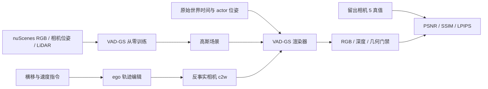

# V7.6 P0：4k/8k 工程记录

记录时间：2026-09-26 00:44（Asia/Singapore）。本页冻结 P0 到 8k 的工程证据；逐项数值见[机器可读记录](../autoresearch/worldsim_v76/p0-8k-evidence.json)。后续已完成[16k 官方测试与复现审计](P0_REPRODUCTION_AUDIT.md)，发现 [V76-F01](../research_failures/entries/V76-F01.md)：旧初始化的 COLMAP track 错绑；旧 P0 已停止。下文保留的“等待30k”是发现该错误前的计划，不再作为现行结论门禁。相机0的61帧是混合训练/留出诊断，相机5是整路未见外推；二者都不能替代官方时间 test。现行阶段与下一门禁只见 [RESEARCH_STATUS](../RESEARCH_STATUS.md)。V7.5 基线范围见[收尾记录](../autoresearch/worldsim_v75/downstream_bench/r9-closeout/README.md)。

## Architecture components

## P0 运行与结果

- 实验 `VADGS-P0-000`：官方 nuScenes `000` 的 61 帧；相机 0–4 为模型训练/内部测试候选，相机 5 完全留出。VAD-GS 从零初始化，**未恢复 HUGSIM checkpoint**。代码目录 `/root/autodl-tmp/external/worldsim_v75/VAD-GS`；运行目录 `/root/autodl-tmp/runs/v76_ego_view/VADGS-P0-000`。
- 00:44 时训练进程运行至约 14,969/30,000；4k 和 8k 权重已生成，30k 尚未完成。4k 的帧 20 横移 0/0.5/1/2/3.5 m 渲染及相机/actor 世界时间戳断言通过；+3.5 m 的相机几乎进入近物遮挡，不能把该图当纯粹新视角质量样例。
- 相机 5 的 61 帧留出评估：4k PSNR/SSIM/LPIPS 为 `7.996 / 0.5012 / 0.4949`；8k 为 `8.045 / 0.4941 / 0.4860`。同流程相机 0 对照由 `20.999 / 0.7624 / 0.2318` 提升至 `22.648 / 0.7873 / 0.2076`。留出视角大片空白仍在；8k 仅是早期覆盖发现，等待 30k 后判定优化或表示边界。
- 评估器原先按最新 PLY 目录推断迭代，误将一次 8k 评估加载为 4k；已改为显式 `--iteration`，只计入重新确认加载 8k 的结果。该错误属工程失败，不是模型科学结论。

在本记录时间点，30k 尚未完成；4k/8k 空白区域不提前归类为科学或表示失败。历史 HUGSIM 已退役的训练权重和这轮 VAD-GS 的权重是不同资产，不交叉恢复。
