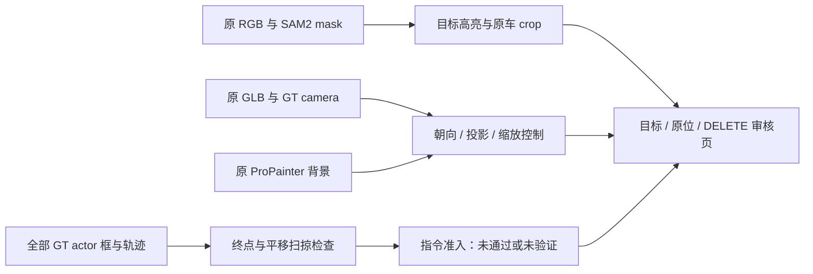

# v77 目标绑定、MOVE 合法性与 GLB 放置审计

`WS-V77-ACTOR-COMMAND-AUDIT-20260926/r1`，2026-09-26。输入复用 `WS-V77-EXPLICIT-POC-20260926/r1` 的两个 GLB、SAM2 mask、ProPainter 输出和 GT 标定/轨迹；没有新模型前向或训练。固定 scene_0230/22、scene_0255/25，均为已曝光开发场景，预训练重叠未知。

**审计结论：旧 MOVE 没有经过指令准入，scene_0230 的车头还放反了；此前据合成图否定 GLB 并关闭路线的归因过早，撤回。** 用户反馈“本地 Blender 中 GLB 看起来没太大问题”作为形状复核意见保留，不代填高保真人工通过。补景残影仍有独立证据。

## Architecture components

## 谁是目标，旧指令是什么

| 场景 | 目标与 GT track | GT 尺寸（长/宽/高，m） | 旧 2 m 位移在参考车身坐标中 |
|---|---|---|---|
| scene_0230 | actor 22，路边棕色旅行车/两厢车；`eded0c5fba8d4d808227d5c60ad2ef13` | 4.510 / 1.815 / 1.559 | 后移 1.697、向右 1.059；参考 f005/CAM2 |
| scene_0255 | actor 25，停车场银白 SUV；`e53a03fcf9884cfc8aeff489e5e4b984` | 4.974 / 2.055 / 1.925 | 前移 1.899、向左 0.628；参考 f020/CAM3 |

旧实现直接选参考相机“屏幕向右”的水平世界方向，归一化为 2 m，所有时刻保持同一世界位移；并没有考虑车头或停车位。世界向量分别为 `[1.999861, 0.023580, 0]` 与 `[-0.684570, 1.879192, 0]`。旧页面只有六相机小图和 actor ID，未提供足够的目标标注。

## 完整时间窗的几何检查

对每个时间点，计算原始 GT 矩形与平移后矩形的凸包，得到**固定朝向纯平移的连续扫掠区域**，与同一时刻其他同高度 GT 对象框逐一检查。保留原位重叠、终点重叠、扫掠重叠与框间距离。50/100 帧全部检查；不是只看 10 张图。GT 俯视框是保守物体包络，不是精确车身网格。

| 检查 | scene_0230 / actor 22 | scene_0255 / actor 25 |
|---|---|---|
| 旧命令终点相交 | actor 2，50 / 50 帧 | 0 / 100 帧 |
| 旧命令扫掠相交 | actor 2，50 / 50 帧；最大新增重叠 0.2793 m² | 0 / 100 帧 |
| 旧命令最小框间距 | 0 m | 0.083918 m；f077，邻车 actor 52 |
| 纯车头前移 2 m 控制 | actor 14，50 / 50 帧相交 | 无框相交，最小间距约 0.712 m |
| 纯车尾后移 2 m 控制 | actor 2，50 / 50 帧相交 | 无框相交，最小间距约 0.712 m |

因此第一例不能作为合法的 2 m 前后移动用例。第二例也未获得准入：8.4 cm 余量不能吸收标注误差，并未检查静态路缘、围栏、草地、ego 车身或可行驶区。本轮没有把“零对象框相交”升级成交通/物理合法，也没有生成新的所谓合法 MOVE。

扫描 0.5/1/2 m、8 个车身方向只用于找到候选空间，不是新结果分母。scene_0230 前移 1 m 无框相交，最小 0.536 m；侧向 2 m 虽有空余，但不代表车辆能够横向行驶或终点可用。若 MOVE 表示真实行驶，必须另有时间、转向、静态空间与动态邻车轨迹验证。

## 相同资产的强控制

1. **车头方向**：两 GLB 都已规范到 Z 轴向上，但正负车长轴不能直接当作 GT 车头。scene_0230 用同一 GLB 比较 yaw 0°/180°后确认原合成前后反了；转正后车身轮廓与棕色外观明显更接近原图。scene_0255 的 0°方向正确。此修正仅绑定这两个既有资产，不是 Hunyuan 通用朝向规则。
2. **相机投影**：旧 Blender `shift_y` 用图像高度归一化，与 horizontal sensor fit 不一致；缩放还漏了像素中心仿射项。参考视图的数学投影最大误差分别为 0.978、5.991 px。校准 shift 后，两参考视图分别约 0.00010、0.000036 px；20 个实际审核视图各检查 9 条相机射线，全部小于 0.02 px。这里只验证 K/c2w 到 Blender 的转换，不代表模型几何精度。
3. **缩放**：scene_0255 原 GLB XYZ 尺寸为 1.9883/0.8881/0.6657，逐轴匹配 GT 的倍率是 2.5016/2.3138/2.8918；相对按车长统一缩放，宽度压缩 7.5%、高度额外拉高 15.6%。另给保留比例且底面锚定一致的控制图。scene_0230 三轴倍率较接近，仍展示同样控制。
4. **不改 GLB**：网格、UV、贴图和原两份 GLB 均未重生成。用户 Blender 灰模截图支持车身结构已经形成；灰模不直接评价纹理、光照或合成。现有材质偏亮、细节、遮挡、阴影等仍需独立判断，不能反向宣布高保真通过。

## 仍成立的观测与代码处理

无资产的 ProPainter DELETE 仍有暗斑或车形残影，独立于车头放反与相机偏移。现有覆盖合成缺场景深度遮挡、阴影、反射和照度匹配。Ω 的旧逐时刻点背景未在本轮改动或重新评价。仍未验证 Hunyuan 2mv，多张候选不等于模型实际多图输入。

`poc_blender_actor.py` 修复主点投影、两既有资产朝向，默认只渲染 factual；未准入旧 MOVE 必须显式传 `--diagnostic-unvalidated-move`，输出名 `move_unvalidated`。新增 `actor_render_audited` 和 `placement_audit.json`，不覆盖旧渲染及命令证据。完整人眼展示采用原 GLB 复导入控制，避免 OBJ 与 GLB 导入差异混在一起。

## 交付、验证与恢复入口

- 新审核页：`outputs/v77-actor-audit/index.html`；目标高亮与原车裁剪、两张 BEV、两组朝向和缩放控制图、每场景 3 段同步视频。视频各 10 个源时刻：0230 0–4.5 s/2 fps，0255 0–9 s/1 fps；0230 CAM2→CAM4→CAM5 的切换显式标注。这是抽样时序，不是完整 10 Hz 重渲染。
- 旧页 `outputs/v77-explicit-poc/index.html` 增加醒目更正链接；原正文完整保存在 `index_pre_audit.html`。旧运行全部保留，未删模型、输入、视频或 GLB。
- 几何检查 4 项测试：中途穿越而终点不碰撞、米制间距、旋转框、非重叠高度。修正原位 20 视图/180 射线投影断言，6 视频完整解码/帧数检查，局部链接与图片解码检查。Blender 5.2.2 CPU，固定 render seed 77，16 samples；无 GPU 推理或训练。
- 新运行：`/root/autodl-tmp/runs/worldsim_v77/WS-V77-ACTOR-COMMAND-AUDIT-20260926/r1`；源运行：`/root/autodl-tmp/runs/worldsim_v77/WS-V77-EXPLICIT-POC-20260926/r1`。本地详细渲染与脚本在工作区 `work/v77_actor_audit` 与 `work/v77_*audit*.py`。

`failure_ledger_refs: [V77-F02]`；`failure_ledger_delta: updated V77-F02（撤回资产失败/路线关闭归因，保留背景观测与工程错误）`；`human_verdict: null`。
