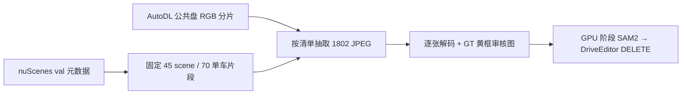

# v77 DriveEditor DELETE：nuScenes val CPU 输入预检

`WS-V77-DELETE-AUDIT-20260928/r1`。本轮按用户要求**只采样、核对 AutoDL 公共盘 RGB、评估数据盘**；没有运行 SAM2 或 DriveEditor，也没有对模型质量作归因。完整抽样和后续推理规则见 [审计协议](DELETE_AUDIT_PROTOCOL.md)。

## 输入结果

- 官方 val 150 scene 中固定 45 个审计 scene、70 个不同单车删除片段；以 scene 为单位另隔离 25 个未看的 final scene。之前九例都不进新审计。70段各26个约10Hz时刻，共1820个帧位置、1802张不同相机JPEG。
- 采用公共盘 `/root/autodl-pub/nuScenes/Fulldatasetv1.0/Trainval` 的官方 metadata 与八个必要 RGB 压缩分片；1802/1802 JPEG 在对应分片中找到，逐张JPEG解码并确认1600×900。缺失0、损坏0、重复0，**本轮无需用户补RGB**。单个分片tar曾报告“成员未命中”，是同一日志前缀可能跨两个分片导致的多分片请求；最终按唯一文件名检查是全通过，不能将分片退出码2误记为缺文件。
- 固定配额：小/中/大22/26/22；前/侧/后24/24/22；GT清楚/部分遮挡35/35；投影后方有/无另一GT车辆26/44。6个审计scene为夜间代理，白天稀疏12、密集27。四个帧位置的最近原始相机曝光偏差70–85ms，属已列出的输入时间误差。
- 每个片段的一帧目标黄框和原图局部裁剪已导出为Windows本地输入审核页（完整路径见下方）。70张图均再次解码。原始文件名、实例token与难度代理见同页 `manifest.json`。

审核图初版把1024×576模型坐标直接画到1600×900源图，黄框显示错误；已乘1.5625重绘，初版留在远端 `input_preflight.badscale_backup`。冻结70个目标选择从未因此改变。抽查A001、A035、A048、A056、A070的纠正后框与图像一致；A012锚点帧只见道路/路缘，目标肉眼不清楚，标为**输入资格疑点**，不静默替换或算模型失败。其他片段待模型输入门槛和用户视频审核共同确认。

用户指出A025旧第2帧的黄色目标框同时含其他车辆像素。核对26帧GT投影：黄色GT实例是移动的黑色皮卡/货车，旁车是不同GT实例。旧最大面积提示帧离画面左边仅3px，其他GT车辆占提示框14.6%；按[统一提示帧规则](DELETE_AUDIT_PROTOCOL.md)改用第12帧后分别变为142px、3.3%，目标车更易单独指认。70例中40例提示帧随同一规则变化；其他GT占提示框≥10%的例数由35降至27，但仍有20例≥20%，所以这只是输入改善，不保证SAM2单车mask正确。A025旧图与逐帧黄/蓝GT投影对照保留于远端run的 `input_overlap_diagnostic`。

本地审核入口：`C:\Users\dengyunlong\Documents\Codex\2026-09-26\xia\outputs\v77-delete-audit-input\index.html`。远端原始run：`/root/autodl-tmp/runs/worldsim_v77/WS-V77-DELETE-AUDIT-20260928/r1`。轻量核验数字见 [preflight_summary.json](../autoresearch/worldsim_v77/delete_audit_20260928/preflight_summary.json)；冻结选择和确切RGB成员见同目录的 `selection.json` / `expected_sources.json`。人审结论仍为null。

## 存储与交接

`/root/autodl-tmp` 数据盘为500GB，现用447GB、可用约54GB；`/root/autodl-pub` 公共盘可用约2.6TB。公共分片直接读、仅抽目标RGB，抽出的原JPEG占266MB，metadata占2.5GB，70张预览约5.8MB。按当前只做70例单相机DELETE及视频审核的范围，**无需现在扩容数据盘**；预计输出可在现有空间内，GPU阶段仍需逐批监控剩余空间并保留安全余量。若以后全量解压nuScenes或造200–500段训练集，必须重新预算并很可能扩容；当前结论不覆盖这两项。

用户要求CPU完成后由其开GPU。当前CUDA检测为0；因此停在输入核验，等待用户切回GPU后再做SAM2 mask、冻结DriveEditor deletion、四列视频和一帧粗分类。凡提示框仍含邻车的例子需先检查实例mask，错误mask不得算作补景模型失败。未启动训练、Ω、GLB、定时任务或电源操作。`failure_ledger_refs: [V77-F02]`；`failure_ledger_delta: none`；`human_verdict: null`。
