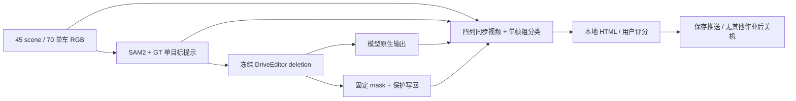

# v77 DELETE audit：GPU执行与交付

`WS-V77-DELETE-AUDIT-20260928/r1`，`failure_ledger_refs: [V77-F02]`，`human_verdict: null`。用户本次会话开启GPU，授权推理、半小时检查和完毕关机。冻结配置与分母见[协议](DELETE_AUDIT_PROTOCOL.md)。

## 执行合同

- 输入：70个clip×26帧，RGB/GT已冻结；提示帧用p2统一可分辨性规则。审核抽帧用同一冻结prompt。空mask帧保留RGB并标记。
- SAM2：`envs/worldsim-v77-sam2/bin/python`，既有SAM2.1-large权重。70例完成，中位4.135秒。21例存在GT有值但core为空的帧；须结合截边、遮挡、实际像素判断。其他GT投影与write重叠仅作风险提示。
- DriveEditor：`envs/driveeditor/bin/python`，复用已验证`repair_drive.Engine`；seed42、25步、10帧窗0/9/18、1024×576。逐窗保存原生/写回、时间、GPU峰值及像素合同。单窗240秒上限；异常保留已完成窗口，不自动扫参数。
- 导出：`envs/motionproj/bin/python`。每clip四条26帧10fps视频：原视频黄框、mask、原生生成、最终DELETE，实际解码验证；人工0/1/2分留空。
- `run_inference.py`顺序执行DriveEditor→编码→HTML；控制器及推理各自独占run锁，已完成窗口可恢复，不依赖SSH会话存活。完成状态不等于视觉成功。

## 工程与资源

默认motionproj环境构建SAM2时缺iopath，未产生结果；既有专用SAM2环境成功运行，未安装新依赖。SAM2可选CUDA后处理扩展`_C`未编译，官方实现跳过该步骤，记录环境边界。DriveEditor先有CLIP随机初始化提示，随后完整checkpoint恢复显示0 missing / 0 unexpected keys。

启动前RTX3090约24GB空闲，数据盘600GB、余154GB。先验总耗时5–7小时：最多210生成窗，旧同GPU中位72.7秒约4.2小时，加编码、审核、传输与工程处理。以本run实测更新，不把空mask窗口算生成吞吐。

## 运行和收口

run根：`/root/autodl-tmp/runs/worldsim_v77/WS-V77-DELETE-AUDIT-20260928/r1`。代码：`scripts/worldsim_v77/delete_audit/`。以controller_state.json、drive_state.json、实际进程及日志共同核验。控制器完成后，助手完成每例一帧粗分类、输入资格、HTML检查和本地同步，再更新此报告与实验索引。原生deletion不冒充factual重建。

本地交付：`C:/Users/dengyunlong/Documents/Codex/2026-09-26/xia/outputs/v77-delete-audit/`。半小时监控ID `v77-delete`：正常无实质变化时安静，失败、新结果或需操作时通知。关机前保存、推送并确认无其他作业/控制器；随后执行用户授权的AutoDL关机、检查SSH断连并删除监控。

首例A001已完成26帧，四条视频实际解码104帧通过。启动快照4个生成窗口中位70.46秒、峰值21.861GiB，40个窗口帧的洞外/保护区/精确写回像素合同均通过。审核预览发现4px粗黄框遮挡小目标，导出层统一按目标短边改用1/2/3px线宽；首版预览备份保留，未修改推理输入。当前估计剩余5–6小时（含后续审核与传输），以真实进度更新。见[启动核验快照](../autoresearch/worldsim_v77/delete_audit_20260928/gpu_start_summary.json)。

启动阶段`failure_ledger_delta: none`：环境问题已恢复，尚无新模型质量结论。
