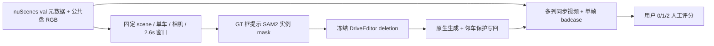

# v77 · DriveEditor DELETE 的 nuScenes val 问题审计

任务 `WS-V77-DELETE-AUDIT-20260928/r1`。本轮只检查**已训练 DriveEditor 的背景补景**，不运行 Ω、GLB、INSERT、MOVE，也不训练新权重。九个已被多轮观察和调试的 v77 scene 留在 DEV 记录中；它们映射到原始 nuScenes scene 后都不在官方 val split。新的 audit 与 final quarantine 以 scene 为单位隔离。官方 DriveEditor checkpoint 的训练 scene 清单尚未独立核实，因此这里的“val”是 nuScenes 官方划分，不宣称 checkpoint 完全未见。

## 冻结抽样

- 元数据是 AutoDL 公共盘官方 `v1.0-trainval_meta.tgz`；用 nuScenes devkit 的 `val` 名单确认 150 scene。逐条读取 `sample_annotation`、`sample_data`、`ego_pose`，不按模型输出或主观“容易/难”挑片段。
- 预先固定随机种子 `770128` 和输入门槛：每 3 个 2Hz keyframe 提一个开始点；6 个连续 keyframe 中目标至少出现 5 次、可见度至少 4 次 ≥2；中心帧目标投影至少 12×9px、画面占比 0.00035–0.35。一个 clip 只删一个车辆实例，同 scene 最多两个不同实例。
- 45 个 audit scene：夜间元数据 6、白天 GT 稀疏 12、白天 GT 密集 27；其中 25 scene 各两个不同目标，合计 70 clip。另从剩余 val scene 冻结 25 个 final scene，本轮不看其 RGB、不运行模型。
- 70 clip 的配额达到：小/中/大目标 22/26/22；前/侧/后相机 24/24/22；GT 可见性 clear/partial 35/35；目标投影后方有其他 GT 车辆 26、无此证据 44。`behind_vehicle_proxy` 只是投影与深度近似，不等于能看见真实后车。
- 每个 clip 使用 6 个 keyframe 之间的 26 个 10Hz 目标时刻，最近原始相机帧作为 RGB。26 帧中个别最近曝光重复或时间差 >65ms，按输入时序误差单列，不算模型故障。采样、GT 投影、公共盘成员与逐图解码记录在同一 run 中。

## 固定 DELETE 输入与输出

SAM2.1-large 使用统一的单实例提示帧选择：在目标GT投影面积不小于最大帧50%的候选中，优先取目标框离画面四边至少8px的帧，再取提示框内**其他GT车辆投影比例最低**者，平局取面积较大者。此规则对70例一视同仁；若没有未截边候选则保留截边候选并显式标注。它在A025把原最大面积第2帧换为第12帧，旁车投影占提示框由14.6%降为3.3%；选一个GT实例不意味着矩形里只有一辆车，真正的单车mask必须单独验证。旧提示几何和用户指出的两车框证据保留。

SAM2在选中帧用box提示后双向传播。逐帧把 SAM 实例与目标 GT 凸包加 3px 相交后取最大连通块；写回区域膨胀 3px 但仍受 GT 凸包约束。DriveEditor 模型输入用写回区域外接矩形，左右/上加 8px、下加 24px。写回矩形内部作 8px 平滑过渡；精确写回区权重 1，其他 GT 车辆包络在精确写回区外权重 0。空 mask 保留 RGB，并计入输入缺陷。冻结 DriveEditor 已训练 checkpoint，seed42、25 步、1024×576、10 帧窗起点 0/9/18；同时间重叠帧传递条件，最后一窗只保存 26 个真实时刻。保存原生生成与最终合成，不能只展示经过保护的结果。

审核页每 clip 展示目标黄框原视频、删除 mask 范围、DriveEditor 原生生成及最终 DELETE；同时间同步播放，并附最大 GT 投影面积的单帧原图/输出对照。目标 instance token、相机、来源文件、有效可见帧、输入难度均公开。输入难度由大小、夜间、GT 可见性、邻车投影及交通密度的固定代理给出；单帧粗分类将与用户 0/1/2 人工评分分开存。时序漂移要看视频，不能从一个静帧伪造确定结论。只有 mask/邻车写回条件达标的 case 才进入补景模型失败率分母；不删除难例。

DriveEditor 官方交互接口没有“保持原车不变”的 factual reconstruction 任务。这里保留原视频作为事实输入控制；`DriveEditor factual reconstruction` 字段标记为**未运行/不可判**，不把原视频原样复制冒充模型重建。后续如要衡量原位对象生成，应另立固定零位移或 replacement 协议，不混进 DELETE 补景审计。

## 已曝光九例的用户评分（DEV，不进新 audit/final）

分值：0 任务失败，1 效果不太好，2 可接受但不一定好。

| DEV scene / actor | 原位重建 | 重建后 DELETE | 用户备注 |
|---|---:|---:|---|
| scene_0230 / 22 | 1 | 2 |  |
| scene_0255 / 25 | 1 | 0 |  |
| official_000 / 12 | 2 | 2 |  |
| processed_350 / 7 | 2 | 2 |  |
| processed_663 / 6 | 0 | 0 | 原目标模糊且只有半个车身，暂缓 |
| processed_191 / 12 | 0 | 0 | 小目标且有树干遮挡，暂缓 |
| processed_425 / 1 | 0 | 0 | 小目标、无遮挡、难度一般，需解决 |
| processed_382 / 4 | 1 | 1 |  |
| processed_756 / 3 | 1 | 1 | 小目标、夜间、难度一般 |

本轮失败粗分类仅用于决定训练数据应针对哪个重复问题：actor regeneration、hidden actor identity wrong、white mosaic/hole、collateral deletion、mask failure、temporal drift、none/uncertain。每例保留唯一主标签及备注；输入条件错误与生成内容错误分开记，不把缺文件或 CUDA 不可用算进模型失败。
