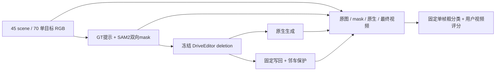

# v77 · 45 scene / 70 单目标 DELETE 审计交付

`WS-V77-DELETE-AUDIT-20260928/r1`，`failure_ledger_refs: [V77-F02]`。70例均按同一冻结p2提示、SAM2、DriveEditor和写回规则完成；没有按结果重选样本、重挑帧或逐例调参。25个final scene继续隔离。原始模型训练scene重叠尚未核实，本轮是nuScenes官方val上的问题审计，不是已认证的独立最终测试。

## 已完成的工程范围

- 70/70片段、45个scene，每片26帧、10fps、2.6秒。采样列表、来源时间、mask、原生和最终PNG均保留。
- 210个十帧窗口，其中198窗实际生成、12窗因全空mask按协议保留RGB。不能把跳过的窗口当生成成功。
- 生成耗时合计3.984小时；控制器从启动到视频与初版HTML完成4.195小时。生成窗中位72.49秒，PyTorch分配显存峰值21.862GiB。
- 四列共280段MP4已逐段解码，共7280帧；窗口帧的2100组洞外、保护区、精确写回像素合同全部通过。合同只能证明写回实现符合配置，不能证明目标mask、真实遮挡或补景内容正确。
- 原视频黄框、模型洞/写回/保护叠图、DriveEditor原生输出、最终DELETE均可同步播放。每例提供同一固定prompt的一帧原图/输出与四组件裁剪，附实例token、相机、难度、空mask风险和评分入口。原生deletion不是factual reconstruction，该项保持未运行/不可判。

## 70个固定抽帧的粗分类

这些是助手单帧观察，**不是70段视频的成功率，也不是纯补景模型失效率**。人工0/1/2 verdict全部留空。未从静帧评时序漂移；未逐帧审核。疑似再生没有被包装成经过检测器、隐藏GT身份验证的确定结论。

| 主类 | 个数 | 代表与边界 |
|---|---:|---|
| 背景模糊／块状伪影 | 22 | A017暗色团块、A019灰白涂抹、A057大块黑白结构、A069夜间矩形；部分同时有输入疑点 |
| 本帧未见明显问题 | 19 | A009、A038、A043、A049等；不等于完整视频通过或真实隐藏背景恢复正确 |
| 无法确定 | 11 | 极小、黑夜、严重截边或多个实例混在一起 |
| 仍见车体，身份待核实 | 9 | A007、A034、A042、A061等；场景可有真实后车，不能看到车就判幻觉 |
| 真实后车结构异常 | 2 | A013白客车被补成箱状结构；A039夜间后方白车身为大片平面，后者有输入边界混杂 |
| 疑似车辆再生 | 4 | A022、A050、A058、A065；A058近景几乎无背景上下文，不能和普通尺度例混成纯模型比较 |
| 输入遮罩缺陷 | 3 | A023/A040前景栏杆纳入写回；A028严重遮挡的大巴可见车头未被完整覆盖 |

本帧输入检查：45例未见明显mask错误、22例边界/身份难确认、3例有明确mask缺陷。另有21个clip在**其他某些帧**出现GT投影存在但core为空；两者不是同一个口径。因此没有把45例自动认证为全片合法输入，也没有计算全片条件失败率。

冻结GT难度代理为high/medium/low＝31/33/6。助手在同一帧补充可见性后为37/28/5：对强夜间眩光、前景栏杆、密集车列、重叠自行车、运动截边及近景占满画面的A002/A023/A025/A054/A056/A058升为high，A041由low升为medium。原代理保留，说明与新值分开存；不据此更改抽样。

本轮没有直接启动训练或修改生成策略。粗分类表支持下一轮选重复问题，但隐藏实体身份、时序、模型与mask的因果归属仍需用户视频评分及后续有控制的验证。

## 交付、验证与证据

本地审核：`C:/Users/dengyunlong/Documents/Codex/2026-09-26/xia/outputs/v77-delete-audit/index.html`。各卡的“人工DELETE评分”只保存在浏览器，可导出JSON；不自动代填。四列含同一个视角和时刻，输入mask叠图用于定位操作范围。

远端完整run：`/root/autodl-tmp/runs/worldsim_v77/WS-V77-DELETE-AUDIT-20260928/r1`。轻量记录见[工程完成数据](../autoresearch/worldsim_v77/delete_audit_20260928/completion_engineering.json)、[单帧注释](../autoresearch/worldsim_v77/delete_audit_20260928/assistant_reviews.json)与[交付验证](../autoresearch/worldsim_v77/delete_audit_20260928/delivery_validation.json)。原生全帧与固定写回结果同时保留，初版粗框预览及注释前manifest/HTML也有备份。

本轮`failure_ledger_delta: updated V77-F02`，只追加本次冻结审计观察和证据边界。用户已授权本轮完成后关闭AutoDL；保存、推送、交付验证与其他进程检查之后执行，关机结果另存本地`shutdown_receipt.json`，不把断网等同命令执行成功。

浏览器工具因file URL安全策略拒绝自动打开本地页面，未尝试用其他浏览器/服务绕过。本地HTML有70张卡片、280视频及700个资源引用，全部存在，MP4字节数与已解码远端一致；页面JS通过`node --check`。没有冒称浏览器内同步播放/评分交互已实际通过。
