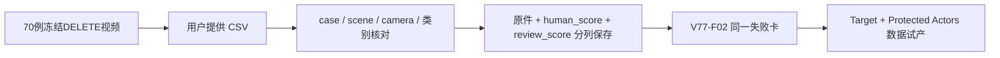

# v77 · 用户70例视频评审归档

接收日期2026-09-29；对应`WS-V77-DELETE-AUDIT-20260928/r1`。这是用户提供的CSV评审记录，未重跑或改写任何原视频/模型结果。原70例已完成的单帧助手观察继续保留，不能替代这一份视频评审。

70个case ID唯一、齐全，scene/camera/category与原审核manifest全部匹配，覆盖45个官方val scene。CSV原件按字节复制保存，中文备注、时间证据、mask计数全部保留。

| 来源字段 | 0失败 | 1效果不太好 | 2可接受 | 未填 |
|---|---:|---:|---:|---:|
| human_score（用户verdict） | 26 | 26 | 15 | 3 |
| CSV review_score（独立保留） | 26 | 26 | 16 | 2 |

人工未填：A043/A052/A060。A006的human_score=2而review_score为空；A043/A060的human_score为空而review_score=2。保持原值，不以另一列补分，也不把空值变成0。评分不是DriveEditor factual reconstruction的结果，该项仍未运行。

这批case已用于失败发现和后续方法选择，继续作为audit/development资源，不能再称未曝光最终测试。25个既有final scene仍隔离。

## 由评审支持的新阶段范围

- A022/A041：CSV均human_score=0，描述删除区出现替代车形，支持检查纯背景恢复数据。原RGB、mask缺失等混杂保留，不把单一例的全部退化直接归为网络。
- A013/A048：CSV均human_score=1，记录真实后车的形状或表面损伤。任务应恢复并保护真实B的身份，而不是用“删干净A”代替成功。
- 密集车列：保留其他actor的shape/appearance/pose。训练素材先排除模糊、小目标、极端截边和几何证据不足，避免把感知输入故障混进well-observed组。

本轮采用用户指定的`Target + Protected Actors`：真实nuScenes train视频Y为GT，人工仅在输入X增加一个待删A。保持DriveEditor架构不变；当前只做CPU素材与质量流程，SAM2及后续批量GPU推理前暂停。不会用生成补景作真实GT，不开启正式训练。

[CSV原件](../autoresearch/worldsim_v77/delete_audit_20260928/user_review/V77_DELETE_70case_review.csv) · [分列记录](../autoresearch/worldsim_v77/delete_audit_20260928/user_review/user_review_records.json) · [统计/差异](../autoresearch/worldsim_v77/delete_audit_20260928/user_review/user_review_summary.json) · [新数据质量协议及组件图](TARGET_PROTECTED_QUALITY.md)。failure_ledger_delta: updated V77-F02。
