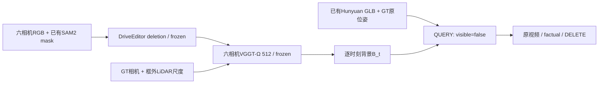

# v77 DELETE完整工程：登记与执行协议

task/run：`WS-V77-DELETE-FULL-20260927/r1`。用户授权跑完两个scene的DELETE链路；不做新MOVE、自动合法性网络、训练或第二补景模型。人工verdict始终null。

## 固定范围

- scene_0230/actor22，源f0–49，共50帧/5秒；scene_0255/actor25，源f0–99，共100帧/10秒；六相机10Hz。
- 24个DriveEditor窗口，10帧/stride9，seed42/25步，同一源帧的上一窗composite作下一窗首帧条件；没有重复输出尾帧。
- 0230固定已验证SAM外包矩形边距左/右/上8px、下24px；CAM5两个有离散污染的SAM帧只留最大连通块，原件保留。0255采用官方扩大范围并物化随机结果；必要时最小扩展覆盖SAM。
- 无目标mask视图复制原RGB，保留既有小目标/近裁面门控；不假设这等同全部目标观测都删除。
- B_t保留150个时刻，各自从六相机推理；GT相机与GT框外LiDAR标定单尺度。不是持久静态/4D世界。
- 原GLB未重新生成；保留0230 yaw180°与主点修复。Blender5.2.2 CPU/16samples/seed77固定照明，181个RGBA/Z层。Z=5平面实测Z pass为camera z。
- QUERY只改可见性；使用相同B_t、相同GLB层和相同相机。固定3×3点投影，深度容差0.15m；纯几何与RGB空洞补足分别输出。

## 执行与证据

远端run：`/root/autodl-tmp/runs/worldsim_v77/WS-V77-DELETE-FULL-20260927/r1`。登记见[registration](../autoresearch/worldsim_v77/delete_full_20260927/registration.json)。当前状态只见[RESEARCH_STATUS](../RESEARCH_STATUS.md)；本报告尚未记录完成结果。代码位于`scripts/worldsim_v77/delete_full_*.py`。

资源为单RTX3090串行，DriveEditor每窗180秒/总3600秒有界，Ω总3600秒；不与DriveEditor争GPU。零训练；不创建定时任务或自动关机。

开发场景已曝光；真实隐藏背景无GT；官方训练重叠未核对。GT提示、相机、actor位姿尺寸及背景尺度均明确为POC辅助。工程接通不等于高保真、几何正确或跨相机一致性通过。旧两条MOVE仍未准入。

`failure_ledger_refs: [V77-F02]`；本轮待结果收口时更新原卡，不新增失败ID；`human_verdict: null`。
