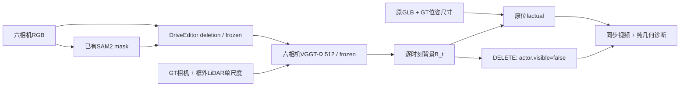

# v77 DELETE：完整工程回放与边界

完整工程已接通；长时序补景与背景几何仍有明确缺口

DELETE 现在是显式场景状态操作：关闭原位 GLB，不再临时调用补景模型。但 BUILD 出来的背景仍可能含新生成的车形、时序漂移和错误深度，因此流程完成并不等于两例达到高保真。以下标注是助手观察，人工结论留给你。

task/run：`WS-V77-DELETE-FULL-20260927/r1`。源码提交与当前状态见远端v77分支。人工 `human_verdict: null`；以下视觉判断均为助手观察。

## 实际执行

- DriveEditor：24 / 24 窗；10帧/窗、stride9、seed42、25步；本轮总耗时26.0分钟，记录的峰值allocated显存21.86GiB。完整官方训练后包初始化，执行deletion，无有效目标appearance/3D条件，不训练。
- Ω：150 / 150 个时刻，每次联合六相机；512 balanced实际输入688×384。纯RGB网络预测后，使用GT相机和框外LiDAR拟合一个米制尺度。
- 原GLB：复用Hunyuan3D-2.1单图资产；没有重新生成。0230 yaw180°、0255 yaw0°，GT逐轴尺寸；Blender5.2.2、Cycles CPU、16 samples、seed77、固定世界光与太阳光。181个RGBA/camera-Z层。
- QUERY：读取B_t与GLB层，仅切换目标visible=False；四项测试覆盖目标唯一性、重复/不存在指令、背景不变、前后遮挡及无效深度。没有再次调用DriveEditor、Ω或3D生成器。
- 原位渲染沿用主点校准；已知z=5平面验证Blender Z pass直接为camera z，修正了原草稿中不应再除射线模长的实现。输出尚不包含光照拟合、地面接触阴影或反射。

| 场景 / 目标 | 时间范围 | 处理目标视图数 / RGB视图数 | 几何覆盖率最低 / 平均 | 删除区域覆盖率最低 / 平均 |
|---|---|---|---|---|
| scene_0230 / 22 | f0–49，5s @10Hz | 70 / 300 | 49.6% / 79.2% | 88.1% / 96.6% |
| scene_0255 / 25 | f0–99，10s @10Hz | 111 / 600 | 95.1% / 98.9% | 89.0% / 98.4% |

覆盖率只表示有投影点，不能说明几何正确。主三栏在几何缺点像素使用保存的DriveEditor RGB补足；另存完全不补足的灰洞纯几何视频，避免以图像掩盖几何缺口。

## 逐场景观察

### scene_0230 / actor22

目标是路边棕色跨界车，黄色区域标出 actor22；旁边深色 Jeep 和其他停放车辆不属于删除目标。跟随视角依次经过 CAM2、CAM4、CAM5，相机切换不是生成闪烁。

局部侧面补景有改善，但不能把这段视为完整 DELETE 成功：后向 CAM5 的背景生成了另一辆车。

- 0.5 秒左右 / CAM2：主要目标车体消失，路面与路缘连起来；围栏局部仍软化、形变。
- 约 2.2–3.8 秒 / CAM5：DELETE 栏仍出现棕红色车形，2.5 秒的直接 DriveEditor 输出已经存在该车形，甚至呈现与原车不同的朝向。这不是 GLB 删除开关失效。
- Ω 合并六相机点云后，围栏、近车边缘和远处建筑有碎裂或重影；纯几何视频显示远景/天空缺口，主三栏通过保存的背景图补足缺点像素。
- 原位 factual 使用同一 GLB，身份没有逐帧重新生成；高光、材质、接地和实际视频仍有差异。不能用背景再生成的车形来否定这份 GLB。

删除区域按8px网格采样重投影，得到5365个跨相机样本对，其中相对深度差超过10%的比例为40.9%。该诊断混合了真实遮挡、估计误差和生成不一致，不是真值错误率，也不能据此单独断定哪一个模块失败。
### scene_0255 / actor25

目标是停车场入口、围栏后方的浅色 SUV，即 actor25。主观察视角是 CAM3；CAM1 只在开头短暂可见。左侧深色车辆和停车场后排车辆应保留。

前段去车和道路补全有改善；后半段出现发白、车列与围栏变形，且背景深度会错误遮挡放回的 GLB。

- 约 1.5–2.5 秒：直接补景中的浅色 SUV 主体已去掉，可见连续路面；邻车边缘与围栏仍有局部模糊和不合理结构。
- 约 5–9.5 秒：补景区域越来越亮，围栏和后排车列出现波浪状/拉伸形变。前面一秒的改善不能外推为十秒时序稳定。
- 原位 factual 中部分车身被 Ω 背景深度错误裁切；取消深度测试时，同一 GLB 是完整的。页面保留这一控制，但取消遮挡也会盖住真实前景，不能作为正确结果。
- 本轮保留每个窗口和同时间接缝，不扫种子或新增模型；尚未分离跨窗条件、mask变化和模型本身对长期漂移各自的影响。

删除区域按8px网格采样重投影，得到6956个跨相机样本对，其中相对深度差超过10%的比例为42.9%。该诊断混合了真实遮挡、估计误差和生成不一致，不是真值错误率，也不能据此单独断定哪一个模块失败。

## 时序和mask合同

0230固定SAM可见区域外包矩形：左/右/上8px、下24px。CAM5两个帧存在车外离散SAM污染，只留最大连通块；原mask、原登记和清理记录均保留。0255保留官方scale_bbox方案并物化随机结果，复用旧f15–24的已验证mask，必要时最小扩大覆盖SAM。不是两个scene共享一种mask的消融实验。
10帧滑窗用同一源时刻重叠1帧，上一窗composite作为下一窗首帧条件。最终保存旧窗重叠输出，不重复首帧；尾窗输入重复只用于填满模型输入，最终视频不重复尾帧。跨窗条件并不保证道路、栏杆和车辆语义一致。页面提供同时间旧窗末帧/新窗首帧比较。
逐像素核验900个RGB视图：SAM均在最终mask内；背景局部合成mask外全部与原RGB一致。局部合成能保护mask外像素，不能保护扩大mask里的邻车和围栏。
继承此前SAM的小目标与近裁面门控；无mask的相机直接复制原RGB，并不等同“所有目标观测已清理”。本轮只把目标actor显式化，其他车辆仍作为背景内容保留。

## 指令合法性与结果边界

本次DELETE不产生新的占据体。助手通过源帧/连续抽帧核对目标身份和删除区域；没有实现神经网络或启发式交通规则判定。旧0230 MOVE碰撞和0255近距/静态占据拒绝保持，不运行新MOVE。
GT用于mask历史提示/门控、相机内外参、actor原位姿与尺寸，框外LiDAR用于单尺度；不是RGB端到端自动方案。B_t分别存储每个时刻，不称持久静态或4D世界。两个场景已曝光，无隐藏背景真实GT，官方训练重叠未核对。
本轮没有重新训练或修改Ω、Hunyuan、DriveEditor权重。失败只记录到具体视角、时段和处理环节，不据此否定GLB或模型家族。

## 可复核产物和验证

- [审核页](../autoresearch/worldsim_v77/delete_full_20260927/review_link.md)：22段MP4，共1650个视频帧实际解码，均10Hz且匹配50/100帧长度。包含跟随视角三栏、六相机三栏、直接补景、mask、纯几何两栏、取消深度测试的同GLB控制；每scene十个时间点静帧。
- [validation.json](../autoresearch/worldsim_v77/delete_full_20260927/validation.json)：媒体实解码、本地文件链接、JavaScript语法；未宣称完成浏览器交互测试。
- [summary.json](../autoresearch/worldsim_v77/delete_full_20260927/summary.json)、[registration.json](../autoresearch/worldsim_v77/delete_full_20260927/registration.json)、[build_validation.json](../autoresearch/worldsim_v77/delete_full_20260927/build_validation.json)；每scene独立JSON保存factual/DELETE状态、指令、逐帧可见性和覆盖率。
- 远端完整资产根：`/root/autodl-tmp/runs/worldsim_v77/WS-V77-DELETE-FULL-20260927/r1`。`background_world/<frame>/`保留原Ω预测、点云、尺度诊断、投影深度和几何图；`cam*/windows/`保留所有原生DriveEditor输出；`actor_layers/`保留原位RGBA与Z。
- 本地审核包只含媒体与清单，不重复下载全部点云/模型。场景JSON中的asset_root_remote明确给出完整资产根。

`failure_ledger_refs: [V77-F02]`；`failure_ledger_delta: updated V77-F02`；`human_verdict: null`。
