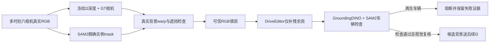

# v77 DELETE 三场景入口修复

状态：已登记、执行中；结果不预填。唯一task/run `WS-V77-DELETE-REPAIR-20260927/r1`，人工verdict null。

3×30帧主视图强控制；非重跑三场景完整六相机世界。旧GLB不变。A精确mask、B证据优先，其余固定。来源为原RGB，不用旧生成图充真实背景；完整配置见登记。官方代码参考：[DriveEditor](https://github.com/yvanliang/DriveEditor)、[SAM2](https://github.com/facebookresearch/sam2)、[GroundingDINO](https://github.com/IDEA-Research/GroundingDINO)。
