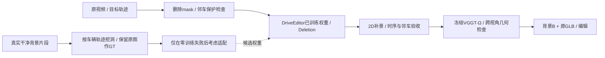
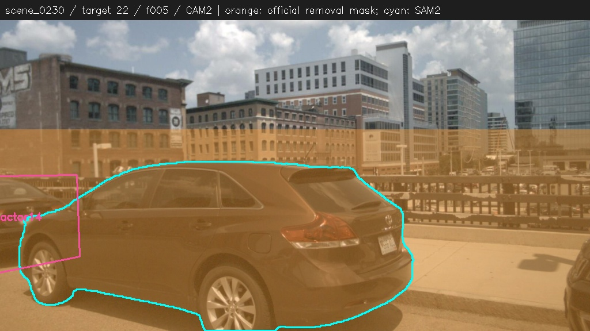
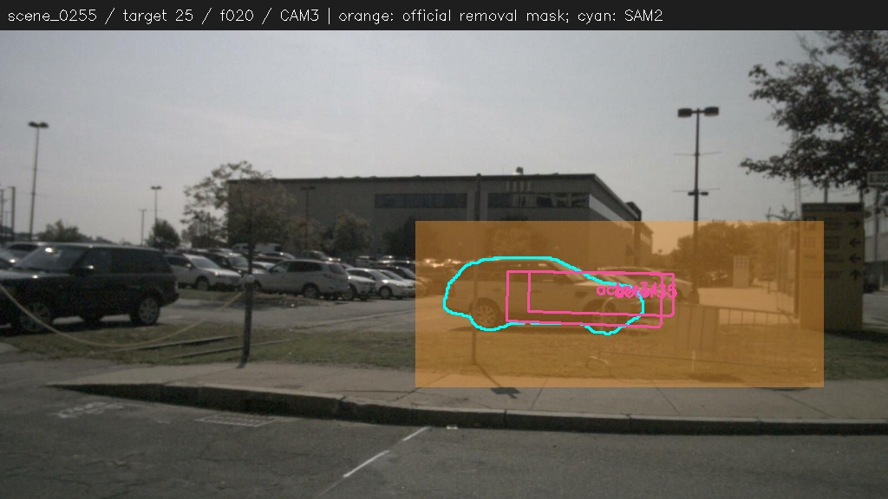

# v77：DriveEditor 补景接入与数据构造评估

2026-09-26 · `WS-V77-DRIVEEDITOR-ASSESS-20260926/r1`。本次核对官方论文、源码、旧环境，并完成两场景20帧的CPU mask预检。**建议先用训练好的DriveEditor做零训练deletion对照；目前没有证据要求先造训练集。** 这不是新生成画质结论。

## Architecture components

## 1. 能直接用到哪一层

可接入的是**视频背景补全模块**。先把ProPainter替换为DriveEditor的Deletion分支，原GLB、目标身份、校正朝向、编辑器与Ω权重固定。先看视频补景是否清晰稳定，再将合格输出重建成B；单相机看起来合理不等于多相机描述同一个3D场景。

用户给出的训练数据机制得到核实：作者用无目标背景区域的遮挡重建训练删除能力，10,110条训练视频中含2,000条inpainting子集。论文常规设置为10帧、1024×576，并展示较长片段及迭代生成。这些是作者设置，不能保证我们两个case已通过，也不保证六相机独立生成后的空间一致性。[论文](https://arxiv.org/html/2412.19458v2)

必须取得**DriveEditor训练后的checkpoint**。单纯组合原始SVD和SV3D只完成训练初始化，不能代替已学习删除任务的权重。[官方README](https://github.com/yvanliang/DriveEditor)

## 2. `get_deletion()` 的核对与补充

- 原物体3D框仍用于定位挖洞区域；取消的是要生成的目标外观与位置条件。代码以常量reference、空位置字典、无效深度图和 `valid_mask=0` 表达删除，不是所有输入字段都可以直接省略。
- `scale_x=scale_y=1.9` 是宽高分别扩大，理想未裁边面积约3.61倍。`scale_bbox()` 还随机偏移中心；大框会限制为最多1.5/1.25倍，并裁到图像边界。因此不是固定居中的1.9倍矩形。比较不同模型时应直接保存、复用同一mask，不能仅靠seed假定输入相同。
- 置零的是[-1,1]归一化图像张量，对应中性填充值，不是要求RGB黑色。`mask_concat`同时明确告知缺失区域。
- deletion没有有效物体appearance prior，不应把删除能力归功于SV3D补出一辆车，也不能未经实现验证便声称可删除SV3D分支、显存自动减半。

[官方推理实现](https://github.com/yvanliang/DriveEditor/blob/main/interactive_gui.py)。扩大mask与清理边缘/阴影残留的目标相符，但未发现源码将1.9明确解释为专门覆盖阴影；这是合理的工程解释，不是已做消融的唯一因果结论。

## 3. 已完成的两场景预检

实际调用上游提交 `e67d73a6ffc0a90996331db1e1415ab92b341293` 的 `scale_bbox()`，固定seed42，输出1024×576 mask。使用原GT相机/框；没有加载生成权重。

| 项目 | scene_0230 / actor22 | scene_0255 / actor25 |
|---|---:|---:|
| 检查窗口 | CAM2，f000–009 | CAM3，f015–024 |
| 删除区域占画面 | 28.5%–73.3% | 15.0%–15.9% |
| 原SAM2目标mask覆盖 | 10/10帧均100% | 10/10帧均100% |
| 与其他对象投影框相交 | 10/10帧 | 10/10帧 |

投影框交叠只是潜在改动范围，不等于已生成的邻车损伤；远处或被遮挡的框也可能投影重叠。静态围栏与道路纹理需要另看源图。0230的大近景目标会使官方矩形覆盖很大区域，0255还涉及围栏和停车场多辆车；**扩大mask有收益也有代价，不能机械全放大后就宣布解决。**

橙色为该次官方函数得到的删除mask，青色为现有SAM2目标轮廓，粉色仅示意交叠最大的两个其他GT框；完整计数在 [summary.json](../autoresearch/worldsim_v77/driveeditor_assess_20260926/summary.json)。原图与mask没有被用作训练数据。

## 4. 现在能否在现有机器跑

远端源码与 `/root/autodl-tmp/envs/driveeditor` 仍在，torch2.1.1+cu118，CPU几何导入运行成功。官方和既有适配代码保留，旧源码的本地修改未覆盖。

旧约12.06GB的 `model.safetensors` 与demo `data.pkl` 已在2026-09-25清理中退役，当前symlink目标不存在。需要恢复模型，不能将此前生成的视频当作可运行权重。demo数据只用于GUI初始化，接我们的两场景输入时可以改成非交互加载，无须把demo当训练资料。

当前是单RTX3090 24GiB。官方GUI列出的配置高于32GB，或两张24GB；旧V7.5记录证明单卡串行CFG与分块解码适配曾完成原生10帧对象编辑，所以优先复用并重验这条路径，不宣称原版GUI能直接装入当前单卡。[官方资源说明](https://github.com/yvanliang/DriveEditor#-use-this-model)

## 5. 最小的零训练对照

只跑原两个actor，各固定一个10帧窗口；有输入问题先修输入，不训练。建议共三组，GPU串行：

| 组别 | 模型 | 删除mask | 用途 |
|---|---|---|---|
| A | 原ProPainter权重 | 原SAM2加既有边缘处理 | 对齐后的旧方法 |
| B | 原ProPainter权重 | 保存的官方DriveEditor扩大mask | 分离扩大mask带来的影响 |
| C | 已训练DriveEditor | 与B完全相同 | 分离生成模型带来的影响 |

三组用相同RGB、10帧窗口、1024×576评价分辨率。显式物化mask，避免模型内部再默认膨胀；记录实际输入与合成区域。旧R2的688×384、196帧结果作为历史系统对照，不能直接拿来归因“仅换模型”。DriveEditor原始整帧输出和保持mask外原像素的适配合成分别保存，防止把mask外修饰藏掉。

先验收目标残留、道路/路缘/围栏连续、邻车是否保留、10帧是否闪烁和贴纹理。如果官方大mask造成明显邻车变化，停止该原样配置，另记“邻车可见mask保护”适配；不能把适配结果写成原版成绩，也不因输入挖掉邻车而否定模型。

视频改善后再检查两个重叠窗口和第二相机；通过后重跑冻结Ω，检查背景深度、跨视角边界/路缘对齐及漂浮面。**2D生成阶段失败才考虑模型适配；2D成功、3D不一致则先解决跨视角条件或约束，不直接扩大同一种单目训练集。** 小样本不算FID/FVD总分。

## 6. 如果需要造数据，怎样造

核心训练对为：干净背景视频 `Y`，带洞输入 `X=(1-M)Y+M·c`，mask `M`，监督目标仍为真实 `Y`。这与“拿现有有车视频当去车GT”不同；后一种会把模型训练成还原原车。

### 第一批：真实背景 + 车辆形状/轨迹的空洞

1. 从独立训练scene提取10帧连续视频，选择已确认无目标车辆的道路、停车位、路缘、围栏与建筑区域。仍保留区域外正常交通对象作为上下文。
2. 在世界坐标中放一个虚拟车辆包络或移用真实车的尺寸/轨迹，通过每帧相机投影生成mask。让洞的尺度、透视、运动、截边、距邻车间隔与我们真实DELETE分布接近，避免只训练小型随机方块。
3. 候选须检查全部帧是否挖掉原本就存在的车/人；用GT、可见实例mask与抽样人工审核共同过滤。保留一部分紧邻真实邻车但不覆盖邻车的困难例，训练局部保持能力。
4. 干净源RGB直接作GT。既有blank分支在 `category_name=''` 时读取每帧 `im` 和矩形 `pos`，已生成无物体条件，可作为首轮数据格式入口。[官方dataset代码](https://github.com/yvanliang/DriveEditor/blob/main/sgm/data/nus.py)

**第一批无须先渲染假车。** 如果假车及其影响完全落在mask内，挖洞后输入与直接遮干净背景相同；渲染没有增加监督信息。最省事且可信的起点是现成真实RGB的遮挡重建。

### 第二批：只补实际失败模式

| 数据来源 | 怎么得到监督 | 主要用途与限制 |
|---|---|---|
| 同场景目标离开后的真实视图 | 相机/深度对齐，检查静态表面、遮挡与光照；仅可靠可见像素作为有效GT | 对真实删除更接近；错位或未显露区域不可强行当真值 |
| 同一世界的多相机干净片段 | 同一虚拟3D遮挡体投到各相机，保留同步相机与深度信息 | 检查或训练跨视角一致性；仅把这些视角当独立样本不能自动获得跨视角约束 |
| 真实干净背景 + Blender车辆/阴影 | 原RGB为clean目标，渲染图为corrupt输入；记录alpha、阴影、深度与轨迹 | 用于漏mask、阴影与边缘残留控制；此时渲染才有额外价值，且不需要自造生成网络 |

不把ProPainter/DriveEditor生成图直接冒充真值。确需伪标签时，单独标记来源、人工过滤、降低权重，并与真实监督单列统计。

### 数量、划分与是否训练

建议先制作并抽查200–500条10帧数据小样，另留50–100条独立scene验证片段；这是工程起步量，不是效果保证。确认覆盖真实mask尺度和困难表面且验证有收益，再扩到约2,000条量级。按scene/log划分，同scene相邻帧和所有相机必须落在同一个split，当前0230/0255只作开发诊断、不混入训练；另外保留未曝光测试scene。

公开toy loader的train/val当前均构造读取同一个固定 `train_data.pkl` 的Dataset，因此我们要显式接入独立split清单，不能将随机shuffle当验证隔离。也需核对官方checkpoint的训练场景列表；未查清时不宣称我们的评估是对该预训练模型完全未见的场景。

若零训练结果明确显示域差异，再从DriveEditor已训练权重做小规模deletion适配，不从SVD+SV3D重训整套；Ω与actor模型保持冻结。参数高效微调是需要实现和验证的方案，不是官方现成LoRA开关，也未保证当前24GB可训练完整官方配置。

干净GT验证看洞内误差/感知距离、路缘线连续性、mask边界、受遮挡判定约束的时序一致性；真实DELETE另看残影、邻车保持、闪烁及下游Ω几何。模糊图可能有低像素误差，所以不能只看PSNR。

## 执行记录

本轮完成文献/源码核对、实际环境检查、20帧mask预检与两张源图标注。零GPU生成、零训练；**没有声称DriveEditor已修好这两个scene**。

运行：`OMP_NUM_THREADS=4 OPENBLAS_NUM_THREADS=4 CUDA_VISIBLE_DEVICES= /root/autodl-tmp/envs/driveeditor/bin/python /root/autodl-tmp/v77_driveeditor_probe.py`。远端证据：`/root/autodl-tmp/runs/worldsim_v77/WS-V77-DRIVEEDITOR-ASSESS-20260926/r1`；代码归档在v77的 `scripts/worldsim_v77/driveeditor_mask_preflight.py`。种子仅用于独立mask函数，完整推理的RNG顺序可能不同，故保存mask用于后续相同输入对照。

更新同一V77-F02输入边界记录，无新失败ID，人工 `human_verdict: null`。
