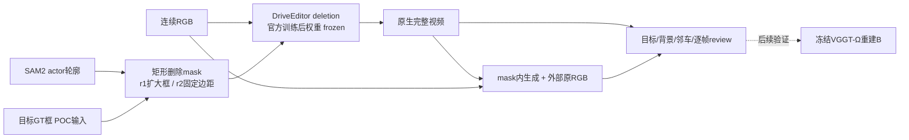

# DriveEditor deletion：两场景补景实测

`WS-V77-DRIVEEDITOR-COMPARE-20260927/r1,r2`。2026-09-27，零训练，三次推理、30个生成帧。人工 `human_verdict: null`；以下视觉结论为助手逐帧观察。

**已训练好的DriveEditor在两例中都产生了实质视觉改善，但0230需要收紧删除范围。** 这支持先继续现成模型的背景视频路线，暂时不必造训练集；不代表长时序、跨相机或Ω背景几何已经合格。

## 结果与单项控制

- **scene_0230 / actor22 / CAM2 / 源帧0–9**：近处棕色旅行车。r1采用已保存的官方扩大框，10帧持续产生深色车形、轮状结构及变化的阴影；这不是成功删除。mask覆盖部分非目标车辆，无法把全部残影单独归为原车残留。
- **同场景r2**：只替换mask，保留RGB、权重、seed42、25步、串行CFG、单帧解码。使用SAM2外包矩形，左右/上8px，下24px；10帧SAM目标覆盖率100%。主要黑色车形残影消失，路面和路缘连续可辨；桥栏局部仍弯曲、软化和变化，邻车边缘也需复核。只做了这一个控制，没有扫seed、边距或其他模型。
- **scene_0255 / actor25 / CAM3 / 源帧15–24**：围栏后的银色SUV。r1官方扩大mask下，10帧目标SUV不再可见，停车场路面可辨，较历史ProPainter大块糊影有实质改善。围栏细线、远处车列仍软化/形变。该例没有追加r2或ProPainter。

0230的结果说明编辑mask显著影响该例效果；控制同时改变范围与中心偏移方式，不能声称已分离这两个因素，也不能推广为mask越小越好。原失败输出和输入全部保留，不能只展示较好版本。

| scene / run | mask占画面 | 模型加载与推理记录秒数 | 原生mask外RGB MAE（0–255） |
|---|---:|---:|---:|
| scene_0230 / r1 | 28.5%–73.3% | 103.8 | 4.85 |
| scene_0255 / r1 | 15.0%–15.9% | 103.8 | 3.04 |
| scene_0230 / r2 | 14.8%–45.1% | 110.1 | 4.26 |

三次峰值已分配显存均21.86GiB。原生mask外变化说明扩散/编码会影响整帧；局部合成PNG的mask外最大差异均0，30帧重新计算全部逐像素一致。这只是合成正确性，不是背景质量分数；MP4有编码损失。

## 指令与证据边界

本轮DELETE同一目标，不产生车辆移动路径；去车后须保住其他actor、围栏、道路。助手已查看全部30生成帧及对应源帧/mask。扩大mask的非目标覆盖是操作范围风险，生成后再检查实际损伤。0230旧MOVE碰框、0255旧MOVE近距/静态占据问题保持；没有新MOVE，也未实现自动合法性模型或规则。

每段只有10帧/10Hz（源采样跨度0.9s、视频播放1s），单相机，两个已曝光开发scene。隐藏背景无真实GT，官方训练数据与这两个scene是否重叠未核对，不能作未见泛化或几何真值结论。此次未运行Ω重建、未改变Hunyuan GLB和原位factual。单帧解码是保留的24GiB适配，本轮未单独测其时序影响。

## 模型与验证

官方训练后checkpoint完整12,059,467,678字节、4,077张量；三次加载均0 missing / 0 unexpected keys。官方源commit `e67d73a6ffc0a90996331db1e1415ab92b341293`，现有单3090串行CFG和单帧解码适配保持。deletion的valid_mask为0，SV3D去噪主干跳过；加载完整文件不表示使用DriveEditor替代整个v77 pipeline。零有效物体外观/3D框生成条件，r1原目标框仅界定删除区域。

r1条件曾逐张量与官方冻结矩形deletion返回值比对，20帧/12项一致。r2沿用相同条件代码，仅更换物化矩形；边界裁剪和目标覆盖已检查。11个MP4（8个RGB结果/对照、3个mask标注）实际解码计数均10帧、10fps、1024×576。HTML媒体链接静态检查通过，未声称浏览器交互自动测试。

## 保存与下一步

远端原始run：`/root/autodl-tmp/runs/worldsim_v77/WS-V77-DRIVEEDITOR-COMPARE-20260927/r1`、`r2`。r1包含先前已完成的ProPainter历史，不是本轮新增。r2保存唯一范围控制登记与全部PNG。原权重下载后关机任务曾失败退出，本轮用户继续授权已取代旧安排，没有自动关机或定时任务。

下一步先固定当前两例的mask方案扩展连续时间窗，检查目标再出现、栏杆漂移和邻车保持；再做跨相机一致性检查，最后接冻结Ω重建。暂不造训练集、不训练Ω、不增加第二补景模型。人工最终结论由用户填写。

`failure_ledger_refs: [V77-F02]`；`failure_ledger_delta: updated V77-F02`。
