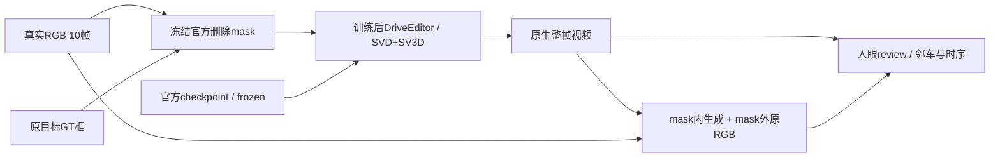

# DriveEditor 两场景直接补景：执行登记

任务 `WS-V77-DRIVEEDITOR-COMPARE-20260927/r1`。用户于2026-09-27纠正执行方向：取消定时任务，直接做DriveEditor补景，不再追加ProPainter实验。定时任务已通过app工具删除，实际配置文件不存在。本报告是执行登记，**不是生成质量报告**。



| scene / actor | camera | 原视频帧 | 时段 | 输入 |
|---|---|---|---|---|
| scene_0230 / 22 | CAM2 | 0–9 | 0.0–0.9s | 1024×576 RGB + 已保存扩大mask |
| scene_0255 / 25 | CAM3 | 15–24 | 1.5–2.4s | 同上 |

采用[官方仓库](https://github.com/yvanliang/DriveEditor)链接的训练后权重（Google Drive id `1QuDnHjMS6KYwq-HglzzCSucc1HZaDW3J`），文件大小12,059,467,678字节。不以裸SVD/SV3D初始化权重替代训练后权重。原权重曾被清理，本次恢复；下载来源和完成记录保存在 `/root/autodl-tmp/work/v77_driveeditor_restore/state.json`。

## 推理配置与边界

官方源commit `e67d73a6ffc0a90996331db1e1415ab92b341293`，保留已有`interactive_gui.py`串行CFG和`sample.yaml`复用checkpoint内CLIP权重的修改。没有修改模型网络。10帧，25步，seed42，decoding_t=1，一张3090，单模型阶段超时1800秒。没有前段生成条件，不声称长视频结果。

轻量适配跳过GUI的demo data.pkl加载，使用已经物化的官方删除矩形，保持官方零物体条件、mask下采样和归一化。CPU测试将相同矩形送入官方get_deletion，对每scene的12个返回项逐张量比对；20帧全部一致，测试没有模型前向。恢复权重后才运行生成。

mask来自 `WS-V77-DRIVEEDITOR-ASSESS-20260926/r1`；与原GUI相比固定了随机框的位置，避免重新抽样。0230扩大mask占28.5%–73.3%画面，0255约15%–16%；可能影响其他车辆，必须看DriveEditor实际输出，不能根据ProPainter的结果预先否定DriveEditor。

保存每帧原生生成与mask外复制原图的合成版；记录原生mask外RGB变化、合成mask外最大差异。后者应为0，仅检验拼接正确，不是补景质量指标。没有真实隐藏背景GT、没有PSNR排名。两个scene均是开发例，不是未曝光泛化集。人工`human_verdict`始终null。

## 运行与检查

本次只启动一次性命令：下载断点续传完成→safetensors结构可读检查→两scene串行推理。它不创建任何定时唤醒。

```bash
/root/autodl-tmp/envs/driveeditor/bin/python /root/autodl-tmp/work/v77_restore_driveeditor.py && \
/root/autodl-tmp/envs/motionproj/bin/python /root/autodl-tmp/v77_driveeditor_controller.py drive
```

完整run位于 `/root/autodl-tmp/runs/worldsim_v77/WS-V77-DRIVEEDITOR-COMPARE-20260927/r1`。下载使用16连接、显式Range范围与字节数检查、最多3次/段、总时限2小时；仅连接错误重试，不循环重跑模型。完整模型存在后，controller依次运行scene_0230与scene_0255，失败即停；重复启动由锁及状态文件拒绝。

用户纠正前产生的A/B ProPainter输出留在相同run作为历史，不追加实验，不充当DriveEditor成绩。本次尚未有DriveEditor生成输出时不得发布空白视频或挪用旧结果。

`training_steps: 0`；`failure_ledger_refs: [V77-F02]`；`failure_ledger_delta: updated V77-F02`；`human_verdict: null`。
