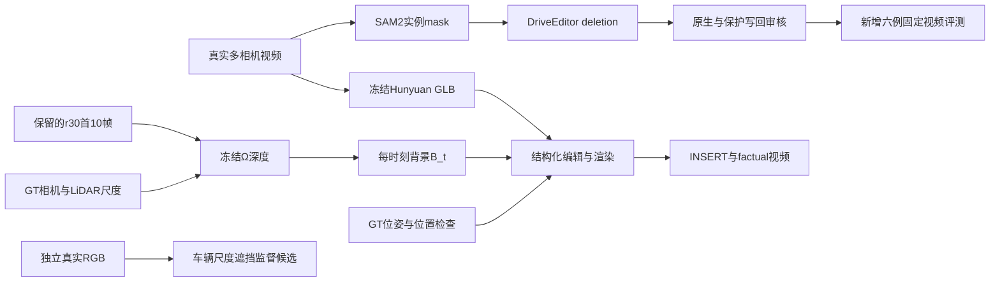

# v77：固定九场景表面与编辑工程检查点

`WS-V77-EXPAND-EDIT-20260928 / r1–r7`，2026-09-28。新增六例按同一规则完成一次评测：五例各30帧DriveEditor生成，一例停在mask输入。**这是完成数量，不是成功率。** 保留原scene_0230、scene_0255和official_000，以及用户对0255的r18>r15判断；没有覆盖r18/r21/r30或旧GLB。

本轮新知识：r30配置迁移在350有可保留结果，在无其他GT车辆遮挡的425明确再生车辆；382则有真实隐藏actor11，检测到车不能直接判幻觉。r30接回Ω、INSERT和目标12原位控制均有实际产物，但原位接地/外观尚未验收，MOVE只完成候选筛选。

## Architecture components

新增六例未进入Ω。图中的Ω输入仅为已有r30。B_t仍逐时刻独立，没有持久世界、交通响应或全车显式化证明。背景无命中处回填输入RGB的读出与纯几何读出分栏保存。

## 输入与固定协议

远端证据根：`/root/autodl-tmp/runs/worldsim_v77/WS-V77-EXPAND-EDIT-20260928`。代码在`scripts/worldsim_v77/expansion_*.py`；本地审核在`outputs/v77-expansion/index.html`。完整输入帧/标定/生成PNG/渲染RGBA与深度保留在run目录；Git只收登记、摘要与可复现代码。

GT框用于SAM提示、实例包络约束和诊断，不直接用大框作为精确目标轮廓。SAM2.1-large双向传播，最大GT投影面积帧作提示。目标core为SAM与GT hull+3px相交的最大连通分量，膨胀3px且仍受包络约束。模型洞为其外接矩形，上/左右8px、下24px。写回为矩形内8px smoothstep；实例write内权重1；其他GT对象包络在write外权重0。包络保护不是精确遮挡真值。

五个准入主视角均固定DriveEditor deletion、seed42、25步、1024×576、10帧窗口，起点0/9/18/27；使用同时间重叠帧作为下一窗条件，末窗补齐但只留30个真实时刻。生成参考/物体位置条件关闭；首窗条件由遮洞RGB构造，续窗使用前一窗生成的同时间结果。没有per-scene seed、阈值搜索或新模型家族。r30规则迁移包含重新得到的目标mask，不是假装沿用原scene mask。

从157个元数据根中仅14个有首30帧六相机RGB；179与204分别是0230、0255别名，已排除。新增开发与本轮留出在生成前登记。原始文件名日志前缀没有已知跨集合交叠；历史V5使用和预训练重叠未知。本轮留出不等于独立外部测试；后续用于诊断的样例必须转为开发资源。

## r1：新增六例结果

| scene / target / camera | 角色 | 实际结果与边界 |
|---|---|---|
| 350 / scene-0436 / 7 / CAM5 | 开发 | 30帧生成。10时点主体删除，邻车仍在；路面/标线与边缘待用户审核。DINO+SAM源正控制10/10，疑似车报警0/10。 |
| 663 / scene-0875 / 6 / CAM5 | 开发 | 30帧生成。出现褐色伪结构；目标write与前方actor15的GT包络末帧交叠91%，mask可见性与生成问题未独立排除。报警10/10不能代替根因判断。 |
| 191 / scene-0242 / 12 / CAM2 | 开发 | 30帧生成。车样轮廓仍明显；actor13在前方与write交叠约31–34%，遮挡/实例完整性未拆清。报警3/10。CAM4仅首帧极小边缘core。 |
| 425 / scene-0535 / 1 / CAM5 | 本轮留出 | 30帧生成。原生首窗即出现完整车样物体并延续；30帧无其他GT车辆包络与write交叠，源正控制与报警均10/10。限定在GT召回范围内，是明确再生反例。 |
| 382 / scene-0471 / 4 / CAM0 | 本轮留出 | 30帧生成。真实actor11在后方；不能将10/10报警称为幻觉。须核对保留邻车身份/位置；末帧黑色矩形残片是独立质量问题。源正控制9/10。CAM2仅末帧小core。 |
| 756 / scene-0998 / 3 / CAM2 | 本轮留出 | 主视角22/30帧core为空，CAM0只有首两帧有core；公交遮挡与传播漏分割未分清，未送DriveEditor，计入六例分母。 |

实际270帧SAM传播覆盖9个相机流，五个主流生成150个唯一帧、20个窗口。没有把无效跨视角强行生成后报成功。guard复用GroundingDINO-tiny+SAM2.1-large，抽查10/30时点，仅作告警；没有检测到车也不能证明背景真实。`neighbor_audit.json`使用向下延长0.4m的GT投影包络，中心深度仅提示前后关系，不等于精确表面可见性。

## r2 / r3：Ω与INSERT

r2原样复用official_000 r30的CAM0首10帧，其他五相机采用原RGB；目标12在其余视角GT投影面积全部为0。官方Ω512 checkpoint冻结，GT K/c2w及背景LiDAR全局尺度保留，每时刻六相机独立前向。纯点几何删除区外观接近r30；远景树木/天空有孔洞，混合读出用输入RGB填无命中像素。覆盖率不等于几何准确或遮挡正确。

r3使用已存在的0255/25 GLB作为**新增**actor，不冒充official_000/12。源图和地面占地轮廓筛除跨人行道/路缘的候选，采用空道路proposal2，尺度4.974×2.055×1.925m。30帧包络筛选最小其他对象间距3.55m、ego近似包络1.24m；只有10帧渲染，不能称连续3秒或完整道路合法。CAM5十帧可见，CAM4仅f0可见，其余九帧无像素。

保留无背景深度遮挡、Ω遮挡、纯几何三个对照。CAM5除首帧32个像素被遮挡外，其余无裁切；没有接触阴影和场景光照拟合，画面仍有合成感。原有GLB未改动。

## r5 / r6 / r7：目标12原位与MOVE前提

r5从目标12真实多视角中选取较清楚的f46/CAM2侧后图，单次SAM图像分割后用现有冻结Hunyuan3D-2.1：shape50步、seed7740、guidance7.5、octree256；PBR6视图、512分辨率、不重网格。其他真实视角用于检查；不是2mv多图联合生成。输入含未来时刻，是重建BUILD资料，不宣称因果预测。

原网格与PBR各八视角保存。Blender原生长轴Y、车头+Y，显式转Z=-90°得到车辆前轴X；f0/CAM0、f46/CAM2的0/180朝向对照支持0°。实际mesh变换后包围盒与给定pose/size误差小于2mm，投影检查小于0.02px。当前PBR＋固定光照组合出现绿色斑纹，车轮细节退化，连观察源f46的外观还原也不理想；贴图、材质与光照未单变量分清，不据此否定整个资产路线。

放大首10帧又暴露GT接地：框底比局部LiDAR路面平面高12.8–16.0cm。r7保留r5，**只用首帧测量固定下移14.61cm**，相同GLB/XY/yaw/尺寸/B_t/相机/光照，重渲染首10帧和f46源控制。接地对照有向路面的变化，但没有修复外观与缺少接触阴影；不宣布完整factual通过。平面最近源支持f0距目标2.34m、其他时刻最远6.84m，是外推诊断而非轮胎接触真值。

r6仅筛选四个固定0.5m位移，30帧×每个位移11个中间位置；纵向+0.5m的其他GT对象最小间距1.382m、ego14.297m、静态体积点0。另一个纵向候选有12个静态点而未准入。零框碰撞不是完整交通合法证明；原位接地/外观尚未验收，**本轮没有执行MOVE**，不拿不合格前提否定MOVE。

## r4：监督数据准备

另外三个scene276/296/827，78个候选mask片段，来自28段相机短片、16个不重叠时间窗；34个训练候选、44个验证候选。车辆4.5×1.8×1.5m静态包络投影到30帧，原始真实RGB作目标，输入仅在mask内置零。2340个mask完成GT交叠筛选，156个首尾输入合同检查通过。没有生成补景GT，没有训练。

不是200–500个独立合格片段：抽看18组首尾样例仍有树木/人行道/过暗区域，尚未全片人工审核；白天train与夜间validation是域偏移压力划分，并不平衡。与新增六例和旧0230/0255无已知原日志交叠，全部九例无共享actor track；official_000原日志身份未知，track不重复不能代替日志隔离。`training_admitted=false`，正式训练前需补足身份、审核与样本量。

## 资源、验证、停止边界

RTX3090 24GB，CPU通常4线程，数据/打包2线程（cgroup14核）。DriveEditor20窗推理合计1395.45s、峰值21.86GiB；Ω10次总66.34s、峰值5.26GiB；Hunyuan shape43.73s/7.63GiB，PBR220.99s/13.45GiB。推理峰值不能推出训练显存，未做反传或训练。

150帧实际PNG合同：模型洞外、保护区RGB零改动，write内与原生生成一致；r30十帧输入逐像素相同。既有几何/指令/可见性15测试通过。52个视频、1200帧实际解码，图片/静态HTML引用/JS语法检查通过；浏览器交互未测，未绕过浏览器策略。初期候选数据schema键名及候选编号读取错误在启动实质计算前纠正，旧错误日志保留。

相关测试命令：`python -m pytest -q tests/test_worldsim_v77_geometry.py tests/test_v77_actor_command_audit.py tests/test_v77_r2_space_gate.py tests/test_v77_r3_visibility.py`，在远端motionproj环境、CPU2线程执行，15 passed。`expansion_validate.py`核对实际生成合同；`expansion_ground_validate.py`核对r7相同资产及唯一固定Z变化；`validate_expansion_html.py --output <本地输出目录>`完成媒体和页面静态检查。

停止这一轮留出参数修改、新贴图搜索和MOVE执行。下一步保留本轮固定结果，把425转为已暴露开发反例，先核对首窗实际条件/潜空间洞覆盖，定位最早再生阶段；382必须按保留actor11语义检查，663/191/756先拆可见性与mask。后续训练确认需另留未参与诊断的场景、可信监督和显存反传测试。当前r30、0255 r18/r21和原资产继续保留；人工verdict全部留给用户。

参考实现：[Ω官方接口](https://github.com/facebookresearch/vggt-omega#quick-start)、[DriveEditor官方训练说明](https://github.com/yvanliang/DriveEditor#-train-the-model)。本轮没有训练Ω、语言/RL、新模型家族、自动化或电源操作。

`failure_ledger_refs: [V77-F02]`；`failure_ledger_delta: updated V77-F02`。代码与结果索引见[本轮证据](../autoresearch/worldsim_v77/expand_edit_20260928/review_link.md)。
