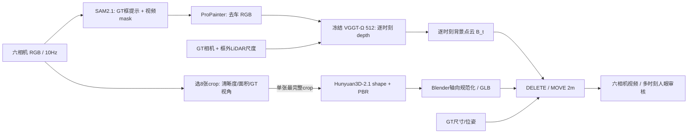

# V7.7 两场景显式资产 POC：背景 + GLB 的 MOVE / DELETE

2026-09-26，`WS-V77-EXPLICIT-POC-20260926/r1`，实现提交 `076fe223`。该试验是用户提出的最小成熟模块组合：冻结 VGGT-Ω 512、SAM2.1 large、ProPainter、官方 Hunyuan3D-2.1。零训练、两个已曝光开发 scene；**更正：原资产失败/路线关闭结论受未准入 MOVE、车头放反、相机投影和缩放问题污染，现已撤回；新审计见 [ACTOR_COMMAND_AUDIT](ACTOR_COMMAND_AUDIT.md)。** 人工 `human_verdict: null`，等待用户查看[两场景视频页](../autoresearch/worldsim_v77/explicit_poc_20260926/review_link.md)。这不是 VGGT、ProPainter 或 Hunyuan 模型单独的能力上限，也不是多视图 2mv 的结果。

## Architecture components

## 输入角色与固定分母

| scene / actor | 选择理由 | SAM2 非空帧（相机） | 完整补景序列 | 本页Ω背景和编辑 |
|---|---|---|---|---|
| `scene_0230 / 22` | 前轮已知困难背景 | CAM0 6、CAM2 13、CAM4 18、CAM5 33 | 对应4流，每流50帧 | f=0,5,…,45，10时刻×6相机 |
| `scene_0255 / 25` | 当前较清楚的对照，后段仍有杆遮挡 | CAM1 11、CAM3 100 | 对应2流，每流100帧 | f=0,10,…,90，10时刻×6相机 |

同一 processed 10Hz 输入；原始逐相机 timestamp 不可得。SAM2 的首框和逐帧门控来自目标 GT 3D 框投影，不是 Grounding DINO 的零真值自动检测。每场景选 8 个 crop，但官方 2.1 shape 和 PBR 实际只用了一个最完整 crop：scene_0230 `f005/CAM2`，scene_0255 `f010/CAM3`。当前 Ω 每帧坐标 gauge 未跨时刻统一，选帧视角多样性使用 GT 相机/对象位姿，不能称“仅 Ω 自动选帧”。用户的 `bus.blend` 与参考拼图是手工制资产流程示例，没有用于这两个目标的网格、UV 或贴图。

Ω只接六相机去车 RGB。`B_t` 点云按 GT 相机内外参和**全部 GT 框以外 LiDAR**的单尺度对齐；每个采样时刻分别推理，未融合成持久 4D 世界。MOVE 使用 GT 对象每帧位姿与尺寸，同一 GLB 沿参考相机水平屏幕右方向在世界平面固定平移 2m（scene_0230 f005/CAM2，scene_0255 f020/CAM3），全部时刻同一位移向量；`placement.json` 保存精确数值。DELETE 不叠加 GLB。像素页使用 Blender 透明资产层与 ProPainter 视频或 Ω 点投影合成，没有深度遮挡、阴影、反射、照度匹配。旧MOVE方向未做合法性检查；以下描述仅记录原实现，不构成命令准入。像素合成不足不能作为唯一失败证据，故单独观察无资产的 DELETE 和独立 GLB。

## 实际完成与资源

- 官方 Hunyuan3D-2.1 形状：scene_0230 101,564 顶点/203,124 面；scene_0255 98,966 顶点/197,928 面；50步、seed 7701/7702、约44秒/目标，峰值约7.6GiB。
- 官方 PBR 纹理：各一个 OBJ + albedo/metallic/roughness 贴图；scene_0230 148,008 顶点/203,124 面、191.6秒、峰值13.47GiB；scene_0255 142,828/197,928、171.4秒、峰值13.44GiB。形状与纹理顺序运行，RTX3090 24GiB。
- 导出时发现 Hunyuan OBJ 在本次模型输出中局部 `+Y` 对应车高、`+Z` 对应车宽；固定绕 X +90°规范到 v77 的 X长/Y宽/Z高后重渲染。修正前的侧翻合成不用于结论。Blender 5.2.2 LTS 实际复导入两个最终 GLB，均为1 mesh、有效 UV、1 material、贴图可读取，面数203,124/197,928。
- ProPainter 跑完 6 个活跃相机流；Ω 对去车六视图新增 20 次冻结前向，每时刻约115–158万点，前向及读出峰值约5.26GiB。点数不等于背景质量。

官方源与权重：`facebookresearch/vggt-omega` 512 检查点见已有[来源记录](checkpoint_manifest.json)；SAM2.1 large 官方检查点；ProPainter 官方 Space 代码与同名公开权重镜像；Tencent 官方 Hunyuan3D-2.1 shape/PBR 权重、官方源码commit `82920d643c0dc2f7bfd7255f45f62d386edfe60c`。PBR 的 DINOv2 giant 和 RealESRGAN 权重用于官方纹理管线。所有模型冻结。

## 观察、停止判据与边界

1. **Background**：`scene_0230/CAM2/f005` DELETE 留下大块深色涂抹；`scene_0255/CAM3/f020` 有灰色车形残影。原位置没有纯黑空洞，不等于闭合成功；两例固定失败证据可在视频中逐帧复核。
2. **Asset（归因已更正）**：两 GLB 可在 Blender 正常导入；原来基于合成认定“另一车型”的结论撤回。审计发现 scene_0230 车头放反，scene_0255 投影与逐轴缩放有问题。相同 GLB 的修正控制、用户形状反馈与剩余材质/成像边界见新审计。单图 PBR 仍不能证明 8 张候选视角已被利用。
3. **MOVE 2m（旧命令未准入）**：scene_0230 旧命令50/50帧与邻车框相交，scene_0255 最小框间距仅8.4cm且未查静态环境。旧MOVE只保留为诊断，不能作为合法编辑验收用例；原位置补景残影与合成遮挡/阴影缺失仍存在。
4. **Temporal**：10 个真实采样时刻中同一 GLB 不逐帧再生成，资产身份在网格层固定；视频层仍受逐时刻 GT 位姿、补景残影和 Ω 点投影覆盖变化影响。逐场景原始/原位/横移和两种 DELETE 均在离线页。

Ω背景远处和天空存在深灰无点区域，固定 3×3 point splat、可见深度截断与天空无几何共同影响，**不单独归咎于 Ω 网络**。`scene_0255` 是“相对清楚”控制，非全时刻无遮挡。两场景均已在前轮 v77 观察，预训练重叠未知；没有独立新场景或高保真通过率。原先称“背景与资产两个独立失败证据”并关闭拼接入口的推断已撤回：补景观测独立成立，资产结论受工程错误污染。现保留该路线待合法指令与放置控制后的评价；不据此扩大训练或自造网络。2mv仍未验证。

## 复现与产物

完整运行和日志：`/root/autodl-tmp/runs/worldsim_v77/WS-V77-EXPLICIT-POC-20260926/r1/`，包含注册、掩码、去车逐帧、选帧、Hunyuan shape/paint、20份Ω prediction/背景点、Blender/合成日志。最终本地页面在 `C:\Users\dengyunlong\Documents\Codex\2026-09-26\xia\outputs\v77-explicit-poc\index.html`，每scene六段10帧六相机同步视频及最终GLB。`review_data.json` 记录采样帧率和分母。轻量证据索引见[本run](../autoresearch/worldsim_v77/explicit_poc_20260926/)。

`failure_ledger_refs: [V76-F03, V77-F01, V77-F02]`；`failure_ledger_delta: V77-F02`；`human_verdict: null`。
