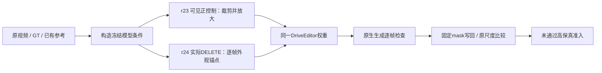

# v77：外观尺度与持续条件的两项控制

Task `WS-V77-HYBRID-BG-20260927`，r23–r24，2026-09-28。此前检查点是实质进展：r21修掉围栏写回碎块，r22揭示细节与跨窗限制。用户优选的r18以及独立r21局部修复继续保留，本轮不替换它们。

两个控制依次运行，并没有同时替换生成器或组合两项变化。无训练、新下载、模型家族、Ω、GLB或MOVE。

## r23：对象成像尺度有局部收益，未恢复完整时序身份

scene_0255 actor52 / CAM3 / f130–139，是原车本来可见的oracle重建正控制。基线为r16有首帧贴入的官方零位移条件。把全10帧mask包络裁到 `[488,216,512,288]`，再变为1024×576推理；车宽高2倍、面积4倍。ROI由固定几何规则选择，不按生成结果挑选。

实际只变换视频RGB条件、mask、fusion mask、六面深度和归一化位置/box height；参考图、CLIP、SV3D、方位索引、物体比例、seed42和25步保持。数据仍来自原r16的1024×576条件，没有额外事实像素。crop同时减少上下文与改变尺度，不是纯latent分辨率因果实验。

逐帧查看相同显示尺寸的真实车/r16/r23：新前几帧更接近原前脸，部分软化/拉伸减轻；随后仍发生细节变形。后段真实行人和杆件挡住车辆，而框内条件也移除了部分遮挡物，必须区分身份失真与遮挡重建；最后一帧明显变差，不将整个10帧判为通过。

去掉作为条件的f130后，同原图尺度、同GT投影框与模型mask交集，平均MAE从29.169降到26.716；9帧中8帧下降，f139从29.828升到35.061。集合包含背景和前景遮挡，不是纯车表面真值。不能以平均值降低认定高保真，也不能据最后帧遮挡失败否定整个crop方法。停止本次crop配置的实际DELETE扩展。

## r24：重复先验更稳，但先验缺细节仍是限制

回到实际DELETE：scene_0255 / actor25 / 保留actor52 / CAM3 f65–74。冻结r18整帧配置，只在后9帧加入保存的r17对应315° SV3D图，按原GT52投影、比例放置。首帧条件和另外11组payload完全相同；每帧mask外变化0，后9帧新增约7503–7942像素。没有加入r23裁剪、更多真实背景或新模型。

实际10帧粗轮廓更贴近给定先验，部分时序形状更稳，但可信前脸/车轮细节没有恢复，亮边、暗侧模糊和平面贴图感仍在，部分增强。判断为“稳定低细节先验”的局部现象，不替换r18、不继续延长该配置。后9帧条件可通过时序模型影响首帧输出，因此只声称首帧输入相同，不声称首帧结果相同。

所有RGB锚点都是已有生成先验，不是真实被遮挡表面。官方流程只贴入关键帧，这次全帧贴入是输入适配，可能产生视角钉死或重复纹理。最终图故意继续旧围栏写回，黑碎块是已定位的另一问题；原生与写回独立展示，不把碎块重新归给模型，也没有覆盖r21较好结果。

## 资源与验证

两次各10帧、10Hz，无插帧。r23推理153.01秒；r24 151.88秒，峰值已分配显存均约22.43GiB，RTX3090串行、4 CPU线程。全部GPU任务终止于正常完成状态。

r23原r16条件逐像素一致、原mask往返、位置变换及回原尺度写回检查通过。r24旧r18上下文精确比对、其余11组条件不变、改变范围检查通过。12个本地视频120帧实解码、42个HTML引用、内联JS语法通过。逐帧原生图及原尺度比较均已查看；未冒称浏览器交互通过。人工最终verdict=null，background_input_dir=null。

第三例输入协议已复核并固定：既有official_000 / actor12 / CAM0 f0–29，右侧移动黑色MPV、道路与施工护栏；原图f0/15/29与登记一致。本轮只检查输入，无第三例新生成。三例都是已用开发场景，不能宣称独立泛化或训练无重叠。后续沿同mask角色、源数据权限、固定条件和逐阶段审核，不按输出挑场景或增加单例手工规则。

下一步先在第三scene的**实际可见路面**做原RGB重投影正控制，确认共享的事实像素复用可靠后才处理删除洞。保留0230困难例与0255当前基线。r23/r24的不足没有否定background+explicit assets或DriveEditor整个家族；它们只说明这两种输入适配尚不足以给出高保真结果。持续目标未完成。

审核：`C:/Users/dengyunlong/Documents/Codex/2026-09-26/xia/outputs/v77-hybrid-delete/object-scale/index.html`。轻量证据：[输入/结果/协议](../autoresearch/worldsim_v77/hybrid_bg_20260927/appearance_controls/review_link.md)。完整原帧、中间条件、视频与失败控制在同task的r23/r24和crop_review。
