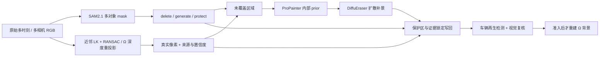

# v77 Hybrid Background Builder：下载与推理前准备

唯一 task/run：`WS-V77-HYBRID-BG-20260927/r1`。本轮依据用户附件，只准备 scene_0230/actor22 与 scene_0255/actor25 的新补景入口；**模型下载完成后停止，等待用户开启 GPU 并继续**。下载、导入和 CPU 合同检查均不算模型效果实验。

准备结果：18个文件全部落盘，官方元数据尺寸核对、JSON/safetensors元数据解析、离线模块与tokenizer加载通过。独立环境使用官方固定的torch2.3.1/diffusers0.29.2等依赖，`pip check` 无冲突，4项CPU测试在该环境通过。没有实例化模型，没有GPU前向；准备进程收口后等待用户。逐文件验证见 `preparation_validation.json`，环境精确版本见 `requirements.lock.txt`。

验证命令（远端仓库根目录）：

```bash
CUDA_VISIBLE_DEVICES= OMP_NUM_THREADS=1 /root/autodl-tmp/envs/worldsim-v77-diffueraser/bin/python -m unittest discover -s scripts/worldsim_v77 -p test_hybrid_masks.py -v
CUDA_VISIBLE_DEVICES= OMP_NUM_THREADS=1 /root/autodl-tmp/envs/worldsim-v77-diffueraser/bin/python scripts/worldsim_v77/hybrid_validate.py
/root/autodl-tmp/envs/worldsim-v77-diffueraser/bin/python -m pip check
```

## Architecture components



Ω、原 GLB 和 DELETE/MOVE 算子保持原实现；本轮仅 DELETE。当前默认仍指向旧 DriveEditor FULL，候选尚未替换默认。第三 scene 的既有失败证据保留，但不纳入此次试验。

## 官方来源与最小下载

- [官方 DiffuEraser](https://github.com/lixiaowen-xw/DiffuEraser)，本地源码 `/root/autodl-tmp/third_party/worldsim_v77/DiffuEraser`。源码 revision `8e6f279ac7531e27ad1849c6f8dab5372a8597e7`。
- 主模型来自作者的 [Hugging Face](https://huggingface.co/lixiaowen/diffuEraser) / [ModelScope](https://modelscope.cn/models/xingzi/diffuEraser) 两个官方入口。实际下载源、revision、逐文件大小记录在 `download_manifest.json`；大文件用官方 ModelScope 直连。
- 主模型 BrushNet + UNetMotion：8.798 GB；SD1.5 只取 text encoder、tokenizer、scheduler、feature extractor、safety checker；另取 VAE 和官方默认 PCM 2-Step。共 18 个新文件、10,976,973,634 bytes（10.977 GB）。不下载 SD1.5 重复 UNet/VAE、训练 motion adapter 或其他 PCM 变体。
- 复用原有三份 ProPainter/RAFT/flow-completion 权重（199,237,191 bytes），通过符号链接挂入新目录。这是 **DiffuEraser 官方推理依赖**，不是重开 ProPainter 独立实验。
- 全部推理模型放 `/root/autodl-tmp/models/worldsim_v77_diffueraser`。使用独立环境 `/root/autodl-tmp/envs/worldsim-v77-diffueraser`，不改旧 DriveEditor/SAM2 环境。
- 第一版局部配准用 OpenCV LK + RANSAC，不额外下载 CoTracker。TABE 是存在明确 amodal 缺口时的后备，本轮不引入。

## 三类 mask 的准确含义

`M_delete` 是目标必须消失的可见范围，包含经图像检查确认的目标边缘/阴影；不能拿 amodal 轮廓覆盖前景邻车。`M_protect` 是可见邻车、前景杆件/护栏等不能改动的区域，不把目标遮挡后的未知设施当成已观测保护像素。SAM2 多对象传播与目标/邻车身份核对仍需 GPU。

`M_generate = Dilate(M_delete) \ M_protect`。膨胀半径暂定 16 px（960 宽坐标），先审 mask 再固定，不做阈值扫表。目标 mask 与 protect 重叠时阻断并查实例归属，不静默丢掉目标像素。

`C_observed` 先经过明确来源、遮挡与配准检查，转成接受/拒绝的布尔支持。不能直接拿任意非零 confidence 做减法。分别保存：

- `H_delete = M_delete \ C_observed`：目标区域里仍缺真实证据的洞，作为主要覆盖率分母。
- `H_generate = M_generate \ C_observed`：允许扩散处理的范围，包含为生成器留出的局部上下文。

给模型的是带真实证据的输入及 `H_generate`。最终输出锁定 `C_observed` 像素、`M_protect` 和 `M_generate` 外像素；PNG 是逐像素检查的标准，压缩 MP4 只用于 review。不宣称把三个 mask 直接喂给未经适配的官方网络；三 mask 是外部工程控制。

CPU 实现 `hybrid_masks.py` 已定义这些约束，4 项测试覆盖邻车保护、证据/残洞分区与精确写回、实例冲突拒绝、浮点 confidence 误用拒绝。测试通过不代表真实分割正确。

## 真实证据的来源与边界

上一轮已试过“Ω/GT/LiDAR 证据 + residual”；新方案不能把它当成从未做过。该轮 0230 真实支持为 0%，0255 为 1.69%，未能证明充分背景证据是否有效。本轮新增近邻的局部配准路径，且与 3D 路径分开保存覆盖率。

先在原始视频近邻帧上用背景特征做 LK 双向检查和 RANSAC 局部 affine/homography。拟合点和被搬运像素都须排除目标与其他动态 actor；不能只在少量角点上拟合成功，就把整块平面外推当作真实背景。保留 source frame/camera/pixel、inlier residual、forward/backward residual、valid footprint；明显非平面、视差或遮挡处交由 Ω depth + GT calibration 重投影并做深度/遮挡检查。

只使用 factual RGB；旧生成背景不能做真实 evidence。接受原像素不意味着隐藏背景真值已知；如果后续需要训练，这类重投影只能作为有遮挡检查和有效区域掩码的监督，不能把所有 warp 自动命名为真实 GT。

## GPU 恢复后的最小执行配置（尚未执行）

| 场景 | 目标/相机 | 固定窗口 | 首要问题 |
|---|---|---|---|
| scene_0230 | actor22 / CAM5 | 原 f18–47，共30帧，10 Hz | 原 DELETE 背景再次出现车辆 |
| scene_0255 | actor25 / CAM3 | 原 f65–94，共30帧，10 Hz | 邻车损伤、灰白目标轮廓 |

先补多对象 protect 与局部 evidence，逐帧确认目标身份。DiffuEraser 使用官方 `2-Step` PCM、guidance 0、seed 42，窗口30帧大于官方最小22帧。先只跑两例各一次，不扫 seed、不并行其他生成器。输出上限960，官方按8对齐后为 **960×536**；同窗口旧 DriveEditor 对照重采样到同尺寸，保留原分辨率视频。GPU 显存仍须实际预检；官方960×540约20GB是估算，不承诺3090一定不OOM。

官方代码的实际迁移点：

1. DiffuEraser `read_mask()` 会先腐蚀1次、再按迭代数膨胀；设 dilation=0 仍会腐蚀，不能以为关闭了 morphology。
2. ProPainter prior 自己也有 flow/image mask 膨胀；两条路径需显式消费同一受保护的 mask，避免内部再次扩大到邻车。
3. mask 视频以 `>0` 二值化，压缩振铃可放大区域；用 canonical PNG/无损 mask 适配并做输入输出边界核验。
4. `read_priori()` 默认删除读完的 prior；接入时保留 prior，不能丢掉归因证据。
5. 最终默认21×21模糊融合会越出 mask；在无损输出上重新施加 protect/observed/outside 锁定，并分别保存原生补景和最终写回。

以上官方默认与三mask合同不一致处，须在 GPU 运行前完成适配和 CPU 预检；**本次准备不冒称完整 hybrid 已接通或 GPU 可运行性已验证**。

## 验收与停止

保留原视频、旧 DriveEditor、三mask、真实 evidence、内部 prior、DiffuEraser 原生输出、最终 DELETE 和失败 guard。0230看真实支持/残洞比例与车辆再生；0255看邻车保持、灰白区域和删除完整度；两例都看结构与时序，人工 verdict 保持 null。

沿用 GroundingDINO + SAM2 匹配原 target/邻车轨迹。没有 factual 身份支持的新车返回 `FAIL_ACTOR_REGENERATION`，阻断 Ω。已知检测器漏掉灰白车形，零检测不可自动通过，仍需逐帧视觉审核。

若两例均明显改善再考虑自动化；若仍有再生车、灰白形或误删，记录同一 V77-F02 并停止此次成熟模块组合，不无限追加模型。当前无训练、无新Ω前向、无新GLB、无定时任务。`failure_ledger_refs: [V77-F02]`，当前 `failure_ledger_delta: none`（只准备，没有新质量实验）。
