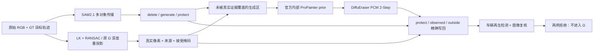

# v77 Hybrid Background：两场景 DELETE 实测与停止结论

`WS-V77-HYBRID-BG-20260927/r2`。用户恢复 GPU 并授权继续后，本轮完成三 mask、真实证据优先、DiffuEraser 残洞补景及车辆再生 gate。**两例仍未得到 actor-free background，不准入 Ω；按既定 stop rule 停止该成熟模块候选。** 原 DriveEditor FULL 默认和全部新旧结果保留，未训练、未改 GLB、未执行 MOVE。工程失败判定不代替用户验收：`human_verdict: null`。

本地审核入口：`C:/Users/dengyunlong/Documents/Codex/2026-09-26/xia/outputs/v77-hybrid-delete/index.html`。原 run：`/root/autodl-tmp/runs/worldsim_v77/WS-V77-HYBRID-BG-20260927/r2`。轻量记录见 `docs/autoresearch/worldsim_v77/hybrid_bg_20260927/r2/`。下载阶段为 r1，保持独立，不把下载验证计为推理结果。

## Architecture components



三个 mask 是外部边界控制，不是向官方网络增加三个训练通道。模型实际消费带真实像素的 RGB 和 `residual_generate`；`residual_delete` 用于目标删除区覆盖率统计。内部 prior 是 DiffuEraser 官方依赖，没有恢复独立 ProPainter 实验。

## 冻结输入、配置与合法性范围

| 场景 | 目标与相机 | 源帧 | 实际输出 |
|---|---|---|---|
| scene_0230 | actor22 / CAM5 | 18–47 | 30帧，10Hz，3秒 |
| scene_0255 | actor25 / CAM3 | 65–94 | 30帧，10Hz，3秒 |

两条 GT track 各30帧身份一致，DELETE 不新增物体占据。没有执行过去未准入的 MOVE；这只确认对象身份和删除语义，不是完整交通规则合法判定。两者都是已曝光开发例，官方训练重叠未知，不能外推为新场景泛化。

DiffuEraser 官方源码 revision `8e6f279ac7531e27ad1849c6f8dab5372a8597e7`；seed42、PCM `2-Step`、guidance0、960×536、30帧单窗口；每例一次生成，没有 seed/模型扫表。官方模型与采样未改，运行时只替换 PNG I/O、mask 读取和输出捕获。原生输出、官方 composite、最终锁定写回分别存档。

GPU 为 RTX3090 24GB。独立环境 `/root/autodl-tmp/envs/worldsim-v77-diffueraser`，torch2.3.1+cu121 / diffusers0.29.2。内部 prior 采用0.6倍尺寸，原生约576×320；展示时上采样。prior耗时8.32/7.45秒，diffusion及写回40.49/41.07秒，模型加载等合计111.43秒。PyTorch peak allocated10.22GiB，运行中nvidia-smi显存占用接近24GB，不能将allocated当作整机需求。检测使用原SAM2环境，GPU过程均串行。

## 输入修正与自动化例外

SAM2.1从目标、邻车、围栏、杆件等首帧种子进行多对象传播；另合入逐帧原图邻车检测以覆盖新进入视野者。目标核心与保护范围按可见实例归属处理，delete扩3px，generate再扩16px并排除protect。该分割不是GT；模型外合同通过不代表实例归属一定正确。

0255初版SAM2把围栏孔洞当成实心保护区，会把孔洞后的目标保留下来。助手看首帧后提供14个SAM2点（6正8负），视觉选择镂空候选0，再传播。**这是含助手图像提示的POC，不是全自动结果。** 没有TABE/amodal推理，没有把遮挡目标的完整形状当成已知。

首次围栏homography在末帧退化：局部内点残差虽低，但点接近共线、远处投影发散。该输入在模型前被拒绝；最终改为LK/RANSAC相似变换，要求有界尺度与至少8内点，实测30帧最少10内点、最大中位拟合误差1.231px。实心mask、退化结果、提示、最终结果均保留。0255证据准备曾使用正在修改的mask，发现后归档并在冻结最终mask上重做；生成前60帧输入合同重新验证。不能把这些工程准备错误记成模型质量失败。

## 真实证据：接受量非常低

| 场景 | delete像素·帧 | 时序接受 | 几何接受 | 覆盖率 | delete残洞率 |
|---|---:|---:|---:|---:|---:|
| 0230 | 469403 | 2 | 0 | 0.000426% | 99.999574% |
| 0255 | 269840 | 0 | 735 | 0.27238% | 99.72762% |

分母是30帧目标delete区域之和，不是全图或更大的generate区域。generate上下文中接受的像素另在逐帧证据记录，因此不能把总provenance检查数误当成目标覆盖率。

时序路径使用原始RGB、近邻±3/6/9/15/24/36帧、LK双向误差<0.75px、局部homography RANSAC1.5px；至少20内点、内点率≥0.75、中位误差≤0.7px。特征和donor像素均排除GT动态actor投影包络（底部扩0.6m），仅接受内点凸包内且离最近内点≤48px的局部支持，不向整块道路外推。光度锚点≥200、中位RGB平均误差≤12；两个donor相隔≥5帧、RGB最大差≤20，接受mask再腐蚀1px。逐候选保留接受/拒绝原因、变换和source frame/pixel。

几何路径复用上一轮**原RGB**的冻结Ω donor，不是重新运行生成背景Ω。使用GT calibration及≤20cm LiDAR支持、贴地actor排除；两个独立时刻需深度差≤0.25m、RGB最大差≤25并腐蚀1px。保存原donor索引和来源。没有把旧DriveEditor或当前生成图作为真实依据。

时序搜索限定在目标GT轨迹有标注的帧，最大偏移3.6秒；没有搜索轨迹消失后的未标注帧。多相机几何来源限于上一轮已审缓存，也不是重新遍历全部日志。这证明本次候选池与规则下合格证据量不足，无法检验“有充分真实背景时，hybrid能否成功”。候选范围、保守阈值、稀疏几何、可见性与局部模型均会影响接受量；**不能据此证明背景从未被拍到**。重投影是带条件的监督候选，不可自动称为完整真实GT。

## 实际画面与语义检查

0230在f18出现灰色立面/块状结构和暗影，f25有拉长深色轮廓，后段f33/f47仍可见棕黑车形。0255在围栏后持续有银灰SUV轮廓和涂抹条带。0230部分失败像素从深色车形变成灰块并不等于删除成功；0255保护更多原围栏/邻车也不等于原目标被删除。内部prior已有涂抹和车形，后续diffusion保留或增强了部分轮廓；这是阶段关联观察，未证明prior是唯一原因。

GroundingDINO-tiny + SAM2.1 large的box/text阈值0.25；需编辑区交叠≥32px、目标核心占比≥0.05，且与原邻车mask的IoU<0.5才记可疑新车。两例原车正控制均30/30命中；选定空路面负控制均0；旧0230/f25已知幻觉正控制命中。

| 场景 | prior可疑帧 | 最终可疑帧 | 最终protect变化像素 | 独立原邻车mask中变化像素 |
|---|---:|---:|---:|---:|
| 0230 | 18/30 | 21/30（f27–47） | 0 | 430 / 1279616，0.034% |
| 0255 | 27/30 | 30/30（f65–94） | 0 | 2862 / 861732，0.332% |

检测器会漏掉灰白块，前9帧未触发不表示0230合格。上述比例不是删车成功率。邻车分母是重新检测得到的可见区域，不是GT全覆盖；protect零变化只约束当前mask，不保证每个邻车像素都被保护。prior经过低分辨率处理，**不使用其全图像素变化量衡量误删**。没有可靠灰白残影GT，不将简单亮度阈值包装成“马赛克面积”或删除完整度指标；这些缺陷由视频与检测证据展示。

## 验证与输出

60帧验证：mask分区互斥、生成区分解、protect及generate外像素不变、observed精确锁定、residual精确来自native输出；真实证据来源逐像素检查，时序来源间隔符合要求，几何donor的RGB和LiDAR支持符合记录。两条track身份检查通过。此为工程合同，不是视觉通过。

24条MP4全部实际解码，每条30帧，合计720帧，960×536/10Hz；传到本地后再次解码通过。63处本地页面引用、内联JS语法检查通过；4项三mask CPU合同测试通过。浏览器工具因file URL安全策略拒绝预览，未绕过；没有宣称浏览器播放/同步交互实测通过。主三栏为原始目标高亮/旧DriveEditor FULL/新版最终DELETE，另有同裁剪放大、三mask、证据图、内部prior和原生输出。PNG是精确验证依据，MP4仅供人眼。第一次打包因PATH无ffmpeg失败，改用已有imageio_ffmpeg二进制并完整解码，未重跑GPU。所有模型输入、各阶段原PNG和失败工程尝试均保留。

远端可复核命令（已产物上只读验证）：

```bash
CUDA_VISIBLE_DEVICES= OMP_NUM_THREADS=2 /root/autodl-tmp/envs/motionproj/bin/python scripts/worldsim_v77/hybrid_validate_run.py
CUDA_VISIBLE_DEVICES= OMP_NUM_THREADS=1 /root/autodl-tmp/envs/worldsim-v77-diffueraser/bin/python -m unittest discover -s scripts/worldsim_v77 -p test_hybrid_masks.py -v
```

执行脚本具有已存在run/阶段拒绝重启检查，不能在r2目录盲目重跑模型或mask准备。完整代码保存为`scripts/worldsim_v77/hybrid_*.py`，本次是固定开发run脚本，不宣称通用生产pipeline。

## 停止、保留与后续边界

两例`FAIL_ACTOR_REGENERATION`、`background_input_dir: null`；0新Ω前向、0新GLB。默认配置未切换到该候选，旧FULL仍保留且已知有自身失败；不是将旧版标成合格。旧/新模型、mask、上下文和分块历史不同，页面对比不是严格单变量消融。当前证据没有否定GLB、整个background+explicit asset表示或DiffuEraser所有配置。

按用户明确stop rule，不继续换seed、放宽语义gate或增加成熟生成器。下一阶段若转数据路线，应先盘点真实可见背景与可靠配准覆盖，再构造真实干净视频的车辆形mask遮挡监督；reveal/warp只在可见且有支持区域监督，按scene分割训练验证，生成补景不作为真实GT。本轮没有启动训练，也没有证明当前两个低覆盖case能提供充分训练GT。

`failure_ledger_refs: [V77-F02]`；`failure_ledger_delta: updated V77-F02`；`human_verdict: null`。官方迁移点及权重来源见下载阶段报告 `HYBRID_BACKGROUND_PREP.md`，当前状态只维护 `docs/RESEARCH_STATUS.md`。
