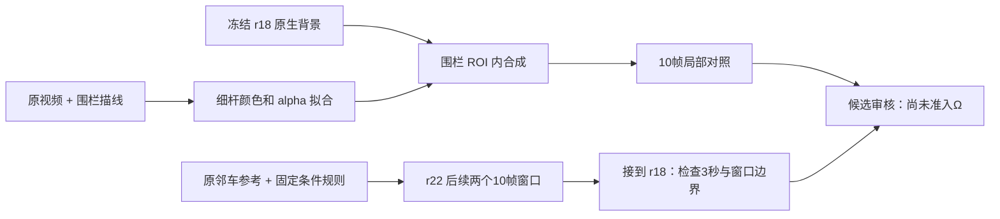

# v77：保留r18，围栏写回与后续时间窗

Task `WS-V77-HYBRID-BG-20260927`，run r19–r22，2026-09-28。Scene_0255 / DELETE actor25 / KEEP actor52，CAM3。用户明确判断 **r18 > r15，值得保留继续修**；这是相对质量评价，不是最终DELETE通过。r18原版完整保留，r21单独作为可撤销的局部修复。

## 结果与原因

r21消除了r18旧保护写回中的轮胎状黑块。10帧逐张检查，细杆比“细mask直接复制原RGB”的控制更连续；后者仍有深色断线。中栏采用alpha>0.15硬阈值而新结果用连续alpha，控制尚未分开颜色估计与软边缘各自的贡献。新杆偏平滑、暗，连接角近似；SUV车头、轮胎、反射仍粗糙。冻结原生背景，因此不把车身质量归功于围栏修复。

r22把r18同一规则用于f75–84和f85–94，再接到旧f65–74。两新窗口共20帧仍保持SUV粗轮廓，未出现r15那种明显低矮车型，但蜡状表面、车头/车轮细节不足仍在。f74/75与f84/85交界的前脸、轮胎明暗与围栏残影有变化；未做相机运动对齐，不把全部相邻像素差解释为模型闪烁。三个独立窗口不能作为无缝连续重建。r22固定旧写回，黑碎块仍在，不能据此否定r21在前10帧的独立收益。

## 逐步控制及停止边界

| Run | 输入与唯一关注点 | 实际结果 / 停止边界 |
|---|---|---|
| r19 | 原RGB f65..110、GT相机、LK与三角化，寻找能复用的真实围栏表面 | 300初始角点/50面板角点；跟踪漂到下杆/草地，0面板点通过原阈值。初次空索引dtype异常已保存，修正后仍无可用几何；不放宽阈值，不进行RGB合成。 |
| r20 | 原f65/f90面板四角，OpenCV单应强控制 | 四拟合点自洽，但独立右侧/底部杆件错位；不采用该warp，不把四点拟合误差当验证。 |
| r21 | 固定r18生成；原f65 RGB + r8助手描线 + 固定短窗LK | 21段杆件，16段拟合、5段短连接近似；单独拟合前景色/alpha，面板取腐蚀内部纹理。10帧局部改善，身份与高保真仍不通过。 |
| r22 | 同r18权重、参考、条件规则、seed42、25步、1024×576；仅查询时间改为f75–94 | 两次10帧独立生成，首帧各7478/7060像素新增对应SV3D先验，后9帧不贴RGB。保留SUV粗形状，细节/跨窗一致性不足；不扩成更长独立窗口，不换seed。 |

r19失败仅否定本次对应点/三角化支持；r20仅否定这组角点与变换，不推断所有相机或Ω几何错误。未证明背景未被观测。迁移的是[OpenCV官方投影/三角化/单应接口](https://docs.opencv.org/4.13.0/d9/d0c/group__calib3d.html)，不是新的网络。

## r21的实现与工程修正

原混合像素 `I = alpha F + (1-alpha) B_old` 不能直接作为新背景上的纯前景色。用原图每条细杆的横向剖面近似局部背景，拟合位置偏差、宽度和前景RGB；Gaussian PSF sigma=0.6，SciPy least_squares soft_l1、f_scale=6、最多250次。每第三个沿杆采样点留出；加权RGB MAE 7.51，对应不画杆控制15.85，尺度0–255。此误差只检验局部近似模型，不是隐藏背景GT或全图质量。

面板内部9×9腐蚀后取纹理，最近内部颜色延伸至边缘，8倍采样覆盖。几何为助手首帧描线、固定短窗LK，非自动SAM输出，未证明3D/长时序准确。原生成图不参与材质拟合。旧示意图“reconstruction/checkerboard”标签不准确；新报告重画为“源图/纯灰底渲染/alpha”，不声称源图重建成立。

初次r21从原图开始、在完整生成mask回写，扩大了围栏以外改动。该版本与源码全部保留。修正版 `r21/scope_fix` 从r18最终图开始，仅在已登记围栏ROI内恢复原生背景并重画杆件。逐帧实测ROI外与r18完全相同，模型mask外与原RGB相同。旧动态分割与真实前景杆有重叠，0–169像素/帧变化；不宣称所有邻车分割像素不变，需按遮挡语义复核。

## 输入角色、资源与验证

r22使用f130 CAM3原邻车52 SAM参考、GT相机/框/六面深度、冻结DriveEditor权重和r17保存的相对315° SV3D图作为每窗首帧条件。SV3D图是生成先验，不是真实隐藏背景。不是完全未经适配的官方deletion接口。参考晚于查询，属于离线BUILD输入；训练场景重叠仍未知。两个新窗口独立，没有上窗末帧条件；r21没有被扩展到这20帧，避免同时修改两个环节。

r19–r21无GPU生成。r22一次加载、两窗耗时154.35s/153.60s，峰值已分配显存22.427/22.425GiB，4 CPU线程。无训练/新权重/模型家族/Ω/GLB/MOVE，无定时任务或电源操作。

实际验证：r21 10帧ROI合同；r22参数化后的f65–74条件/原RGB/mask与旧r18/r15逐像素相同；30帧最终图mask内来自原生、mask外来自原图。12个本地视频200帧实际解码，58引用、JS语法检查通过。视频来自真实帧序列，未插帧。没有冒称浏览器交互已通过。人工相对评价只记录r18优于r15；r21/r22与最终DELETE人工verdict仍空，background_input_dir=null。

审核：`C:/Users/dengyunlong/Documents/Codex/2026-09-26/xia/outputs/v77-hybrid-delete/fence-writeback/index.html`。
轻量证据：[围栏/时间窗索引](../autoresearch/worldsim_v77/hybrid_bg_20260927/fence_writeback/review_link.md)。完整原帧、错误对照、拟合与视频在同task的r19–r22、fence_review；旧r15/r18与FULL默认全部保留。

持续目标未完成。下一步只拆跨窗条件与车身细节；稳定后按同一协议加入第三scene，输入可见性选例，限制新增手工条件，保留0230困难例。r21局部成功不外推成整个background+explicit-asset系统通过。
