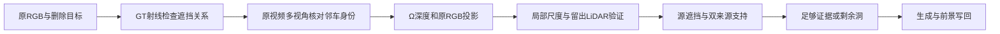

# v77：先校正DELETE语义，再细拆真实证据链

`WS-V77-HYBRID-BG-20260927/r10–r13`，固定既有两开发目标。当前目标未完成，本报告为继续迭代的中间证据；没有新的合格补景。新视频为原图及既有r3/r6的身份标注，零新生成推理、零Ω前向、零训练。

## r10：有车形不自动等于目标再生

0255/actor25是前排路虎；原视频另有银灰SUV actor52在后方。原GT和相机射线检查表明，四检查帧f65/72/80/94的目标SAM区域中，78.5%/78.8%/79.4%/83.3%有后方非目标车辆框支持，主要是52。0230对应四检查帧为6.4%/7.2%/16.2%/26.7%。包络不是精确可见网格，这些比例不等于真实像素GT。

因此撤回“0255删除区域任何车辆检测即幻觉”的过强解读。r2–r6的历史告警数原样保留，但只能作可见mask匹配告警；它可能漏掉合法显露的邻车身份。r4/r6通过遮住车列降低检测数，也可能错误删除这些邻车。不能据此追求空停车场，不能因此把旧r3车形认证为actor52。r3仍有明显形状模糊、保护碎块，既有结果没有准入。

在全日志每5帧、6相机中扫描GT包络候选，为actor25/52各挑最多6个相机方位差至少12°的原图。使用包络可见像素分数排序，未完全建模静态杆件遮挡；保留所有候选与实际参考。原RGB确认两者是不同实例，但仅凭外观相似不能证明生成身份正确。

## r11：首帧matting控制停止

固定r6生成图，使用PyMatting1.1.16（隔离vendor目录，不改既有环境）closed-form alpha及多层前景颜色估计。首帧1600×900原RGB、助手r8线/面板、局部亮脊偏移±10px；ROI(570,495,975,665)，trimap细杆前景1px、未知9px，横杆未知11px，面板腐蚀9/膨胀11px，CG上限2000。alpha与前景RGB估计后仍有明显暗边/锯齿，停止此组合，未扩展为视频。既有细杆有真实暗面，不能把每一条暗线都视为污染。该结果不否定全部matting方法。

官方方法依据：[alpha API](https://pymatting.github.io/alpha.html)、[foreground API](https://pymatting.github.io/foreground.html)。实际源码、trimap、线位置、alpha、前景颜色和首帧图均保存。

## r12：先检查原始邻车像素为何投不回来

原证据链排除全部车辆，不能为只删一个目标的任务恢复隐藏邻车。控制保留actor52：19个时刻f65–155/每5帧、6相机，原RGB+缓存冻结Ω深度、GT相机/框/运动、每帧原LiDAR。源图仍排除actor25和其他对象遮挡，查询仅移除actor25。无生成图作为来源。

固定规则：Ω局部深度梯度<0.3m，框尺寸加0.1m，其他GT框射线遮挡排除，actor52 LiDAR距离≤20cm；3×3点投影，两来源间隔≥5帧且深度差≤25cm、最大RGB差≤25/255，再3×3腐蚀并排除保护区。实际13视图/451点；四查询严格支持均0。静态围栏可见性未完整建模，所以即使通过这些规则也不是隐藏GT。

把筛选继续拆开后，在f125/CAM1、f135/CAM3的稀疏LiDAR采样上，Ω深度中位偏差−1.102m、−0.779m；每帧actor52仅32/30个LiDAR点。f115/CAM1偏差更大且参考被路牌遮挡，不能把测量差都归因于同一种模型误差。具体逐级筛选数保存于depth_attrition.json。

## r13：局部尺度控制有效，但没有解决覆盖

仅增加actor局部median(LiDAR z / Ω z)比例校正。投影锚点按图像x/y排序，交替拟合/留出，各至少8点；比例在0.5–2内，留出中位误差≤0.25m且90分位≤0.5m才收录来源。此规则在运行前登记。该控制同时进行局部尺度拟合与来源准入，不是只对最终图乘一个数字。

5个视图通过稀疏留出检查（f125/C3、f130/C1/C3、f135/C3、f145/C3），留出中位误差从0.80–1.35m降到0.04–0.25m。其他准入规则不变，没有训练网络或搜索阈值。稀疏深度改善不证明完整表面几何或身份正确。

| 查询 | core像素 | r12最终支持 | r13单来源 | r13双来源 | r13最终支持 |
|---|---:|---:|---:|---:|---:|
| f65 | 9775 | 0 | 1220 | 186 | 47 |
| f72 | 9714 | 0 | 1182 | 178 | 26 |
| f80 | 9043 | 0 | 950 | 100 | 11 |
| f94 | 8588 | 0 | 745 | 74 | 1 |

总计85/37120像素帧（约0.229%）；每帧低于0.5%。可复核的改善只在局部深度/少量证据，尚不能形成完整背景，也不证明所有未通过像素从未被拍到。没有据此生成新背景、重跑Ω或改变默认路径。紫色诊断图表示未知，不是补景输出。

## 工程边界与保存

远端任务根`/root/autodl-tmp/runs/worldsim_v77/WS-V77-HYBRID-BG-20260927`，r10原RGB身份审计、r11单帧抠图、r12未校正、r13尺度校正；每组保存登记、源索引/参数、图像、数值和日志。CPU 4线程上限，0新GPU模型前向。新增8个标注视频各30帧，实际解码240帧；所有生成内容来自已保存r3/r6，未计为新独立样本。

本地审核`outputs/v77-hybrid-delete/stage-audit/identity-audit/index.html`，旧页仅新增显著更正入口并保留正文和备份。静态引用/JS语法/实际视频解码和图片已检查；未绕过此前浏览器URL安全策略拒绝，也不声称浏览器交互测试通过。

默认旧FULL、GLB、Ω与所有失败保留。`background_input_dir: null`，`human_verdict: null`，`failure_ledger_refs: [V77-F02]`，`failure_ledger_delta: updated V77-F02`。本轮纠正任务与诊断边界，未否定整个background+asset路线，也未交付完美补景。
