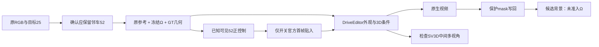

# v77：邻车补全条件的递归拆解

实际DELETE仍未通过；r18对应视角锚点有粗形状改善，但外观细节与写回污染仍在。r14已知可见证据投影仍不足；r15加入真实actor52参考和3D条件后生成错误车型；r16同视角官方条件正控制显示，首帧外观能影响前脸，但不足以保持后续身份与细节。本轮不以检测到车或检测不到车作成功判据，不改旧FULL默认。

## 组件与本次拆分

task `WS-V77-HYBRID-BG-20260927`，本轮run r14–r18。主要开发场景scene_0255：实际删除actor25，应保留后方actor52。此前已发现目标SAM射线多数有后方非目标车框支持；GT包络不是精确可见mesh，仍不能认证任意生成车型。

## r14：先检验已知可见区域的真实证据warp

输入是r13通过稀疏留出检查的5个原视图及其深度比例，重新用SAM2.1 large按GT52框提示，推理5张来源mask。各查询排除同时间所有来源；查询RGB和mask只用于评价。strict保留20cm逐点LiDAR邻近门控，dense仅去掉这一项，其他mask、包络、其他车辆遮挡、梯度、双时刻深度/颜色一致与3×3腐蚀相同。

| 查询 | 评价像素 | strict覆盖 | dense覆盖 | strict / dense命中处RGB中位绝对误差 |
|---|---:|---:|---:|---:|
| f125 CAM3 | 5475 | 11.07% | 19.74% | 7.00 / 9.33 |
| f130 CAM1 | 5359 | 10.26% | 35.32% | 26.33 / 30.00 |
| f130 CAM3 | 5642 | 9.02% | 32.97% | 8.00 / 9.00 |
| f135 CAM3 | 4623 | 10.23% | 22.89% | 14.67 / 12.00 |
| f145 CAM3 | 4438 | 8.27% | 13.32% | 6.67 / 7.67 |

两组命中集合不同，不能把表中的误差直接解释为同像素精度变化。稠密点提高覆盖但仍有大量缺口和色差，尤其CAM1，不能当作隐藏区域可靠来源。误差包含几何、曝光和视角相关反射的可能贡献，未分离其因果。紫色缺口和所有原SAM候选保留，不用低覆盖证明背景从未观测。

## r15：真实DELETE中的邻车参考条件

scene_0255/CAM3/f65–74，1024×576、10Hz、10帧、seed42、25步、单卡串行CFG、decode chunk1、无上一段生成条件。两组共用r3目标矩形与52投影1.05倍包络之并集，外部写回沿用r3写回mask；RGB及mask张量逐一相同。

- deletion：官方中性物体条件。
- neighbor：同输入，加原actor52的f130 CAM3 SAM隔离参考、CLIP、SV3D、GT六面深度/位置/比例条件。

这是利用已有DriveEditor物体条件接口补全保留对象的适配，不是官方原样deletion。不同视角crop未硬贴首帧；SV3D角度相对真实参考计算。查询与参考相差约59°–62°，离散SV3D选315°，仍有约13.8°–17.0°量化误差。条件包括多个新增量，不能把效果归因单一CLIP或深度输入。

实际结果：中性条件有不规则车形和暗块；邻车条件原生结果生成深色低矮、拉长的车身，没有保持参考银灰SUV的身份。两组最终写回又带回围栏附近轮胎样碎块。模型原生身份问题与保护写回污染分别失效；原生图同时缺失被遮掉的真实围栏，不能把其更连贯外观当正确完成。

20帧mask外像素变化为0，只证明写回合同，不保证mask精度。此配置停止，不扩展到30帧或其他scene。隐藏表面没有GT；原GLB与Ω不是这次失败位置。

## r16：只拆首帧外观锚点

把问题缩小到actor52本来可见的f130–139。同checkpoint、seed42、25步和分辨率。直接调用官方`get_editing('Repositioning')`，所有框零位移；官方生成的随机中心mask保存不变。保留已有串行CFG和边界贴入修复，不冒称完整官方环境无任何适配。

anchor组保留官方同视角首帧对象贴入，no_anchor组只取消该贴入；第0帧6910像素不同，第1–9帧完全相同，其余11组条件逐张量完全相同。两组都有同样的CLIP、SV3D和GT深度/位置条件，使用的是同一SAM隔离参考。

这是一项oracle重建诊断：允许把查询首帧真实车作为条件，而非用隐藏真值完成早期DELETE。末段有行人和杆件遮挡，投影框中的像素也不全是车。

逐帧观察：anchor前几帧前脸更接近参考；no_anchor更像另一辆浅色车。但两组后半段均有前脸简化、车身形变及前景附近涂抹，未保持原车细节。平均每帧框内RGB绝对误差anchor为29.071、no_anchor为27.744（0–255），没有整体数值改善；框包含背景和遮挡，不代替视觉判据。不能把r15失败仅解释为少了首帧贴入，也不把初期形似当成10帧高保真。

## r17：SV3D中间结果

仅仪器化重放r15 neighbor一次，10帧输出逐像素差为0；保留sampler的2D/3D latent并实际解码21个SV3D视角。所选315°视角仍呈SUV较高车身轮廓，车轮、暗侧和背面已有模糊/形变；原生视频进一步变成低矮拉长车身。此证据反对“3D分支输出已经完全是一辆轿车”的简单解释，但不认证3D身份正确，也没有单独证伪角度量化、尺度、特征对齐、mask上下文的影响。

重放157.87s，峰值已分配22.43GiB。这是旧条件精确重放，不计为新候选收益。依照该证据，r18只增加对应视角首帧RGB锚点，仍用同一模型。

## r18：对应视角锚点修复

仅把r17解码的315°视角经原官方get_obj_im_cond按GT52位置/比例贴入r15第0帧，改变8004像素，后9帧及原CLIP/SV3D/六面深度/mask/seed不变。源mask采用白背景非白最大外轮廓，完整保存；这是生成先验再次作条件，不是观测到的真实背景。

原生10帧保留了较高银灰SUV车身，较r15低矮拉长车身有局部形状改善。但表面蜡状、前脸和轮胎细节不足；固定旧保护写回又恢复黑色碎块，最终DELETE不通过。单次154.60s，峰值已分配22.43GiB；没有扩展已失败窗口或补做新模型。

新知识：对应视角首帧RGB锚点能在这个开发窗口改善粗车型保持，已有3D特征条件单独不足；它不保证高保真身份、阴影、遮挡或跨相机一致。下一步冻结此原生粗形状，只拆静态围栏保护写回的来源污染，先寻找原视频干净前景表面与可复核局部恢复控制。原生外观细节不足独立保留，不被合成修复掩盖。

## 输入角色、资源与边界

GT相机/框、后时刻原参考、稀疏LiDAR尺度与助手选例都是额外BUILD输入；这些scene已反复用于开发，不是独立测试；官方训练重叠未核对。无训练、新模型家族、新权重下载、新Ω推理、新GLB或MOVE。所有人工verdict为空，`background_input_dir=null`。

| run / arm | 实际输出 | 用时 | 峰值已分配显存 |
|---|---|---:|---:|
| r14 | 5次SAM2前向 + 5查询×2组CPU投影 | CPU投影5.29s，SAM单独日志 | 不把预处理算作视频生成 |
| r15 deletion | 10帧 | 66.31s | 21.86GiB |
| r15 neighbor | 10帧 | 157.17s | 22.42GiB |
| r16 anchor | 10帧 | 152.45s | 22.43GiB |
| r16 no_anchor | 10帧 | 155.03s | 22.42GiB |
| r17 | 仪器化重放10帧与21视角解码 | 见state.json | 见state.json |

单张RTX3090，CPU线程4，每组推理限600秒。不扫seed、不因明确失败继续扩窗口。r16打包曾在推理落盘完成前被状态断言拒绝，零产物；完成后正常打包，保留拒绝日志，没有重复GPU任务。

工程验证覆盖来源同时间隔离、RGB出处、双时刻支持、r15逐像素写回合同、r16单变量条件以及r17重放一致。9项相关几何/可见性测试通过。本地19视频/190帧实际解码、HTML引用与JS语法检查；没有声称浏览器播放交互已测试。审核包含原视频、原生生成、最终写回、10帧局部图、真实参考和所有关键中间结果。

本地审核：`C:/Users/dengyunlong/Documents/Codex/2026-09-26/xia/outputs/v77-hybrid-delete/neighbor-completion/index.html`。
远端完整证据：`/root/autodl-tmp/runs/worldsim_v77/WS-V77-HYBRID-BG-20260927/r14`至`r18`与`neighbor_review`。源码固定在现有DriveEditor checkout，接口来自[官方interactive_gui.py](https://github.com/yvanliang/DriveEditor/blob/main/interactive_gui.py)，原生编辑支持删除、重定位和参考物体条件；本报告只按实际适配结果陈述。

`failure_ledger_refs: [V77-F02]`；`failure_ledger_delta: updated V77-F02`。旧FULL默认仍有已知缺陷，本轮没有合格替代，不表示旧版通过。持续目标未完成；只停止具体失败组合。
