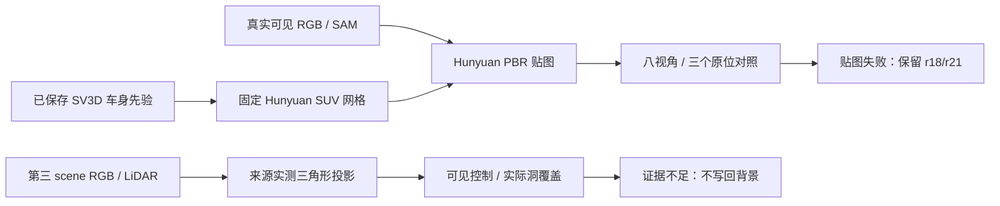

# v77：保留优选背景，分开检查真实路面证据和邻车资产

Task `WS-V77-HYBRID-BG-20260927`，run r36–r41，2026-09-28。用户对 scene_0255 的 **r18 > r15** 相对评价保留；r21 围栏局部收益和第三例 r30 首窗收益保留。本轮没有新的完整 DELETE 视频，未替换背景、未向 Ω 提供输入。所有新人工 verdict 留空。

## 输入、角色与资源

- scene_0255 DELETE25，KEEP52，原审核 CAM3 f65–94；新资产仅为真实后方邻车52。GT尺寸/位姿用于原位诊断，不能当隐藏外观真值。
- 第三开发例 official_000 DELETE12，KEEP34/后段59；r36–r39查询 f0/f10（测量审计还含 f15）。scene_0230 困难例保留但本轮无新生成。三例均是开发场景。
- r40输入原始 f130/CAM3 + 已有SAM，裁剪192×149；r41仅将形状输入换为已有 r18 SV3D view12/315°。该侧前图是生成先验。r41贴图仍以原始f130为参考，未再调用SV3D。
- 现有 frozen Hunyuan3D-2.1，seed7740，shape50步/guidance7.5/octree256，PBR6视图/512/use_remesh=false。两次形状各约43.5秒、峰值7.63GiB；一次PBR259.93秒、13.47GiB。CPU4线程，RTX3090，无训练/新权重/新模型家族。
- Blender5.2.2 LTS本地CPU4线程、Cycles16samples/seed7740、固定中性照明；8相机角度、3个GT原位×2朝向，朝向仅排查坐标歧义，非MOVE合法性实验。

## 第三 scene：测量支持改善不能直接变成可靠补景

r36发现释放的车前像素附近存在真实LiDAR路面测量。s10/20/25固定首帧平面附近点被拒绝，而来源局部平面可以解释不少点；图像最近邻关联不是深度真值。仅据此停用首帧平面外推，不能宣称整个相机链/Ω错误。

r37改为来源图像中的实际LiDAR三角形，局部平面只选地面点，不压平几何；边长上限3m/64px、源有效区腐蚀1px、来源目标SAM+3px、其他对象GT包络，透视正确纹理采样与z-buffer。原始相机和位姿不变。独立100条射线/三角形检查最大重投影误差3.925e-5px，自投影RGB误差0。它只验证实现，不能认证跨帧测量/可见性。

| 控制 | q0 | q10 | 结论 |
|---|---|---|---|
| r37可见共享像素 RGB MAE，旧→新 | 11.59→11.75，25016像素 | 7.16→8.52，23392像素 | 无整体改善 |
| r37实际路面洞 nearest / consensus | 0/0，分母1028 | 21/0，分母3001 | 多来源一致支持仍0 |
| r39后向单来源共享RGB MAE，旧→新 | 4.17→14.35，730像素 | 8.32→15.65，5853像素 | 颜色/对应未通过 |
| r39单来源洞支持 / 路面子集 | 125/1028（12.16%） | 111/3001（3.70%） | 只有少量底部道路 |
| r39支持 / 完整目标洞 | 125/2145（5.83%） | 111/3864（2.87%） | 不能当完整补景 |

r37 q10最后来源从r25的f30改为f25，非纯单变量消融；可见MAE均为0–255共享像素，不能跨不同分母直接排名。路面洞分母排除保留对象GT包络，包络不是精确遮挡真值。

r38尝试f50/f75 CAM5后向观测；预先选的路面ROI与留出检查中，f75 q90=16.34cm超过12cm而停止。唯一fallback r39只使用已独立合格f50（556留出点，中位4.20mm、q90=26.24mm），不放宽阈值。后向曝光/光照变化也可能影响RGB差异，不能由MAE断言几何全部错误。所有路面候选均未写入r30/r18或模型输入，不再扩同配置。

## scene_0255：形状有增量，外观仍未通过

r40真实正面单图生成开放货斗的皮卡。八视角确认不符合已知封闭SUV，停止贴图；没有因为文件可导入就采用。

r41唯一形状输入控制恢复封闭SUV。固定网格122424顶点/244828面，轮胎/底盘/前脸仍粗糙。形状候选保留，不能宣称细节或身份完全正确。三原位f130/135/145中，yaw0方向比180符合真实车头；未拟合光照、未处理前景遮挡，所以f145杆件被覆盖属于原始渲染层的已知限制。

r41一次官方PBR后，前脸包含原参考特征，但侧后部有无依据的斑驳绿褐色块，轮胎/车灯细节不可靠。停止当前纹理接入DELETE，不通过新模型/seed继续救这一输入。f130是生成祖先参考，不能当留出；其余两帧也是开发场景对照。

拓扑检查：r40一个连通分量、3个零面积面；r41七分量、5个零面积面，主分量244386面。顶点有限、封闭性检查通过。这些仅为文件/几何诊断，没有把长CPU UV阶段归因于拓扑，也没有用几何可读证明资产外观正确。当前GLB作为未定位诊断文件保留。

工程错误另存：远端Blender3.0色彩资源不完整，默认与显式OCIO均黑图；本地5.2.2首次按名称取shader节点失败，随后按节点类型创建后正常。错误图不用于模型结论。最初拓扑脚本在motionproj环境缺trimesh，改用已有Hunyuan环境成功；没有安装新依赖。

## 产物、验证与下一步

审核页：`C:/Users/dengyunlong/Documents/Codex/2026-09-26/xia/outputs/v77-hybrid-delete/retained-asset/index.html`。原视频/r18/r21是既有10帧对照，新增视频仅8角度固定资产环视，不能当4秒场景时序。包含原始输入、全部8视角、两个朝向的三原位对照、路面反例、轻量JSON、可下载GLB。

完整产物：`/root/autodl-tmp/runs/worldsim_v77/WS-V77-HYBRID-BG-20260927/r36`至`r41`；本地渲染上传各run的`local_review/`，黑图和原始状态完整保留。代码：`scripts/worldsim_v77/hybrid_road_measurement_audit.py`等本轮脚本。轻量证据见[retained_asset](../autoresearch/worldsim_v77/hybrid_bg_20260927/retained_asset/review_link.md)。验证范围见对应JSON：引用、图片解码、4视频38帧实际解码、JS语法、相机/算子检查；未做浏览器交互验收。

下一步仅检查真实actor52可用外观覆盖，把可见实测纹理和推断侧后表面分开，再决定是否修改纹理输入。不得重复同一正面单图PBR、首帧平面外推或相同后向双来源失败。不覆盖r18/r21/r30，不将局部车型修复升级为高保真补景。`human_verdict=null`、`background_input_dir=null`、`failure_ledger_refs=[V77-F02]`、`failure_ledger_delta=updated V77-F02`。

官方依据：本轮读取现有Hunyuan代码`hy3dpaint/textureGenPipeline.py`的RGBA白底合成与`use_remesh`路径；[官方仓库](https://github.com/Tencent-Hunyuan/Hunyuan3D-2.1)。来源实测投影沿用相机变换；平面限制参见[OpenCV官方单应说明](https://docs.opencv.org/3.4.8/d9/dab/tutorial_homography.html)，不把该文档当本次外观效果证据。
