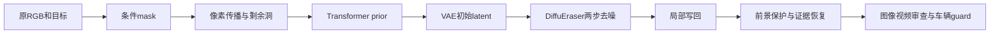

# v77：分阶段定位与写回控制

`WS-V77-HYBRID-BG-20260927/r3–r9`。这是继续迭代的中间检查点，尚未得到可准入的完整补景，不结束用户的持续目标。固定 scene_0230/actor22/CAM5/f18–47 与 scene_0255/actor25/CAM3/f65–94，各30帧、10Hz、960×536；均为反复曝光的开发例。

## 已定位的问题与控制

所有生成控制继续用原DiffuEraser权重、官方脚本的PCM 2-Step、seed42、guidance0，GPU串行；没有新下载、训练、Ω前向、GLB变更或MOVE。r8/r9仅CPU复用r6生成图。

| run | 具体改变 | 助手观察 / 证据 |
|---|---|---|
| r3 | 连贯目标外包矩形，左右上16px、下48px；模型条件不挖protect孔洞，最终恢复protect | 0230早段灰块明显减轻，后段及0255仍再生车形。形状、范围与保护处理共同变化，不能视为单一膨胀量因果消融。 |
| r3 prior probe | 不改输入，捕获mask、传播图、剩余洞、Transformer prior | 重跑prior与保存结果最大像素差0。传播阶段仍有大洞，C2已有车形；传播填充约18.1%/29.8%，不等于经几何验证的factual coverage。 |
| r3 noise control | 同mask和条件，将局部prior初始latent改为同seed噪声 | 仍有车形，反对“只要拿掉prior残影就解决”的假设；不证明prior完全无影响。 |
| r4 | 模型遮掉周围车列外包矩形，最终操作区域仍等于r3 | 再生车告警显著降低，但路缘、草地、杆件漂移，最终写回有硬接缝。0230按左半画面选择车列、0255选择全车列，是助手场景规则。 |
| r5 | r3局部条件 + r4在目标范围内的无车prior | 车形又明显出现，不采用。合成prior是生成提议，未当factual或GT。 |
| r6 | 逐车辆矩形替代整块车列矩形，SAM离群像素用GT投影+16px约束 | 保留更多车间结构；车辆减少，但0230仍有错误杆件/阴影，0255仍有合成接缝。 |
| r7 | 只对0255插入VAE/去噪阶段取样钩子 | 30帧DiffuEraser原生输出与r6最大像素差0。VAE保留prior布局；去噪中间latent含噪，不能作最终质量评价。原生输出比最终写回图连贯，必须继续拆D→E。 |
| r8 | 冻结r6原生图，只更正0255栏杆保护mask | 旧SAM镂空mask把原车轮周围碎块带回，同时漏掉细杆。助手首帧描线/面板、沿用冻结LK相似变换后，粗碎块减少，但细杆仍夹带原车暗色。这不是全自动分割，也不是已通过精确matting。另存不恢复静态栏杆的反证控制，不能当合法编辑。 |
| r9 | 同r8保护，固定OpenCV NORMAL_CLONE再精确恢复保护和范围外 | 局部颜色边界略缓和，条带与结构错位没有解决；不采用为成功结果，不能用融合掩盖几何错误。 |

这轮最关键的新证据是：**“最终图有车形/碎块”需要分别检查生成内容与保护写回，不能统归生成器失败。** r7纠正了仅从最终图认定“扩散把草地全部抹平”的过强判断。原生图仍改写了场景结构，不能因此当真实背景；写回mask的污染也独立成立。

## 同guard结果

GroundingDINO-tiny + SAM2.1 large，原图目标正控制均30/30；规则沿用r2。数字是触发未匹配车辆告警的帧数，非成功率、非人工判定。

| 条件 | 0230 | 0255 |
|---|---:|---:|
| r2历史 | 21/30 | 30/30 |
| r3矩形 | 14/30 | 29/30 |
| r3噪声 | 14/30 | 27/30 |
| r4车列 | 2/30 | 0/30 |
| r5替换prior | 15/30 | 24/30 |
| r6逐车 | 1/30 | 3/30 |

r8/r9没有重跑车辆guard，不捏造分数；它们已有可见失败，不进入Ω。检测为空不覆盖结构、阴影、接缝或时序。原邻车新显露部分与再生车辆的区分仍需进一步检查，不能仅靠可见mask的IoU确认身份。

## 工程验证和输入边界

- 指定protect与写回范围外原PNG精确不变。独立源邻车检测mask中仍有约541/1,279,616与4,518–4,520/861,732像素改变；保护合同不是所有邻车保真的证明。
- r8/r9各30帧验证新的protect、邻车保护和范围外不变。新版保护范围是人工式假设，不因为像素合同成立就升级为准确前景GT。
- 严格接受的原始证据覆盖仍沿用r2极低覆盖结果。模型传播填上洞、生成prior看似无车都不能升级为真实观测。
- 固定两scene/单相机3秒，跨相机、长时序和下游几何未准入；训练重叠未知。
- 共10个新生成控制窗口300帧，外加1个30帧完全复现的扩散诊断；prior仪器复现2例。复现不算新独立样本。51个审核视频1530帧，均实际解码；图像接触表覆盖全部30帧，MP4仅人眼审核，PNG负责精确验证。
- 本地静态引用、JS语法和实际解码结果见审核包。浏览器预览此前被URL安全策略拒绝，未绕过或声称已测交互。

## 保存与后续定位范围

远端根目录：`/root/autodl-tmp/runs/worldsim_v77/WS-V77-HYBRID-BG-20260927`，r3–r9保存登记、输入、生成、分阶段PNG和日志。`stage_review`含审核包，源码为`scripts/worldsim_v77/hybrid_*control.py`等本轮文件。

保留r2、旧DriveEditor FULL默认、全部GLB与失败结果。`background_input_dir: null`，`human_verdict: null`，`failure_ledger_refs: [V77-F02]`，`failure_ledger_delta: updated V77-F02`。当前继续细拆前景边缘残留与背景几何错位：先审计写回是否带回原车，再审计邻车真实显露与生成结构，不机械加seed、换模型或靠颜色融合宣布完成。

官方源码依据：`DiffuEraser/diffueraser/diffueraser.py`、`pipeline_diffueraser.py`与`propainter/inference.py`（原第三方目录未修改）；使用精确匹配断言的运行时取样钩子，r3/r7复现验证通过。
