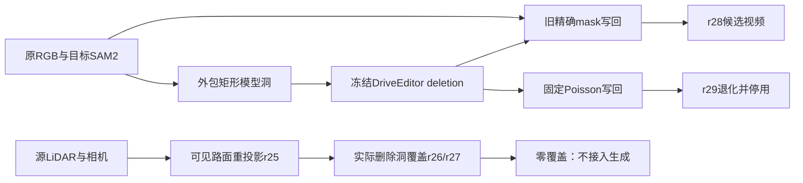

# v77 第三例：生成条件改善，地面来源与写回继续分解

2026-09-28，`WS-V77-HYBRID-BG-20260927 / r25–r29`。保留用户对 scene_0255 的比较评价 **r18 > r15**；不把这句话升级为最终背景通过。r21局部围栏候选与全部旧结果保留。当前持续目标未完成。

本轮最有用的新结果是第三开发scene `official_000 / actor12 / CAM0 / f0–9` 的r28：同一冻结DriveEditor，将模型输入洞由精确轮廓改成带小边缘的矩形，最终仍按原精确mask写回。旧灰色车形块消失，路面更连贯；仍有亮边、车底附近接缝及不可信细节。保留r28作为改善候选，不准入Ω。助手检查全部10帧，新人工verdict为空。

## 输入角色和公平比较

- 第三例为之前登记的右侧黑色MPV actor12；已参加过旧修复，不是独立测试。相机0，30帧用于CPU来源审计，10帧用于本轮新GPU生成。
- 保留后方卡车actor34：f0投影深度约44.85m，目标约34.09m。f0/f5/f9卡车框与精确写回mask交叠747/714/560像素，说明隐藏保留对象需要补全，不等于可见邻车被误删。框不是隐藏纹理GT，卡车生成部分身份/结构仍需核对。
- 几何来自已有处理目录的LiDAR/pose/GT框文件，本轮未重新认证原始传感器采集链。相机、框、LiDAR均是POC额外输入；不是仅RGB的自动重建。
- 可见query RGB只作误差评价；donor始终为其他时刻原RGB，不使用生成帧作为真实证据。平面拟合使用f0手工指定的可见道路区域，明确属于辅助控制。
- r28与保存的DELETE-REPAIR/r1前10帧使用相同原RGB、checkpoint、seed42、25步、1024×576、10帧，无前窗条件。输出mask不变；只改生成输入洞/遮挡上下文。矩形形状和面积同时变化，不能归因为纯形状变量。
- 模型矩形来自旧精确mask外包框，左右上8px、下24px，借用已有0230边缘规则，无结果驱动调参。无reference、有效对象生成框或外观条件。

## A→B→C 的三个地面控制

| Run | 实际检查 | 结果与边界 |
|---|---|---|
| r25 | f0 LiDAR局部平面；f0/10/20原图可见道路重投影 | 439训练点、220留出点，留出中位4.67mm/q90 7.38mm。其他时间源RGB在部分已可见道路大体对齐。最近来源覆盖36.2/37.0/37.3%，覆盖内MAE12.03/7.50/6.77；双时刻一致覆盖14.4/14.4/11.1%，MAE8.17/8.45/5.18。覆盖不同，不作同像素公平排名。 |
| r26 | 冻结r25平面/训练点凸包及来源，查询域换成目标洞 | 30帧170,227像素帧中，地面支撑、最近来源、一致来源全0。中间车道验证域没有覆盖右侧目标，不证明隐藏背景从未观测。 |
| r27 | 同平面，来源域改成每个来源时刻的局部LiDAR地面三角形 | 仍0目标覆盖；可见正控制后两查询也为0。不能继续当可用补景。f10/f20候选地面相对首帧平面的中位偏离约8.7/17.0cm，超过固定5cm，尚未分离道路非平面、坐标/位姿处理与拟合外推。 |

r25固定RANSAC300次/seed42/5cm内点、至少50点、法线距world-up15度内；来源偏移+5/+10/+20、GT物体包络外扩3px并向下0.5m，深度3–50m。r27增加固定局部三角形支撑：世界最长边3m、图像最长边64px、源mask侵蚀1px。没有阈值搜索。局部三角形不是精确遮挡/语义GT，仍可能遗漏细物体、阴影或非地面。

r26/r27只作来源覆盖审计，没有把零支持或假设平面涂色当背景，也没有把紫色诊断图交给模型。即使可见区域误差小，也不能代替目标洞上的真实补景效果。

## r28与r29：将生成问题与写回问题分开

r28：全部10帧旧灰块明显改善，后方真实卡车逐渐显露，路面总体更连贯。f0–f4原车下缘仍有亮边；f8–f9局部线状接缝和亮色地面边界更明显。原生图与精确写回分别保留，不能把写回边界全部归为生成器内容错误。细节与卡车隐藏部分没有GT，不声称完整身份保真。

r29：冻结同一生成图、原RGB及精确mask，只运行OpenCV NORMAL_CLONE，并强制mask外恢复原RGB。结果变成更明显的灰黑色块，10帧保留为失败，停止本配置，不替换r28，不改模式/seed或做网格搜索。与旧0255/r9一致，梯度域写回并不自动修复错误边界或结构；本轮反例进一步排除这个具体组合，不能否定所有合成方法。

随后f0/3/8/9放大核对：精确mask内部孔洞均0，不能将边界直接归为内部漏洞。车底/阴影覆盖和生成—原图边界的结构、色调对应仍待拆分。下一步冻结r28，检查这一小步，不重跑模型掩盖写回问题。

## 资源、验证和恢复入口

r25/r26/r27为CPU控制，分别约4.66/34.01/35.16秒；r28单次10帧推理约66.05秒，RTX3090峰值21.86GiB；r29 CPU约3.85秒。CPU均4线程。无新模型家族、权重下载、训练、Ω、GLB或MOVE。

8个视频文件共80帧已实际解码；47个本地引用和JS语法通过。原始PNG合同验证：r28原RGB与旧输入完全一致、write mask完全一致，mask外0变化、mask内等于原生图；r29 mask外0变化。浏览器交互未验证，不用上述工程合同代替视觉质量。助手查看新旧全部10帧对照及来源图，人工新verdict为空。

完整证据：`/root/autodl-tmp/runs/worldsim_v77/WS-V77-HYBRID-BG-20260927/r25` 至 `r29`，视频包 `road_review`；原始PNG不清理。

本地审核：`C:/Users/dengyunlong/Documents/Codex/2026-09-26/xia/outputs/v77-hybrid-delete/third-scene/index.html`。原0255审核页、旧FULL默认及资产均不替换。三个scene均开发可见，不称独立泛化评估。

`failure_ledger_refs: [V77-F02]`；`failure_ledger_delta: updated V77-F02`；所有新run `human_verdict=null`、`background_input_dir=null`。保留比较改善与失败，不以最终准入拒绝抹掉r18或r28的实际改善。
