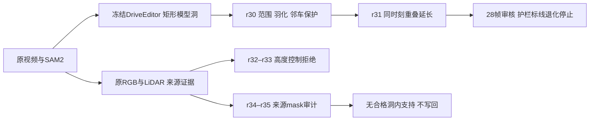

# v77 第三例：写回范围、时序退化与来源证据细拆

task `WS-V77-HYBRID-BG-20260927`，run r30–r35，2026-09-28。保留用户对 scene_0255 的 **r18＞r15** 判断；这属于比较评价，不是最终通过。r21围栏局部修复、r28和所有反例保留。第三开发例 official_000/actor12 的 r30 首窗写回改善，r31 延长后退化并停止；持续目标未完成。

## 输入、语义和证据边界

official_000、CAM0、1024×576、10Hz，删除右侧黑色MPV actor12，保留后方卡车34和后段可见的远处行人59。GT对象包络不是像素级可见性真值，隐藏邻车外观没有GT。三scene均参与过开发，不当独立泛化测试；GT相机/框/LiDAR为POC额外输入，尚非仅RGB全自动系统。没有恢复训练、添加模型家族或启动新Ω/GLB/MOVE。

## r30：冻结生成图，只拆写回

10帧同一r28原生图，三臂依次只增加一个处理：①写回范围改为现有模型矩形；②外边缘向内8px smoothstep羽化，旧精确洞alpha=1；③矩形内、旧洞外的其他GT对象包络alpha=0，恢复原图。

硬矩形减轻车形接缝，却出现矩形边缘并改动原本可见卡车；羽化缓和边缘；邻车保护恢复规定区域。f0保护区634像素，三臂分别改动634、617、0。全部10帧验证矩形外不变、旧洞内精确复用原生图。静态护栏和其他包络外结构仍可能改变，不能以合同宣称所有邻车保持。助手检查全部10帧后保留有限改善；亮度块与结构细节未通过。

## r31：延长到28帧后停止，计划30帧未完成

原计划窗口start9、18、27，各10帧，前10帧复用r28/r30。实际仅start9、18完成，新增20预测帧、去除重叠保留18新唯一帧，合计f0–27。start27未启动，不以计划代替完成。

使用已有DriveEditor单卡适配：同一权重、25steps、seed42、10帧、串行CFG、decode chunk1。后窗首帧用前窗同一时间输出作RGB条件；这是生成历史，不是真实证据。两个窗口耗时合计144.54秒，峰值21.86GiB。重叠f9/f18的模型区域同时间MAE4.951/4.834，不是相邻时刻运动对齐后的闪烁度量。

目标黑MPV未明显回生，但中后段道路亮块、虚线弯折、护栏涂抹和结构过渡明显。已看全部输出帧，停止此延长配置，保留首窗改善。历史旧precise基线与r31的生成洞、上下文和合成都不同，只作历史比较，非单变量因果证据。真实卡车34与小投影远处行人59不可被任意车辆/大灰条判据混淆。

## r32–r33：高度动机成立，不等于控制有效

nuScenes官方说明ego_pose按二维平面定位，translation.z恒为0，这提供了核查高度的动机，而非证明当前处理位姿的全部误差原因。[官方schema](https://github.com/nutonomy/nuscenes-devkit/blob/master/docs/schema_nuscenes.md#ego_pose)

按相邻5帧可见路面LiDAR，XY近邻≤0.2m，局部坡度修正后只估计标量z；每三点留出一个，要求中位误差<5cm、q90<12cm，至少50对。相机与LiDAR同移z，xy/旋转不变；固定r27地面5cm、三角边3m/64px和RGB一致阈值。

r32的35→40无对应点，停止；r33单独登记连通0–35前缀，查询0–15，不外推也不宣称完成整段。f35校正−0.250m，局部拟合一致，但原图重投影退化：

|查询|共享像素|r25 MAE|高度控制MAE|
|---|---:|---:|---:|
|f0最近来源|25,645|11.9547|13.0595|
|f10最近来源|24,484|7.2190|8.3443|

16帧57,177洞像素中单来源和双来源合格支持均0。拒绝该z-only控制，未写入候选背景，不能据此否定所有完整几何估计。处理目录的XYZI格式与变换数量级已核查，但未重新认证原始传感器链。

## r34–r35：零覆盖继续拆到来源排除

r34保持r27全部规则，仅在q0/q15、来源+5/+10/+20分类拒绝原因。q0洞2145像素仅505满足固定3–50m地面射线范围，q15为5439中的2372。大部分有效落点被来源车辆包络排除；图上部分位于车前路面，所以包络不能当精确遮挡真值。

r35仅把来源目标12的GT包络换成已有SAM2 core+3px，其他对象和全部地面支持条件不变。预先只选有保存SAM2的五来源对，不包含缺SAM2的f35；这不是完整窗口恢复。

|查询→来源|旧包络排除|新轮廓排除|新释放|地面合格支持|
|---|---:|---:|---:|---:|
|0→5|505|496|9|0|
|0→10|505|439|66|0|
|0→20|470|287|183|0|
|15→20|2369|2108|261|0|
|15→25|2206|1730|476|0|

原图核对释放点主要在车前下缘，但SAM2预测并非可见性GT，仍可能含阴影、几何偏差。mask-only不足以通过测量支持，停止直接写回。这里的计数是来源对的查询像素，不可加总当唯一目标覆盖率；不能由零支持断言背景从未被拍过。下一步仅拆已释放位置的路面测量与局部几何，不重复相同z-only或扩同类生成窗口。

## 复核、保存和结论范围

本地审核：`C:/Users/dengyunlong/Documents/Codex/2026-09-26/xia/outputs/v77-hybrid-delete/third-scene-temporal/index.html`。
远端完整产物：`/root/autodl-tmp/runs/worldsim_v77/WS-V77-HYBRID-BG-20260927/r30`至`r35`及`temporal_review`。
轻量证据：[temporal_review](../autoresearch/worldsim_v77/hybrid_bg_20260927/temporal_review/review_link.md)。

11视频共200帧实际解码；页面引用、内联JS语法和已有逐帧像素合同检查完成。逐帧图像已查看，未声称浏览器交互通过。GPU只有r31两窗，其余CPU4线程；无残留控制器、自动化或电源操作。

所有新`human_verdict=null`、`background_input_dir=null`，旧FULL默认不变。同一V77-F02追加失败与改善，`failure_ledger_delta: updated V77-F02`。保留r18/r21/r28/r30，不以长时序失败抹掉短窗收益，也不把短窗收益宣布为完美补景。
