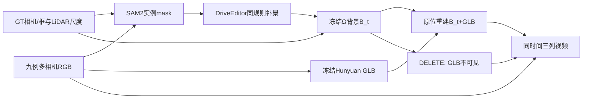

# v77九例统一规则完整DELETE重跑

`WS-V77-NINE-FULL-20260928/r1`。用户要求九例都用同一最新可迁移规则跑完整pipeline，再提供原视频／原位重建／重建后DELETE三列视频。当前文档登记共同协议，不预填结果。实际阶段见同一`docs/RESEARCH_STATUS.md`与run状态。

九例为scene_0230/22、scene_0255/25、official_000/12、processed_350/7、processed_663/6、processed_191/12、processed_425/1、processed_382/4、processed_756/3。全部已参与选择或观察，当前统一重跑是开发对比，不是严格独立泛化评测；历史r18/r21/r30不作为本轮输出，保留不覆盖。

每例首30个连续处理时刻、6相机、10Hz回放。所有有GT目标投影的相机均尝试相同SAM规则，合计17流。空mask保持空，不用GT大框补造精确实例；没有mask的位置输入RGB保留。即使输入或补景失败，也继续一次完整**诊断**链，明确标记未通过，不从九例分母移除。

共同参数：SAM2.1-large最大GT投影帧box提示、双向传播；core为SAM与目标GT hull+3px相交的最大连通区域；write膨胀3px并受该hull约束。DriveEditor模型洞为write外接矩形左右/上8px、下24px。写回矩形smoothstep8px，write权重1，write外其他GT包络权重0。seed42、25步、10帧窗0/9/18/27，同时间重叠条件，末窗补齐后仅保留30帧。

每例30帧六相机中core面积最大的真实crop作一次Hunyuan2.1参考；shape seed7740、50步、guidance7.5、octree256；PBR6视图512，不重网格、不择seed。

首例暴露共同轴转换错误：固定Rz-90后，0230网格长轴落在Y，尺寸约0.894×1.989×0.627m。旧GLB和首批局部渲染保存于axis_error_control，模型不重跑。`engineering_amendment_01.json`登记九例共同修正：OBJ转正Z后按水平顶点PCA对齐长轴X，再用同一真实参考渲染yaw0/180；分数为maskIoU−0.25×前景RGB_MAE[0,1]，差小于0.01固定选0并标不确定。一次选定方向烘焙入GLB，30帧使用同一GT原位尺寸/高度和固定world+sun。方向估计是BUILD参考拟合，不等于语义车头或外观验收。保存两候选控制，不从编辑结果人工逐例调参。最终协议见effective_registration，初始登记完整保留。

Ω官方512权重冻结，GT相机及背景LiDAR全局尺度对齐，每时刻独立B_t。原位重建是B_t＋显式GLB；DELETE只把同一GLB的visible变为false。QUERY无网络前向。默认页面展示纯点几何；可选输入RGB回填仅补无几何命中像素，单独标注，不能用完整RGB证明几何完整。

每例主视角按GT有投影的时刻数最多选择，平局比较累计投影面积，不按模型结果选择。六相机同屏提供完整范围复核。保留原图、mask、DriveEditor原生/写回、Ω预测/点云、GLB、RGBA与深度层、三列视频和分阶段联系图。人工verdict留空。

唯一run根：`/root/autodl-tmp/runs/worldsim_v77/WS-V77-NINE-FULL-20260928/r1`。实现：`scripts/worldsim_v77/nine_*.py`。预期本地报告：`outputs/v77-nine-full/index.html`。GPU单卡顺序运行，CPU渲染可并行，非周期任务。无训练、新模型家族、自动化或电源操作。后续结果与`failure_ledger_delta`在同一报告收口，不预先指定通过。
