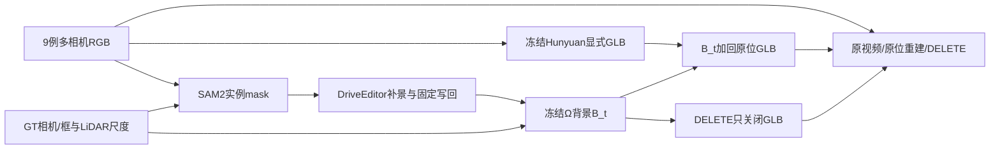

# v77九例统一配置完整DELETE视频交付

`WS-V77-NINE-FULL-20260928/r1`。本轮九例均完成同一协议的SAM2、DriveEditor、冻结Ω、Hunyuan与原位/DELETE读出；人工verdict为空。按照用户最新要求，本轮交付统一配置视频，不继续归因或加入逐场景补丁。

## 结果如何读

本轮统一配置重跑九例；每例30个连续时刻、六相机参与，按10Hz回放约3秒。每行三列同步比较原视频、原位重建和重建后DELETE。页面仅提供目标、配置和产物说明，质量结论留给你审核。

默认三列中间是补景后B_t加回同一目标的新GLB，右侧严格复用B_t，只把visible改为false；不是三次独立视频生成，也不是直接把原RGB充当重建。默认纯点几何；输入RGB仅无几何命中位置回填是可选诊断，不能证明几何完整。可切六相机、同范围固定目标裁剪与0.25倍回放。每例30帧六相机、10Hz约3秒。原图黄框为目标GT位置。

九例全部已参与选择或观察，不是独立泛化评测。旧r18/r21/r30和上一轮产物完整保留，没有当成本轮输出。本轮无训练，未把失败例从分母移除；输入/补景不合格仍只运行一次完整诊断链，不能当准入成功。

## 九例目标

| scene / actor | 目标 |
|---|---|
| scene_0230 / 22 | actor22，路边棕色车辆。随自车驶过，它在不同相机中从车尾、侧面到车头出现；以原视频黄框为准。 |
| scene_0255 / 25 | actor25，停车场内的银色SUV，部分时刻与另一辆银灰车辆重叠；黄框标的是本次删除对象。 |
| official_000 / 12 | actor12，前方右侧的深色小轿车。原视频黄框标出它的位置。 |
| processed_350 / 7 | actor7，路口画面右侧迎面的蓝色SUV；左侧深色轿车为其他对象。 |
| processed_663 / 6 | actor6，左侧近景银色轿车后方较远的小车。放大或全屏查看黄框；近处银色大车不属于本次删除对象。 |
| processed_191 / 12 | actor12，道路对侧、树木与白色栏杆后方的小车，画面中可见部分较少。原视频黄框与实例参考共同标识目标。 |
| processed_425 / 1 | actor1，直路中央迎面的灰色车辆。 |
| processed_382 / 4 | actor4，右侧路边的深色轿车；紧邻的银色车辆及其他车辆保留。 |
| processed_756 / 3 | actor3，夜间画面左侧的深色小车，中段被公交车遮挡，后段再次露出。公交车不是删除对象。 |

## 实际执行与检查

共1620个RGB视角时刻、17个SAM流；DriveEditor记录68窗，其中46窗实际生成、22窗全空mask保留RGB；Ω实际270次六相机前向；Hunyuan各9次shape与PBR；最终原位渲染层340张，方向控制18张。默认27个三列视频，含六相机、放大和其他诊断共193段视频，实际解码5790帧。

本轮15项已有几何/编辑测试通过；背景写回、保护区不变、原位投影/尺度、DELETE仅visibility变化和所有帧数由实际产物验证。页面204个静态引用、175个动态视频路径、JS语法和图像文件检查通过。浏览器交互未实际验证。上述检查不替代视觉验收。

| scene | GT有投影视角时刻 | 其中空mask | Ω次数 | GLB层 | 几何覆盖中位数 | 资产通过深度测试中位比例 |
|---|---:|---:|---:|---:|---:|---:|
| scene_0230 | 50 | 0 | 30 | 50 | 80.0% | 100.0% |
| scene_0255 | 41 | 2 | 30 | 41 | 99.4% | 9.3% |
| official_000 | 35 | 1 | 30 | 35 | 98.1% | 100.0% |
| processed_350 | 30 | 0 | 30 | 30 | 99.2% | 100.0% |
| processed_663 | 30 | 0 | 30 | 30 | 90.6% | 18.2% |
| processed_191 | 60 | 29 | 30 | 60 | 98.8% | 0.6% |
| processed_425 | 30 | 0 | 30 | 30 | 95.8% | 100.0% |
| processed_382 | 31 | 0 | 30 | 31 | 69.7% | 18.3% |
| processed_756 | 33 | 23 | 30 | 33 | 99.6% | 0.0% |

覆盖和深度通过比例只是工程描述，不是正确几何/正确遮挡率。GT有投影不保证表面可见；空mask需要区分遮挡、出视野和分割缺失。真实邻车包络审计不能当像素可见性真值，更不能把所有删除区车形都判成幻觉。

## 共同协议与工程修正

完整参数见[协议](NINE_FULL_PROTOCOL.md)。同一seed、提示/选帧/写回/资产规则施于全部九例。首例固定Rz-90转换暴露长轴错放，错误GLB与局部渲染保留；九例共同改为水平PCA长轴X，再用真实参考yaw0/180的固定maskIoU−0.25×RGB_MAE选择方向，差小于0.01固定0并标不确定。这是所有例共同的BUILD修正，未根据编辑效果人工逐例调参数。初始登记与工程修正/effective登记均保留，模型不因该修正重跑。

不做光照拟合/接触阴影/逐例贴地补丁，GT位姿、尺寸、高度和固定world+sun规则相同。B_t按时刻独立重建，其他车辆多仍在背景，尚非持久一致世界；GT/LiDAR辅助、隐藏表面无GT、官方权重训练重叠未核实均为边界。没有执行MOVE、训练或新增模型家族。

## 资源与证据

单卡RTX3090 24GiB串行模型队列；DriveEditor阶段57.8分钟、峰值allocated 21.86GiB，Ω阶段24.3分钟、峰值5.26GiB。Hunyuan逐作业耗时见actual_summary，含加载/CPU处理，不把推理显存当训练显存。Blender5.2.2本地CPU4线程。

唯一run根 `/root/autodl-tmp/runs/worldsim_v77/WS-V77-NINE-FULL-20260928/r1`，完整原图/mask/生成图/Ω预测点云/GLB/RGBA深度/错误控制原地保留。本地审核 `outputs/v77-nine-full/index.html`。轻量登记、资源和验证见[证据索引](../autoresearch/worldsim_v77/nine_full_20260928/review_link.md)。没有定时任务、自动重试或电源操作。

`failure_ledger_refs: [V77-F02]`；`failure_ledger_delta: updated V77-F02（共同坐标转换工程修正与本轮边界，无新增质量归因）`；`human_verdict: null`。本轮停止在九例同配置完整对比。用户要求：后续策略需在固定九例中逐例确认收益；如果只有部分场景受益、其他场景没有收益或退化，先不接入，再考虑可信数据与训练动态处理差异。本轮不启动训练，不逐例换seed/参数。
