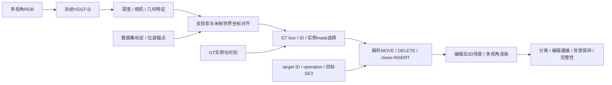

# V7.7：VGGT-Ω 的零训练结构化对象编辑

task：`WS-V77-BOOTSTRAP-20260926`。分支：`v77`。继承V7.6收口commit `6350b258`及[V76-F03](../research_failures/entries/V76-F03.md)。当前状态只写[RESEARCH_STATUS](../RESEARCH_STATUS.md)；用户参考原文见[附件存档](../references/V77_USER_DIRECTION_20260926.txt)，其中外部论文、荣誉与性能说法不自动视为已核验事实。

唯一初始问题：**冻结的VGGT-Ω重建，能否不依赖语言定位或逐场景优化，直接支持精确米制对象编辑？** 后续重建基座统一使用VGGT系列。HUGSIM/VAD-GS当前结果保留为baseline/failure evidence，不继续对象级修补。

## Architecture components

## P0范围与输入合同

- Ω全冻结、零训练；不加入自然语言、颜色/材质、非刚体、ego闭环、扩散精修或新学习模块，不做逐场景优化。
- 使用现有nuScenes/Waymo driving logs与GT 3D box/track ID；首轮规划20–30个actor，实际scene、actor和视角清单在实验前登记。已用于旧阶段诊断的logs是开发集，不重新称独立测试。
- 按数据实际相机数采样。nuScenes为6相机，不能直接照抄参考中的“7相机”；多时刻输入必须保留timestamp和动态对象坐标关系，先以同步多视角作最小控制，避免将运动目标跨时刻叠成重影资产。
- 模型输出坐标不能直接假设为数据集米制世界坐标。先用已知标定/位姿建立并记录尺度、旋转、平移对齐；GT box仅在同一坐标系中选择目标。标定、GT实例与其他锚点都是披露的额外输入，不是检测或纯RGB米制度量能力。
- GT box可能包含道路或背景，只是目标选择控制；不能把“点落在box里”当作实例分离成功。mask来源、不可见部分和动态身份缺口分别记录。

## 解析操作

命令为 `(target_id, operation, target_pose)`；当前只支持刚体平移/yaw、DELETE与clone-INSERT，尺度固定为1。

MOVE对目标点执行 `P_edit = T_target @ inv(T_source) @ P_source`，非目标世界点保持原样。DELETE移除目标点。INSERT从已有donor复制对象点到新SE(3)，登记新的实例ID并保留donor；不声称创造了未见表面。

MOVE候选为x/y分别±1、±3米，以及yaw±15°、±30°；再各做DELETE和clone-INSERT。实际测试命令在run清单中固定。不能只检验指令矩阵自身，应在输出点集、实例状态和渲染中验证位置/yaw、数量与存在性。

## 四项直接评价与停止规则

| 评价 | 要检查的输出 |
|---|---|
| Object isolation | actor本身是否完整、是否混入背景/路面，是否出现轮胎等部件分离 |
| Edit adherence | 对齐后的米制位置/yaw误差，DELETE存在性，INSERT计数与donor保持 |
| Background preservation | 非目标世界点/属性是否改变；渲染中由遮挡改变造成的差异单列 |
| Multi-view completeness | 固定多个相机的silhouette、depth、缺失面、ghost/duplicate；分母完整报告 |

P0不以CLIP或全图PSNR替代对象质量。移动/删除暴露的原位置以及INSERT未见面可能出现空洞，应如实展示；点变换正确不等于高保真观测已解决。

若geometry已支持精确编辑，先承认解析算子足够，再定位尚缺的补全/可见性问题。若actor抽取时已残缺或背景分离失败，记录具体failure再决定下一步；不立即加head，不重开旧Gaussian修补路线。通过P0之后才考虑仅服务于unseen surface、disocclusion或边界修复的学习模块。

## Backbone与权重准备

官方实现：[facebookresearch/vggt-omega](https://github.com/facebookresearch/vggt-omega)。2026-09-26核验官方README：512用于in-the-wild应用；416-Reproduction是另一个用于benchmark比较的checkpoint。本阶段采用512，不混写两者成绩。官方接口提供相机、depth/depth confidence及camera/register tokens，几何由反投影形成。

用户提供[Drive权重](https://drive.google.com/file/d/1778LS0SYy30L0CfLDmzlRsEy6xFUqBdR/view?usp=drive_link)，页面文件名为 `vggt_omega_1b_512.pt`。远端已有完整同名512文件，来源、实际复用路径、Drive重复下载状态及检查结果统一见[权重manifest](checkpoint_manifest.json)。不能仅凭同名/同大小宣称不同镜像全文件一致，也不把已准备权重写成已完成推理。

本页记录BOOTSTRAP时的启动协议；该次只准备分支、权重与协议，`failure_ledger_refs: [V76-F03]`、`failure_ledger_delta: none`。后续实跑及与协议的差异见 [24对象与三时刻控制结果](P0_RESULTS.md)，包括额外GT/LiDAR、processed时间限制、实例ID/图像存在性尚未实现的边界。
