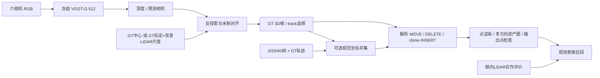
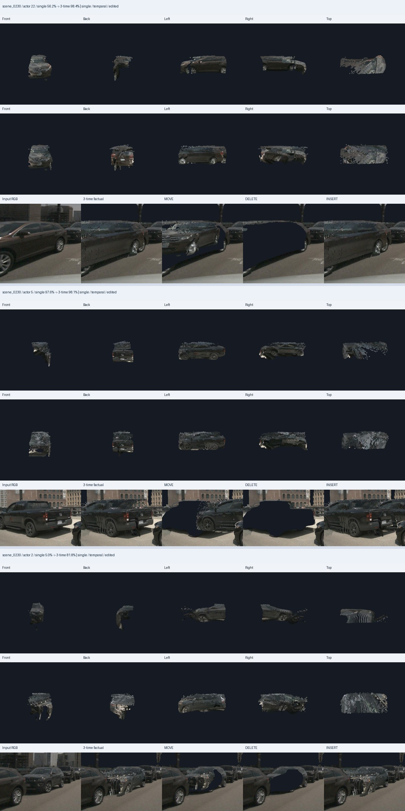

# V7.7 P0：冻结 Ω 的对象编辑与三时刻控制

2026-09-26。`WS-V77-P0-24ACTOR-20260926/r1` 与后续开发控制 `WS-V77-P0-TEMPORAL-20260926/r1`。核心代码 `90528aa8`；启动协议见 [P0_PROTOCOL](P0_PROTOCOL.md)。当前状态只见 [RESEARCH_STATUS](../RESEARCH_STATUS.md)。

**三场景、24个固定对象的零训练试验已完成。解析点集编辑正确；当前“Ω深度反投影→GT框截取→直接编辑”尚未取得高保真对象资产资格。** GT标定和背景尺度控制明显改变对象支持，三时刻并集补充了部分表面，但仍有缺面、重影与提取不完整。这是直接适配管线的边界，不是对VGGT系列的普遍否定，也没有同条件证明优于HUGSIM/VAD-GS。

## Architecture components



## 输入、分母与来源

原计划的旧六场景RGB和元数据已退役，输入预检后改用三个完整processed导出；变化发生在本轮Ω预测之前。不是旧六场景复跑，也不称独立测试。选择规则仅依赖GT：frame20，刚体车辆类别，距离≤45m，至少一个相机内框在近裁面前，688×384下最大投影框面积≥256px²，合并候选后取最近24个。投影框不保证无遮挡或实际像素可见。

| 场景 | 固定actor ID | 数量 |
|---|---|---:|
| official_000 | 14, 12 | 2 |
| scene_0230 | 14, 22, 5, 2, 25, 15, 24, 19, 10, 30, 36, 23, 16, 29, 11, 7 | 16 |
| scene_0255 | 25, 22, 16, 34, 24, 35 | 6 |

完整输入路径、GT位姿/尺寸/track、相机与顺序见 [单时刻登记](../autoresearch/worldsim_v77/p0_20260926/registration_single.json)。GT尺寸按原导出reader的length/width/height解读；相机extrinsics为camera-to-world。使用相同processed 10Hz帧索引，缺原始逐相机timestamp，故不声称精确同步。未引入旧SAM动态mask。

网络只接RGB。GT标定、框/ID、LiDAR在后处理/评价入口披露。场景已有历史曝光，预训练重叠未知。

## 三个读出及额外信息

1. **预测相机+Sim3**（代码名`native`）：Ω预测K/相机与深度反投影，使用六个GT相机中心拟合一个正尺度Sim3。名称不意味着纯RGB米制能力。短基线中心拟合仍留下明显姿态误差。
2. **GT标定控制**（`calibrated_control`）：相同Ω深度，改用GT内外参；由同帧背景LiDAR拟合每场景唯一深度乘数。先将全部LiDAR投影并取每像素最近回波，再排除全部GT框内部点；保留1–80m有限正深度锚点，以`median(z_lidar / depth_pred)`求尺度。对象框内LiDAR仅作评价。
3. **三时刻规范坐标并集**：在看到单时刻结果后登记的开发控制，另取frame0、40，分别运行相同六相机冻结Ω；各时刻做GT标定/背景尺度控制，再按同一GT track变到对象规范坐标，与frame20点集直接拼接。没有去重、补面或训练；不是原始预登记的独立确认实验。

几何仅过滤有限值和相机深度0.5–80m，无confidence阈值搜索。全局尺度与精确GT位姿均不保证对象局部深度正确。

| frame20场景 | Sim3后相机中心RMSE/m | 旋转误差范围/° | GT控制背景尺度 | 背景锚点数 |
|---|---:|---:|---:|---:|
| official_000 | 0.4343 | 4.99–9.53 | 12.5253 | 15,370 |
| scene_0230 | 0.2824 | 28.37–32.11 | 37.0747 | 11,198 |
| scene_0255 | 0.4599 | 11.64–17.26 | 14.9523 | 21,152 |

完整九组 [对齐记录](../autoresearch/worldsim_v77/p0_20260926/alignment/)和[前向记录](../autoresearch/worldsim_v77/p0_20260926/inference_all.json)保留；不能单独将适配误差归为模型固有上限。

## 算子正确与对象质量分开

| 读出 | 对象数 | 空对象 | 框内观测LiDAR 20cm召回宏平均 | 非空对象命令/已检查命令 | 非目标点最大位移/m |
|---|---:|---:|---:|---:|---:|
| 预测相机+Sim3 | 24 | 3 | 6.93% | 294/336 | 0 |
| GT标定+背景尺度 | 24 | 0 | 27.71% | 336/336 | 0 |
| GT控制+三时刻并集 | 24 | 0 | 55.02% | 336/336 | 0 |

召回定义：frame20 GT框内LiDAR回波到抽取点集的最近距离≤0.2m的比例，再对24对象平均。旧JSON字段沿用`visible_lidar_recall_0p2m`，但没有相机可见性认证，也未验证框内回波的语义纯净度。这不是完整表面召回、纯度或高保真通过率。并集最近距离在数学上不能变差，55.02%不能单独证明资产质量提升。

每对象14个命令：x/y各±1、±3m（8个），yaw±15°、±30°（4个），DELETE和x+3m clone-INSERT（2个）。三读出共1008个命令，其中42个作用于空对象，**仅966个有非空对象支持**。另存固定MOVE（x+3m、yaw+15°组合）/DELETE/INSERT图；方向不按效果择优。

非空输出点对请求SE(3)的最大数值偏差为**1.28×10⁻¹⁴m**；点数断言、DELETE选中点归零、INSERT donor保留通过。这是运行时float64解析运算一致性，既不是GT形状误差，也不是写盘float32资产精度。非目标指框未选中的全部点，可能含漏选对象部件；0位移不能证明语义背景分离。

P0用源点索引/复制区间跟踪操作，尚无持久化的新实例ID场景注册表；没有独立像素mask检查DELETE后完整实例是否消失。点数检查不能升级为图像层存在性成功。

三时刻仍保留24分母：scene_0230/36、scene_0255/34、scene_0255/35缺frame0 GT；scene_0230/29在frame40有GT但抽取为空。20个对象三个时刻均有非空点，没有因缺输入或效果差删除对象。见 [三时刻登记](../autoresearch/worldsim_v77/p0_20260926/registration_temporal.json)和[逐对象指标](../autoresearch/worldsim_v77/p0_20260926/metrics_temporal.json)。

## 逐对象图像证据

代理检查全部24个GT控制单时刻对象与全部24个三时刻对象的五方向资产/编辑图，另看official_000六相机对照；没有把24个native对象全部标为已人工审核。人工verdict均null，代理记录见 [agent_visual_review.json](../autoresearch/worldsim_v77/p0_20260926/agent_visual_review.json)。

- scene_0230/22：三时刻补充后方/侧方支持，仍有重影层与不完整表面。
- scene_0230/5：两种GT控制的观测LiDAR召回都很高，规范视角仍有薄片/缺面，说明指标不能替代完整性检查。
- scene_0255/25：抽取点稀疏，删除这些点并未在图中移除完整车辆外观；局部深度定位、遮挡和实例绑定未分开排除。
- official_000/12：主要是单侧支持，移动后缺新暴露表面，DELETE区域没有补全。
- scene_0255/24：标牌/拖车碎片与地面状条带并存；没有可信实例像素标注，不报告污染率。



固定3×3点splat+最近深度z-buffer，无插值、mesh或生成补洞。采样条带/孔洞、0.5–80m截断和天空缺失不能全部归因于Ω对象几何。遮挡候选也不能构成“可见对象失败率”。没有人工作出的24对象通过率。

## 工程修正、资源与复现

首版评价先排除前景LiDAR再选每像素最近回波，可能跨过目标选后方背景。检查后停止，修正为全部回波先z-buffer再筛背景，同一预测在独立`evaluation_v2/`完整重评。首版部分产物和日志保留为superseded，**报告只使用evaluation_v2及后续三时刻控制**。这是已修正的评价工程问题，旧数值不支持科学结论。

官方代码 [facebookresearch/vggt-omega](https://github.com/facebookresearch/vggt-omega/tree/b2c61f6631d9f344a2d914bfba5d9529d6fc1d35) 固定在该commit；深度按官方`demo_gradio.py`的z-depth约定反投影。512 checkpoint来源见 [manifest](checkpoint_manifest.json)，没有改写为完整Drive新下载。

运行环境`/root/autodl-tmp/envs/worldsim-v77/bin/python`：Python3.12.14、torch2.12.1+cu130、numpy1.26.4、RTX3090 24GiB，CPU配额14核、线程4。venv通过`.pth`共享worldsim-v75包并覆盖numpy；未使用的scipy1.18有numpy>=2依赖提示，不称全官方依赖完全隔离安装。九次冻结前向、54张RGB，输出均有限，单次网络前向峰值约5.26GiB，训练步数0。记录的forward时间不含加载、预处理、保存和评价。

几何测试覆盖旋转源对象的世界平移/yaw、DELETE/clone/空对象与非目标保持、已知Sim3恢复：

```bash
cd /root/autodl-tmp/motion_proj_v77
OMP_NUM_THREADS=4 OPENBLAS_NUM_THREADS=4 /root/autodl-tmp/envs/motionproj/bin/python -m pytest -q tests/test_worldsim_v77_geometry.py
# 3 passed in 0.06s
```

代码在`scripts/worldsim_v77/`，配置`configs/worldsim_v77/p0_24actor_r1.json`。登记的`source_commit=15bab102`是当时HEAD，新脚本当时尚未提交，实际核心代码随后提交为`90528aa8`。原登记不重写，补充来源见 [execution_manifest.json](../autoresearch/worldsim_v77/p0_20260926/execution_manifest.json)。

```text
/root/autodl-tmp/runs/worldsim_v77/WS-V77-P0-24ACTOR-20260926/r1/
  registration.json
  <scene>/prediction.npz, inference.json
  evaluation_v2/<scene>/{alignment.json,evaluation.json,...}
  review/index.html                 # 离线页面，72个对象读出及全部图
/root/autodl-tmp/runs/worldsim_v77/WS-V77-P0-TEMPORAL-20260926/r1/
  registration.json
  <scene>_f000|f040/prediction.npz, inference.json, alignment.json
  evaluation/<scene>/actor_<ID>/actor_temporal.npz, metrics.json, canonical.jpg, edit_crop.jpg
```

Git纳入轻量登记、指标、九组对齐/推理记录、日志和代表图；完整预测/点资产在远端run，完整离线review同时交付本地。工程备份在`/root/autodl-tmp/backups/v77-p0-20260926/`。

本轮新增 [V77-F01](../research_failures/entries/V77-F01.md)：额外标定和跨时刻并集仍不足以让直接适配管线自动获得完整可编辑对象。`failure_ledger_refs: [V76-F03, V77-F01]`；`failure_ledger_delta: V77-F01`。后续执行范围以当前状态页为准。
