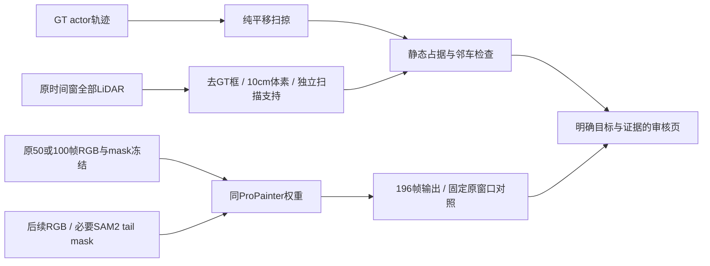

# v77 R2：静态障碍筛查与 ProPainter 长上下文控制

`WS-V77-PIPELINE-R2-20260926/r1`；source commit `e5bc729b`；继承原 POC 两场景、两份 GLB。用户已授权持续迭代。此轮零训练，没有新 Ω/Hunyuan 推理，只扩展一路 SAM2 时序掩码并新增两路 ProPainter 推理。

**结果：scene_0255 的无邻车框碰撞候选仍碰到重复观测的静态障碍；把 ProPainter 输入补到196帧、放开40帧上下文限制后，两例主要补景残影仍在。** 不据此否定原 GLB，不把该有限负对照升级为模型家族失败。原资产、源 mask、原视频与之前结果全部保留。

## Architecture components

## 1. MOVE 增加静态障碍拒绝条件

仍检查 scene_0230/actor22 的0–49帧、scene_0255/actor25 的0–99帧。每帧LiDAR经GT pose转到世界坐标，保留目标附近12m数据，去除所有GT对象框（各维额外0.3m）。累计为10cm体素，按**不同扫描帧**计支持；100个同一扫描回波只算一次支持，不能冒充静态多次证据。

将原位与终点框凸包作为纯平移扫掠体，检查相对原位新增区域内、高于GT车底0.15m且不高于车顶0.15m、至少3次扫描支持的静态体素。每帧至少3个这样的体素记为有障碍证据。该筛查仅能提供拒绝证据；空白、低路缘、未观测地面、ego和道路语义仍未知，不会自动把命令批准为合法行驶。

| 场景 / 命令 | 邻车框扫掠碰撞 | 静态证据帧 | 本轮结论 |
|---|---|---|---|
| 0230 旧2m | 50/50，actor2 | 0/50 | 邻车框拒绝 |
| 0230 车头前移1m | 0/50；最小0.536m | 0/50 | 无新增正占据，仍未验证 |
| 0255 旧2m | 0/100；最小0.084m | 100/100，最多129体素 | 静态障碍拒绝 |
| 0255 车头前移2m | 0/100；最小0.712m | 100/100，最多132体素 | 静态障碍拒绝 |

0230累计背景LiDAR 747,751点/56,862体素；0255为192,731点/48,266体素。0255 f020 前移2m新增区有49个支持体素，其投影落在原车前方围栏/草地边界附近。网页给出原图与红点投影，避免把“车框之间有空隙”当作完整场景可通行。

## 2. 同权重长上下文补景控制

旧输入是0230/CAM2的50帧、0255/CAM3的100帧，源数据实际都有196帧。0255目标在CAM3一直可见至f164；旧100帧没有包含后半段。阅读官方ProPainter实际执行代码发现：视频长度大于 `subvideo_length` 时，全局参考数被限制为 `subvideo_length // ref_stride`，旧40帧设置会限制参考范围；图像传播另有100帧分块上限。

本轮只做一次长上下文强控制：保持同权重、688×384、fp16、neighbor_length=10、ref_stride=10，把输入扩到196帧、subvideo_length=200。完整原评价窗口的RGB与mask直接链接旧run，确保不改原输入。0230/CAM2后续目标已离开，追加空mask；0255仅缺失尾段mask由原SAM2.1 large、GT框提示/门控传播补充。SAM2 seed=7703；ProPainter使用官方CLI，没有额外seed覆盖。不是新单目/多视图生成网络。

GPU串行：SAM2 26.5s，两个ProPainter阶段64.5s/64.9s，RTX3090 24GiB。保存两路各196帧；审核仍固定原50/100帧窗口（10Hz），原始/R1 DELETE/R2 DELETE六视频。固定图为0230 f0/5/10，0255 f0/10/…/90。本轮只诊断两个相机流，不冒称重跑全部六个活跃流或完整Ω背景。

在固定帧直接比较，scene_0230 的大块深色涂抹与 scene_0255 的车形残影没有消失。掩码内旧新平均绝对像素差分别为9.30、6.37（0–255）；这只能证明输出有变化，**不是背景质量分数**。删除区域之外最大RGB变化均为0，未靠改动无关区域掩盖差异。没有无车背景真值，人工 verdict 留空。

此结果不支持“只要补足时序长度就能修好背景”的假设；不继续机械扫长度、ref_stride等参数。图像传播仍有官方100帧分块机制，196帧全局参考也不等于所有隐藏表面曾真实可见。后续先盘点背景观测覆盖，区分有源可传播的背景与从未显露的区域。

## 3. 输入质量与下一项有界控制

检查原0255的生成参考crop发现前景围栏仍在输入像素中，而灰模结构可用。下一项先量化静态遮挡/可见性，建立参考图准入与原位成像对照；固定当前几何和校正朝向，避免把参考污染、贴图和光照错误归为网格失败。尚未重新生成资产，也没有新增另一套补景模型。

## 验证、复现与持续执行

- 测试覆盖独立扫描计数、空数据不代表自由空间，以及既有扫掠穿越/间距/旋转框/高度过滤，共6项。
- 六视频完整解码、尺寸和50/100帧计数通过；输出删除区域外保持原RGB。文档链接、JSON与脚本语法检查执行；网页交互没有新的浏览器UI验收。
- 新脚本在 `scripts/worldsim_v77/r2_space_gate.py`、`r2_long_context.py`、`r2_controller.py`、`r2_collect.py`。控制器有同run互斥锁，各GPU阶段串行且单阶段限1800秒，不会无限重试；完成状态保存在 `controller_state.json`。
- 完整run：`/root/autodl-tmp/runs/worldsim_v77/WS-V77-PIPELINE-R2-20260926/r1`。本地审核：`C:\Users\dengyunlong\Documents\Codex\2026-09-26\xia\outputs\v77-pipeline-r2\index.html`。
- 用户授权的持续跟进通过当前任务heartbeat `v77-pipeline` 每30分钟继续。先读最新研究状态与实际进程；有实质结果、失败或需用户行动才通知，未变状态静默。每次完成具体有界实验，保留正负对照；人工 verdict 不代填。

`failure_ledger_refs: [V77-F02]`；`failure_ledger_delta: updated V77-F02（补静态障碍及长上下文控制证据）`；`human_verdict: null`。
