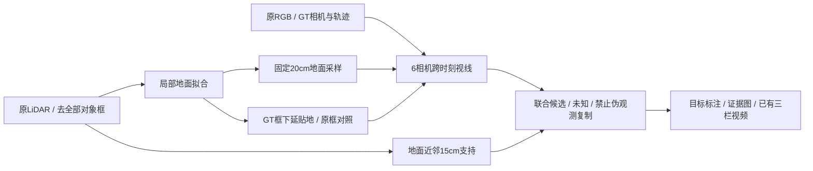

# v77 R3：背景参考可见性与贴地遮挡包络

`WS-V77-PIPELINE-R3-20260926/r1`；源提交 `a0a18b3a`；延续 scene_0230/actor22、scene_0255/actor25。**新增背景参考检查与拒绝状态；修复原GT框悬浮导致的车底“假可见”风险。没有新的补景/资产渲染改善，也未执行新的MOVE。**

## Architecture components

## 问题与有界控制

R2的196帧ProPainter控制仍留主要残影，因此本轮不继续扫描长度参数。先检查是否存在能复制到原车底的真实背景依据。不能将“目标出了当前相机”或“GT轨迹结束”当成原地面已经可见；也不能只检查投影进入图内。

BUILD仅诊断既有数据：0230用目标GT已知的0–130帧，0255为0–180帧，分别131/181帧、每帧6相机。每scene源数据均196帧，其余65/15帧目标状态未知，排除且列出分母。未增加scene，未变更actor。GT相机、轨迹与原LiDAR均为额外诊断输入，不是RGB自动方法的合法输入成绩。

参考时刻0230 f005、0255 f020。在原车框周边1.6m及车底，以20cm间隔固定世界查询点；“核心”定义为原框水平投影各边内缩20cm。使用目标中心10m内原LiDAR，逐帧去掉全部GT框（各维增加0.2m），仅近标称车底±0.4m的点拟合局部路面。RANSAC固定seed7704、128次三点提议、最多16000样点、最大斜率0.2、8cm内点阈值，再最小二乘拟合。拟合内点中位误差分别3.62/3.50cm，仍只是局部平面近似。

QUERY通过开线段与有向框求交来检查相机到每点的遮挡；视野范围0.5–60m。仅触及查询终点不计前景阻挡。发现0230原GT底面世界高度范围−0.0045至0.5455m；全轨迹中心净位移约0.65m，不能据高度漂移推断车腾空。原框会放过车底射线，采到车身下缘、阴影或路面混合像素。

修复控制将每个GT框只向下延伸到局部平面以下10cm，保留顶面与水平尺寸。它有意保守，不对真实车底间隙作可见背景承诺；这不是修改GLB、移动目标或改善GT标注。原框完整输出保存在run的 `raw_box_control/`，同一run保留前后对照，不当作独立实验样本。

## 结果与拒绝条件

| 原车底核心查询 | 0230 / 168点 | 0255 / 207点 |
|---|---:|---:|
| 进入任一相机视野 | 168 | 207 |
| 原GT框全部不挡视线 | 168 | 9 |
| 下延贴地后全部框不挡视线 | 0 | 9 |
| 仅原ProPainter相机视线候选（CAM2/3） | 0 | 0 |
| 地面LiDAR距离≤15cm | 13 | 0 |
| 贴地视线候选且有近邻地面LiDAR | 0 | 0 |

两例均输出 `no_jointly_supported_core_reference`、`copy_as_observed_background_admitted: false`。禁止据这些核心查询直接拼接所谓“真实观测背景”；未输出替代背景图，未重跑Ω。框外周边联合候选分别526/872和583/927，说明可传播候选主要在原位置外围，不能把外围可见性算作核心已恢复。

零联合候选是这个保守诊断的结果，不是“不存在任何真实无车背景”的证明。静态围栏等物体没有完整射线遮挡模型，平面不适用于所有墙面/路缘；RGB视线与LiDAR近邻也不是同一扫描射线。因此即使联合候选非零，也只标为 `candidate_requires_static_occlusion_check`，不能自动准入复制。

本轮没有分离阴影、mask、照度各自对ProPainter残影的贡献，不将缺证据直接升级成残影的唯一因果解释。原GLB形状反馈与前轮撤回的“资产失败”结论保持不变；MOVE仍未准入，R2静态障碍拒绝仍有效。

## 代码、验证与产物

- `scripts/worldsim_v77/r3_visibility.py`：局部地面拟合、开线段/OBB、原框与贴地包络双控制、逐点/逐视图来源与背景参考准入状态。
- `scripts/worldsim_v77/r3_collect.py`：实际相机位置与框底对照，不改变源图/GLB。
- `scripts/worldsim_v77/r3_review_page.py`：本地生成中文审核页，使用Windows微软雅黑绘图。旧POC入口保留备份并加最新链接。
- 远端验证：`OMP_NUM_THREADS=4 OPENBLAS_NUM_THREADS=4 CUDA_VISIBLE_DEVICES= /root/autodl-tmp/envs/motionproj/bin/python -m pytest -q tests/test_v77_r3_visibility.py tests/test_v77_actor_command_audit.py tests/test_v77_r2_space_gate.py`；**12项通过**。新增6项覆盖线段端点、平行射线、异常地面点、悬浮框漏出车底、保留框顶与互不相交的RGB/LiDAR证据不能准入。
- CPU主检查最终一次运行约10.1秒；先做原框诊断，之后做贴地修正及准入输出验证。零训练、零新模型前向，未启动GPU作业。只将同一run视为一个有界对照。

完整run：`/root/autodl-tmp/runs/worldsim_v77/WS-V77-PIPELINE-R3-20260926/r1`。逐点NPZ含世界查询、core、视线计数、最佳源frame/camera、RGB候选、近邻LiDAR来源；逐视图JSON记录每帧各相机分母。登记见 [summary](../autoresearch/worldsim_v77/pipeline_r3_20260926/summary.json)。

本地审核页：`C:\Users\dengyunlong\Documents\Codex\2026-09-26\xia\outputs\v77-pipeline-r3\index.html`。每scene保留“原视频 / 修正原位factual / DELETE”三栏、目标高亮和新证据图。三栏视频明确标为**放置审计轮的10时刻既有结果**：0230为2fps、0255为1fps，不冒充R3新推理；另链接R2完整10Hz长上下文控制。12项测试、静态文件链接/图像检查及视频元数据记录见审核页validation；未作浏览器交互验收。

## 停止边界与下一步

停止这批核心查询的“真实背景参考复制”尝试，不继续ProPainter长度扫参。下一项只检查scene_0255已有8张生成crop的前景围栏/杆件污染，并核对实际消费的单图参考；先做源证据与可见性对照，有足够依据再决定是否使用同一个Hunyuan材质流程重跑。保留当前GLB几何、全部旧结果与现有模型，人工verdict仍为空。

`failure_ledger_refs: [V77-F02]`；`failure_ledger_delta: updated V77-F02`；`human_verdict: null`。
