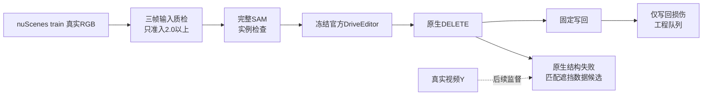

# r51：新增真实 DELETE 输入，单独定位原生生成失败

任务 `WS-V77-TARGET-PROTECTED-20260929/r51`，主机 `wm-vgpu-1008`，2026-10-08。CPU已完成：从40个新scene候选准入 **33景/33例**，每景一个独立删除目标；7例低质量剔除、0例不能确定不准入。SAM/DriveEditor尚未运行，训练0步。



## 先保存用户给出的失败拆分

r50用户复核将 R001/R004/R008/R028/R030/R044/R041/R062/R081 及较轻的 R037/R055 放入原生生成问题；R002/R023/R027/R029/R038/R050/R051/R060 为原生可接受、写回损伤，不用于训练diffusion。R009记为写回加重、待单独检查，不自动并入训练候选。

这是用户对已曝光开发图像的判断，不是新增推理或隐藏GT。旧AI四列分数、视频与人工记录均保留。本轮不修写回来改变对照，不把postprocess问题转成模型监督。

## 新输入和质量门槛

复用r50缓存RGB和已核对的官方SDK时刻/几何：48个尚未进入r50输入审核的场景、85个候选，按固定seed771051从40景各选一车；优先中位尺寸≥140×65px、后车布局和较大目标，原r50全窗尺寸/边距/visibility门槛仍保留。输入选择不读生成结果。

独立subagent请求5.6-sol/xhigh、未开fast，逐例打开f00/f05/f09真实原图与crop、实际B参考；按一位小数评分。目标须唯一、轮廓可辨、尺度/曝光/清晰度足以看结构；0/1分或不能确定均不进GPU。请求配置与运行模型可核验边界见JSON，不猜测实际运行身份。

准入33例全部≥2.0；后车证据另记 {'weak': 8, 'sufficient': 8, 'absent': 17}，相机分布 {'CAM_BACK': 14, 'CAM_BACK_LEFT': 4, 'CAM_FRONT': 12, 'CAM_FRONT_RIGHT': 1, 'CAM_FRONT_LEFT': 2}。B充分仅指真实可见片段，不表示隐藏完整车身有GT。后车证据不足的case可以检查再生车/背景，但不能宣称强B先验已足够。质量评分只覆盖抽帧，未判整段视频时序。

准入scene与r50全部38个输入审核scene分离，5个train隔离scene不看RGB、不训练，旧val隔离不动。来自先前数据缓存，可能与之前合成数据/官方预训练有场景重叠，因此是开发扩充，**不是最终泛化评测**。

## 下一步固定推理与分类

保持r46官方DriveEditor原权重+r21完整SAM：sam_full_v2、seed42、25steps、10帧、1024×576；无Adapter、微调、参考分支或时间模块修改。每例恢复独立原视频，只删一个actor。GPU先跑SAM并看实例身份；错误实例或空mask直接拒绝，不靠放宽门槛凑数。

准入后每例只跑一次官方DELETE，完整保存原生PNG/视频和固定写回。单帧复核先看原生：生成就错记native failure；仅最终写回错进engineering queue；两者都错分别记录，不能混成一个分数。目标/后车结构、车形再生、薄膜及向道路延伸分开备注。人工verdict留空。

只有可靠输入/实例、原生已出错的案例用于匹配后续遮挡布局和显露过程；**失败生成绝不成为训练Y，Y仍是真实视频**。本轮不造新训练数据、不训练、不追加seed/参数扫描。

## CPU验收和运行入口

330帧原视频实际解码通过，10个不同真实曝光/窗、关键帧关联标注语义、场景分离和官方/SAM权重存在检查通过。CPU cgroup额度0.5核，线程设1；数据盘余约39.1GiB，预计本批推理新增不超过3GiB，无需本轮扩盘或清理。

远端run：`/root/autodl-tmp/runs/worldsim_v77/WS-V77-TARGET-PROTECTED-20260929/r51`。入口复用r50模型/写回代码，新脚本仅管理新清单、输入准入和页面。GPU准备结束通知用户，用卡前等待开启，不后台等卡。

```bash
# GPU开启后：先SAM，审核身份后才允许delete
/root/autodl-tmp/envs/worldsim-v77-sam2/bin/python scripts/worldsim_v77/target_protected/iteration18/expand_real.py masks
/root/autodl-tmp/envs/motionproj/bin/python scripts/worldsim_v77/target_protected/iteration18/expand_real.py assets
# 保存本run mask_visual_review.json，approved/rejected覆盖全部准入case
/root/autodl-tmp/envs/driveeditor/bin/python scripts/worldsim_v77/target_protected/iteration18/expand_real.py delete
/root/autodl-tmp/envs/motionproj/bin/python scripts/worldsim_v77/target_protected/iteration18/expand_real.py assets
```

本地 `outputs/v77-real-delete-r51/index.html` 当前只展示输入，GPU列明确留空。[准入清单](../autoresearch/worldsim_v77/target_protected_20260929/r51/selection.json)、[完整输入质检](../autoresearch/worldsim_v77/target_protected_20260929/r51/input_quality_review.json)、[CPU验收](../autoresearch/worldsim_v77/target_protected_20260929/r51/cpu_check.json)、[用户r50拆分](../autoresearch/worldsim_v77/target_protected_20260929/r51/r50_failure_split_user.json)。修改前备份`/root/autodl-tmp/backups/v77_r51_cpu_20261008`。

`failure_ledger_refs: [V77-F02]`；`failure_ledger_delta: updated V77-F02（用户原生/写回归因边界）`；没有新模型失败或科学否定，人工verdict null。
