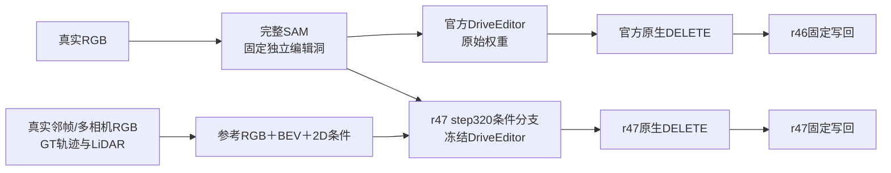

# r51：官方、r46 与 r47 的真实 DELETE 对照

任务 `WS-V77-TARGET-PROTECTED-20260929/r51`，`wm-vgpu-1008`。旧r50的40例补跑r47，新r51的32例同时完成官方基线和r47：共 **52景72例**，新推理104窗，旧基线复用40窗，新增训练0步。全部输入、失败与写回对照保留。

## 对照定义

官方原生列也使用统一r21完整SAM，不是重新采用官方1.9倍框挖洞；r46是同一原生输出的固定写回。r47加载已有`branch_0320.safetensors`，RGB编码、BEV与2D融合复用原r47实现，主干与分支均不训练。查询RGB、mask、alpha、seed42、25步、10帧、1024×576固定。原生与最终分别评分，原生DELETE不能称为factual重建。

当前候选参考池使用10个查询SAM帧，加查询开始前约1秒/开始/结束/结束后约1秒六相机关键帧；旧r47为26个SAM帧。此外，8例候选池带入了同scene其他查询窗关联到所选sample的36个非关键曝光；最终R003/R009/R051采用其中5槽，全部通过源SAM擦除检查。实际来源见reference_pool_audit.json。沿用固定4保护车槽＋2上下文槽选择，不按输出挑参考。额外RGB/LiDAR提取1034文件约173MiB；109个已选源mask检查，2槽未通过后停用、不重选。目标A的源像素编码前擦除，无隐藏GT进入条件。

绿O是保留车GT 3D框投影proxy，蓝N是实测背景落点，灰U未知；BEV是80m世界网格。不是精确silhouette、不是完整自由空间、不是隐藏真值。页面每例提供实际OCC/BEV视频、六槽真实参考及逐帧洞内占比。

## 样本与评分边界

新40景候选输入独立复核后33例通过，7例0/1分剔除；SAM再拒绝R093，三帧均串入右侧邻车，故32景32例生成。旧r50保留原准入40例20景。新32景与r50审核过的38景分离，但与r47分支训练同场景的7例为 R001, R002, R099, R103, R115, R120, R122，共6景；官方预训练重叠未核实。它们是开发对照，不是严格最终泛化评测。

按用户指定使用5.6-sol/xhigh、未启用fast逐例直接审核固定f05，各列给一位小数0.x/1.x/2.x分数；2.0表示可接受但不完美、不作为满分。AI原生比较：{'改善': 12, '持平': 55, '回退': 5}；AI最终写回比较：{'改善': 12, '持平': 55, '回退': 5}。四个输出列达到2.0的抽帧数：{'official_native_score': 40, 'r46_writeback_score': 30, 'r47_native_score': 37, 'r47_writeback_score': 27}。完整像素观察逐例留存；这不是人工视频通过率或统计显著性结论。旧人工分数、旧r50 AI记录均保留，人工和时序verdict为空。

先看原生判断生成错误，再看写回新增损伤。保持用户给出的r50原生错误11例/仅写回损伤8例归档，不因本轮AI重评覆盖人工意见。未来匹配遮挡数据只能使用真实视频Y；失败生成不能变成训练GT。本轮未造新数据或追加微调。

## 执行与交付

72例条件数组、目标RGB擦除、无效参考擦除、CFG两路各25次、洞外像素保持检查通过；504本地视频实际解码5040帧，无缺失链接。推理时间求和：新基线27.2分钟、r47 62.5分钟；r47峰值分配18.51GiB。时间求和不含数据准备、编码与人工/AI审核。

本地 `outputs/v77-real-delete-r51/index.html` 提供原视频、官方原生、r46、r47原生、r47写回五列同步视频，mask/OCC与参考在每例展开区。用户原 `C:/Users/dengyunlong/Downloads/打分记录.xlsx` 新增 `r50+r51（官方-r46-r47）`，72行六列AI分数和备注；保留原6页及WPS内嵌图片、原生链接，修改前备份。

对照资产在 `/root/autodl-tmp/runs/worldsim_v77/WS-V77-TARGET-PROTECTED-20260929/r51/r47_comparison`；复用权重仍在`/root/autodl-tmp/runs/worldsim_v77/WS-V77-TARGET-PROTECTED-20260929/r47/training/branch_0320.safetensors`。完整评分表和本地交付脚本分别归档为`review/scores_with_r51.xlsx`与`review/local_delivery_source.zip`。轻量记录见 [运行摘要](../autoresearch/worldsim_v77/target_protected_20260929/r51/gpu_comparison_result.json)、[独立图像评分](../autoresearch/worldsim_v77/target_protected_20260929/r51/comparison_image_review_56sol.json)、[逐帧条件覆盖](../autoresearch/worldsim_v77/target_protected_20260929/r51/condition_coverage.json)。入口为iteration18的`compare_r47.py`、`run_comparison.py`、`comparison_review.py`，沿用iteration14条件/分支与iteration17原生基线。保留[CPU准备原文](REAL_DELETE_NATIVE_R51_CPU.md)及其中的原始选样、输入审核和用户失败拆分入口。

`failure_ledger_refs: [V77-F02]`；`failure_ledger_delta: updated V77-F02`。GPU已用完，未执行电源操作。
