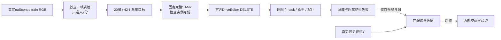

# r50：独立质检后扩大真实 DELETE 结构排查

任务 `WS-V77-TARGET-PROTECTED-20260929/r50`，主机 `wm-vgpu-1008`，更新2026-10-08。按用户要求先用subagent剔除低质量输入，补齐 **20个官方nuScenes train开发场景、42个独立单车目标**，每景2–3辆，全部输入2分。42例SAM已完成，40例实例准入后完成官方DELETE，仍覆盖20景；训练0步。

## 独立质检与补齐

首批49例由独立subagent逐例查看f00/f05/f09真实原图和目标crop，并检查可用的实际保护车参考：25例2分、24例1分，只有9景各有至少两个合格目标。先前主agent43例/18景的粗检查不再用作最终准入。

从同一真实RGB缓存追加38个候选，按同一门槛独立质检。累计87例、38景：**51例2分、34例1分、2例0分，目标输入uncertain为0**。最终20景42例准入；全部36个0/1分案例剔除；另外9个2分目标因所属场景未凑齐两例留作备用，不算模型失败。追加ID不复用旧拒绝ID，旧原图、清单和全部评分保留。

请求配置 `gpt-6-sol / xhigh`，未启用fast。工具没有返回实际运行模型身份，质检元数据明确记录requested配置与runtime未核实，未猜测模型。独立评分规则：

- **2分**：目标唯一可辨，尺寸、清晰度与曝光足够，主要车身轮廓没有严重截断或树/杆遮挡，三张图与目标投影一致。
- **1分**：目标能识别，但明显模糊、小、暗、眩光或重遮挡，不足以排查well-observed结构失败。
- **0分**：目标严重不可见、提示区主要落在其他前景车或输入严重无效。
- **uncertain**：仅确实无法判断才标记，不准入，必要时交用户；本轮没有这类删除目标。

这只是**抽帧输入质量**，不是完整视频稳定结论、SAM正确性或补景效果分数。生成后的用户verdict仍空，CPU页禁用生成评分控件，不要求用户重新审查已经判低质量的输入。

## 保护车证据分开记录

检查A是否适合作为删除目标，同时单独记B参考的`充分/薄弱/无候选/不能确定`。参考只包含真实视频可见像素，不生成或锐化。B证据充分不等于隐藏部分有GT；框重叠不是精确遮挡标签。

B crop只供审核，**没有额外输入本轮r46模型**。A得2分而B参考不足/归属不确定时，仍可做单车DELETE，但不能把它当“可靠后车先验已充分”的样本。后续优先研究A清楚、B实际证据充分且SAM入口正确的结构失败。

## 固定基线与采样边界

- **r46官方原始DriveEditor权重+r21完整SAM**：SAM2.1-large、`sam_full_v2`、r21写回，seed42、25steps、10帧、1024×576。每例恢复独立原视频副本，只删一辆车，不累计多车删除。
- 无Adapter、微调、参考分支、参数扫描或时间模块修改。当前视频模型仍需10帧，本轮主要定位单帧薄膜、后车变形和车身向道路延伸。
- 来源为既有104个train场景缓存，246个去重真实窗口、86景268个元数据目标候选；受旧缓存采样影响，**不是700景均匀总体评测**。新增候选按尺寸排序后仍须独立看图，不放宽质量凑数量，不读取任何本轮生成结果来筛输入。
- 元数据预筛：全窗80×40px、中位宽100px、边距4px、最大画面面积28%、关联visibility>=3。全局标注可见度不保证当前相机可见；独立RGB检查已剔除其失效例。
- 官方SDK关键帧关联标注、非关键帧插值；10个不同真实曝光，间隔40–170ms、中位80–120ms，没有插帧。原视频审核编码为10fps，曝光时间另保留在清单中。
- 五个后续隔离train景继续不看RGB、不训练/选方法，旧val final quarantine不动。隔离只针对本工程，不保证官方预训练没见过。
- 真实隐藏区没有GT。失败生成只用于定位；未来合成数据的Y必须来自真实视频。

## GPU结果与单帧结构粗分类

用户开启GPU并指定 `wm-vgpu-1008`。42例SAM无空mask；独立f00/f05/f09检查40例2分通过，R013吞邻黑SUV及行人、R066吞邻黑车，均1分拒绝。没有逐例改prompt、mask或seed补齐数字。20景仍覆盖，两景各剩1个生成目标，其余2–3个。输入2分与mask2分不表示补景合格。

40个固定DELETE全部完成，累计36.5分钟，中位54.4秒/窗，PyTorch峰值已分配显存21.86GiB，不含reserved/driver。官方checkpoint加载0 missing/0 unexpected；无Adapter、previous-window条件或训练。400帧洞外原像素、完整SAM内原生像素检查全部通过；800张原生/写回PNG保留在run。首次gate字段名不匹配在加载模型前停止，已对齐并保存旧日志；不是模型失败，也没有更换推理配置。

独立subagent每例仅审f05四列和同ROI近景，必要时核对真实B crop，未逐输出帧审查。多标签统计：`{'film_or_ghost': 14, 'car_body_extends_onto_road': 4, 'none_visible': 21, 'actor_regeneration': 4, 'protected_actor_deformation': 1}`，标签可重叠，包含任一列的可见现象；不能当最终任务失败率。原生/写回差别在逐例说明中，`none_visible`只表示抽取帧未见明显结构错误。车辆再生标签是单帧迹象，隐藏身份未知时保留不确定性。人工与时序verdict均空，不能当整段视频通过率、隐藏区域GT或模型根因证据。完整逐例依据见下方JSON。

40例B可见证据：充分9、薄弱8、无候选21、不能确定2。可见片段充分不等于全部隐藏车身已知；优先看有充分真实证据而仍有薄膜/变形的失败，再按布局与洞造遮挡，训练Y仍用真实视频。本轮没有训练或新方法收益，不自动恢复r49或开始参数扫描。

GPU已空、用户可切CPU。实际设备32GB RTX 4080 SUPER，CPU cgroup16核；数据盘余量与结束时进程证据保存在gpu_results.json/runtime，无清理或电源操作。

## 交付与证据

本地 `outputs/v77-real-delete-r50/index.html` 显示20景40个DELETE：原视频、SAM洞、官方原生DELETE、固定写回。两例mask拒绝在独立页保留原图与理由，不让用户重复审核低质入口。黄框A、绿框B。原生DELETE不是factual重建。`input_quality_archive.html` 保留退队列原图与逐例理由，低质量输入无需用户重审。只有确实无法判定的输入才给人工确认，本轮无此目标。

[准入清单](../autoresearch/worldsim_v77/target_protected_20260929/r50/selection.json)、[完整独立质检](../autoresearch/worldsim_v77/target_protected_20260929/r50/input_quality_review.json)、[退队列记录](../autoresearch/worldsim_v77/target_protected_20260929/r50/quality_exclusions.json)、[CPU检查](../autoresearch/worldsim_v77/target_protected_20260929/r50/cpu_check.json)。远端run `/root/autodl-tmp/runs/worldsim_v77/WS-V77-TARGET-PROTECTED-20260929/r50`；修改前备份 `/root/autodl-tmp/backups/v77_r50_quality_20261008T025348Z`。

`failure_ledger_refs: [V77-F02]`；`failure_ledger_delta: updated V77-F02`（新增真实结构现象，输入失败与生成失败分开）；更新同卡，不新造失败ID。

[GPU结果与资源](../autoresearch/worldsim_v77/target_protected_20260929/r50/gpu_results.json)、[SAM独立准入](../autoresearch/worldsim_v77/target_protected_20260929/r50/mask_visual_review.json)、[逐例单帧粗分类](../autoresearch/worldsim_v77/target_protected_20260929/r50/assistant_structure_review.json)。
