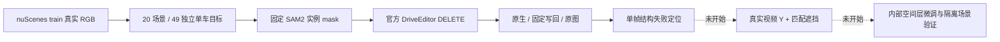

# r50：先扩真实 DELETE，再按结构失败造数据

任务 `WS-V77-TARGET-PROTECTED-20260929/r50`，主机 `wm-3090-1001`。本轮继承 r49 的无稳定薄膜收益边界，按用户最新要求回到 **r46 官方原始 DriveEditor + r21 完整 SAM**。当前只完成 CPU 输入准备；生成、结构失败分布、数据合成和空间层微调均未执行。

## 本轮固定范围

- 20 个官方 nuScenes **train** 场景，每景 2–3 个不同车辆实例，合计 49 例。一例只删一辆车，每个目标始终从独立原视频副本开始；不是同一视频累计删除多车。
- 统一 10 帧、1024×576、seed42、25 步、官方 checkpoint、SAM2.1-large、`sam_full_v2`、原 r21 写回。无新 Adapter、无参考分支、无时间模块训练，也不使用上一轮微调权重。
- 同一视频模型仍需 10 帧输入；“放下时间模块”指本轮不研究或改动时间层。主要看 f05 的结构现象，f00/f09 保留辅助定位；单帧不能判视频时序稳定。
- 目标真实 RGB、GT 相机/框只用于输入与实例提示；额外后车 crop 用于审核，**未额外送入原 r46 模型**。要区分“当前输入视频里有证据”与“别处有合法参考但当前模型没收到”。
- 隐藏区没有真实 GT；生成失败输出只作问题定位，绝不作为未来训练 Y。

## 采样与边界

复用既有官方公共盘 RGB 缓存，避免重新扫描约 294GB 压缩包。来源包含 104 个已准备 train 场景；去重后 246 个真实短窗中有 268 个目标候选，分布在 86 个场景。它受旧来源采样影响，**不是对官方 700 train 场景的均匀总体评测**，也不宣称旧场景从未曝光。

采样仅用原始数据和元数据，在任何新生成输出之前冻结。排除旧九场景、夜间元数据、明显小目标、截边、大幅前景遮挡的候选：全窗目标至少 80×40px、中位宽至少 100px、边界间隔至少 4px、最大面积不超过画面 28%、关联标注可见度至少 3。含后车的布局优先，实例按固定顺序去重。全局 visibility 与框交叠均是代理，不能当精确相机遮挡标签。

49 例中 34 例有达到尺寸门槛的后方车辆投影；其真实参考是否清楚，须结合 RGB 看。R022/R026 的亮度代理较低，单独记录。未触发图像纹理代理，不等于所有输入或后车细节合格。

主 agent 看完全部49例固定f05原图/目标crop后，另将R021/R022/R025/R026/R032/R036标记为输入受限：树木或护栏遮挡、强逆光、过暗。保留原样和理由，先不进GPU结构队列。有效候选43例/18景，部分景暂只剩1个有效目标；20景49例是采样分母，不伪称全部为well-observed。这是GPU前输入检查，不按生成输出挑结果，也不是独立或人工评分。新增案例可在本批后按同门槛补足，不放宽质量门槛凑数字。

另冻结 5 个官方 train 场景，排除全部既有来源场景与本轮 20 景；本轮不读其 RGB、不训练或选方法，后续检查新微调收益。官方原模型可能已用 nuScenes train，故“隔离”仅针对本工程开发/微调，不承诺对原预训练模型未见。旧 val 的 final quarantine 不动。

## GPU 前后分开检查

CPU 页提供每例目标黄框原视频、f00/f05/f09 原图与目标 crop、实际后车参考和来源。完整 SAM、模型洞、原生补景与最终 DELETE 的三列在未推理时明确空缺。

开卡后先运行统一 SAM2，再查看每例目标是否选对、是否空 mask、是否有明确邻车串入；GT 包络交叠只作疑点，不自动认定错误。真实入口错误单列，不能归入补景模型失败。仅通过实例检查的目标运行一次官方 DELETE，不逐例调框、seed、洞规则或步数。

生成后每例至少固定抽一帧原图 / mask / 原生 / 写回，粗分：薄膜或额外轮廓、保护车变形、车身向路面延伸、重新生车、输入 mask 错误、该帧未见明显问题、不能确定。优先选 **A 清楚、B 实际证据充分、入口正确** 的结构失败来确定下一批数据。

后续合成按实际失败的车辆布局、目标洞和遮挡过程匹配，用真实视频作 Y。先保留模型架构和时间模块；内部空间层微调必须在失败覆盖明确后另登记有界对照，不能从 CPU 候选统计直接启动训练。

## 工程与资源

- 相机是约 20Hz，旧 10Hz 网格的最近真实曝光会出现约 50/150ms 间隔。准备入口最初误用过窄间隔门槛造成零候选，已在 GPU 前修正为真实曝光范围；没有插帧或更改图像。首帧关键帧仍直接用官方关联标注，非关键帧按官方 SDK 插值。
- 准备阶段另修正了 NumPy 整数 JSON 序列化、checkpoint 索引路径和 CPU PATH 缺 FFmpeg。复用现有 bundled FFmpeg；不下载新模型。旧输入、修正前脚本与错误状态保留在 run 的 `before_changes/`，这些不是补景模型失败。
- 数据盘约余 91GiB，无清理需要；CPU 按当前 0.5 核配额限制线程。GPU 当前不可用，未运行 SAM2 或 DriveEditor。
- 预计 49 个单窗在 RTX3090 上纯推理约 1 小时，连加载、SAM 和中间实例检查预留约 1–2 小时；不是计时保证，开卡后以实际首批耗时修正。

## 准入与收口

本轮 GPU 最大 43 个一次性 DELETE 窗口，无训练、无自动追加实验。生成或实例检查失败保留原资产和对照，不换 seed 掩盖。结果给出原视频 / mask / 原生 / 最终四列，人工 0/1/2 及视频时序 verdict 留给用户。

CPU 机器合同和实际解码见 [cpu_check](../autoresearch/worldsim_v77/target_protected_20260929/r50/cpu_check.json)；目标清单见 [selection](../autoresearch/worldsim_v77/target_protected_20260929/r50/selection.json)。实际运行目录 `/root/autodl-tmp/runs/worldsim_v77/WS-V77-TARGET-PROTECTED-20260929/r50`，本地页 `outputs/v77-real-delete-r50/index.html`。

`failure_ledger_refs: [V77-F02]`；当前 `failure_ledger_delta: none`（尚无新生成或科学失败），在同卡记录本轮问题边界与准备状态，不新造失败 ID。
