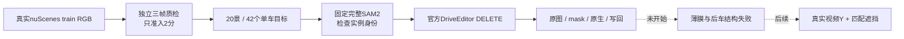

# r50：独立质检后扩大真实 DELETE 结构排查

任务 `WS-V77-TARGET-PROTECTED-20260929/r50`，主机 `wm-3090-1001`，更新2026-10-08。按用户要求先用subagent剔除低质量输入，补齐 **20个官方nuScenes train开发场景、42个独立单车目标**，每景2–3辆，全部输入2分。当前只完成CPU准备；SAM、生成和训练均为0。

## 独立质检与补齐

首批49例由独立subagent逐例查看f00/f05/f09真实原图和目标crop，并检查可用的实际保护车参考：25例2分、24例1分，只有9景各有至少两个合格目标。先前主agent43例/18景的粗检查不再用作最终准入。

从同一真实RGB缓存追加38个候选，按同一门槛独立质检。累计87例、38景：**51例2分、34例1分、2例0分，目标输入uncertain为0**。最终20景42例准入；全部36个0/1分案例剔除；另外9个2分目标因所属场景未凑齐两例留作备用，不算模型失败。追加ID不复用旧拒绝ID，旧原图、清单和全部评分保留。

请求配置 `gpt-6-sol / xhigh`，未启用fast。工具没有返回实际运行模型身份，质检元数据明确记录requested配置与runtime未核实，未猜测模型。独立评分规则：

- **2分**：目标唯一可辨，尺寸、清晰度与曝光足够，主要车身轮廓没有严重截断或树/杆遮挡，三张图与目标投影一致。
- **1分**：目标能识别，但明显模糊、小、暗、眩光或重遮挡，不足以排查well-observed结构失败。
- **0分**：目标严重不可见、提示区主要落在其他前景车或输入严重无效。
- **uncertain**：仅确实无法判断才标记，不准入，必要时交用户；本轮没有这类删除目标。

这只是**抽帧输入质量**，不是完整视频稳定结论、SAM正确性或补景效果分数。生成后的用户verdict仍空，CPU页禁用生成评分控件，不要求用户重新审查已经判低质量的输入。

## 保护车证据分开记录

检查A是否适合作为删除目标，同时单独记B参考的`充分/薄弱/无候选/不能确定`。参考只包含真实视频可见像素，不生成或锐化。B证据充分不等于隐藏部分有GT；框重叠不是精确遮挡标签。

B crop只供审核，**没有额外输入本轮r46模型**。A得2分而B参考不足/归属不确定时，仍可做单车DELETE，但不能把它当“可靠后车先验已充分”的样本。后续优先研究A清楚、B实际证据充分且SAM入口正确的结构失败。

## 固定基线与采样边界

- **r46官方原始DriveEditor权重+r21完整SAM**：SAM2.1-large、`sam_full_v2`、r21写回，seed42、25steps、10帧、1024×576。每例恢复独立原视频副本，只删一辆车，不累计多车删除。
- 无Adapter、微调、参考分支、参数扫描或时间模块修改。当前视频模型仍需10帧，本轮主要定位单帧薄膜、后车变形和车身向道路延伸。
- 来源为既有104个train场景缓存，246个去重真实窗口、86景268个元数据目标候选；受旧缓存采样影响，**不是700景均匀总体评测**。新增候选按尺寸排序后仍须独立看图，不放宽质量凑数量，不读取任何本轮生成结果来筛输入。
- 元数据预筛：全窗80×40px、中位宽100px、边距4px、最大画面面积28%、关联visibility>=3。全局标注可见度不保证当前相机可见；独立RGB检查已剔除其失效例。
- 官方SDK关键帧关联标注、非关键帧插值；10个不同真实曝光，间隔40–170ms、中位80–120ms，没有插帧。原视频审核编码为10fps，曝光时间另保留在清单中。
- 五个后续隔离train景继续不看RGB、不训练/选方法，旧val final quarantine不动。隔离只针对本工程，不保证官方预训练没见过。
- 真实隐藏区没有GT。失败生成只用于定位；未来合成数据的Y必须来自真实视频。

## 下一步与资源

CPU已检查20景每景2–3个不同实例、所有准入分数为2、原视频实际解码420帧。GPU入口同样拒绝非2分清单。当前无GPU，停止等用户开卡，不在CPU加载模型或后台等待GPU。

开卡后先统一SAM并逐例查目标、空mask和明确串邻车；GT包络交叠只提示疑点，不自动认定分割错误。入口通过后每车只运行一次官方DELETE，保留原生与最终写回。固定抽帧粗分薄膜、后车变形、车身向道路延伸、重新生车、mask错误、未见明显问题或不能确定；视频时序需另外看视频。

先看真实结构失败，再按布局、洞和遮挡过程造数据，之后登记有界内部空间层微调与独立场景验证。不能从CPU输入统计直接启动训练，不换seed掩盖失败。

GPU批次最大42个固定窗口，连SAM、加载与入口检查预留约1–2小时，开卡后用实测更新。CPU按0.5核配额限线程，数据盘约余91GiB，无清理或电源操作。追加候选复用既有准备函数；同名prepare导入路径冲突已在CPU修正，不涉及模型。

## 交付与证据

本地 `outputs/v77-real-delete-r50/index.html` 显示20景42个2分目标，原图黄框A、绿框B；尚未推理的列明确空缺。`input_quality_archive.html` 保留退队列原图与逐例理由，低质量输入无需用户重审。只有确实无法判定的输入才给人工确认，本轮无此目标。

[准入清单](../autoresearch/worldsim_v77/target_protected_20260929/r50/selection.json)、[完整独立质检](../autoresearch/worldsim_v77/target_protected_20260929/r50/input_quality_review.json)、[退队列记录](../autoresearch/worldsim_v77/target_protected_20260929/r50/quality_exclusions.json)、[CPU检查](../autoresearch/worldsim_v77/target_protected_20260929/r50/cpu_check.json)。远端run `/root/autodl-tmp/runs/worldsim_v77/WS-V77-TARGET-PROTECTED-20260929/r50`；修改前备份 `/root/autodl-tmp/backups/v77_r50_quality_20261008T025348Z`。

`failure_ledger_refs: [V77-F02]`；`failure_ledger_delta: none`（本次输入准入调整，尚无新生成或科学失败）；更新同卡，不新造失败ID。
