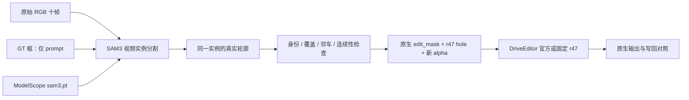

# r53：SAM3 真实轮廓入口与 r52 数据退役

唯一 task/run：`WS-V77-TARGET-PROTECTED-20260929/r53`。2026-10-09，CPU 准备；分割/生成推理 0 窗，训练 0 步。对象仍为 R001（scene-0290 / CAM_FRONT），已曝光的 train DEV，不是独立测试。

图中 SAM3 推理及其右侧实际图像步骤尚未运行；此次只完成权重、CPU 接口与合同检查。未生成新训练 Y。

## 先关闭错误的数据解释

r52 的两类数据均 `retired_from_training`：

- 平移矩形到道路，再以原始 RGB 为 Y，主要重复 DriveEditor 既有背景 inpainting 任务。官方训练包含 10,110 条视频，其中 2,000 条专用于无物体区域挖洞恢复；本轮没有提供 R001 银车后方正确的去车真值。[论文数据构造](https://arxiv.org/html/2412.19458v2#S3)
- ROI 看起来合理不代表按矩形 mask 写回后的伪标签合格。最终硬合成有接缝、标线和结构缺陷，best1 单例学习后全尺寸输出回退。数据仅保留失败证据价值，不继续训练或扩量。

真实 RGB 路线仍有有限的工程诊断价值：原生主干可反传、同场景适配可改变输出；这不能证明该造数据方法教会了指定目标的正确 DELETE。历史结果和 AI 分数不重写，详见 [r52 报告](SINGLE_CASE_FINETUNE_R52.md)。所有 r52 pair 祖先目录含退役标记，`train_one.run` 在读数据、创建模型之前拒绝使用，`train_scored` 经同一入口生效；历史评估入口仍可复现。

## 矩形从何而来

`delete_audit/mask_contract.py:11-16` 将 SAM2 轮廓膨胀后的外接区域全部置 True。原 `iteration17/gpu.py` 和 `iteration19/evaluate_one.py` 将这个 `model_mask` 交给原生模型，r47 条件又单独保存同一个旧洞。R001 f04 的原 SAM2 轮廓为 17,537 像素，模型洞为 32,964 像素的完整矩形。

因此仅换 SAM 权重不能改变最终 mask。保留旧路径复现基线；新 `iteration20/sam3_real_mask.py` 直接保存 SAM3 视频返回的同一实例布尔轮廓，不调用旧外接矩形逻辑。提示框不是删除区域，也不作监督真值。

`load_sam3_handoff` 同步三处：

1. 原分辨率布尔 `DeletionRequest.edit_mask`；
2. 重新生成的二值 float alpha，洞内 1、洞外 0，不复用旧羽化；
3. r47 `priors['hole']`，按已有 1/4 面积规则从同一轮廓重建。

检查严格二值、帧数、实例 ID、空洞、掩码保存一致性、原图和模型尺度的矩形退化。CPU 构造输入验证旧 prior 被替换、alpha 一致，矩形与轮廓不一致会拒绝。此检查仅防接口错误，不能证明真实分割正确；近矩形判据是当前 R001 的防退化规则，不是通用质量评分。

## 来源与运行边界

- 官方源码：`/root/autodl-tmp/external/sam3`，commit `0570b3a5be9c4e694f23d85232fb55f4a6f1f7fc`。
- 用户指定镜像：[ModelScope facebook/sam3](https://modelscope.cn/models/facebook/sam3)，下载 `master/sam3.pt`，3,450,062,241 字节。没有重复下载 `model.safetensors`。
- 权重路径：`/root/autodl-tmp/models/worldsim_v77_sam3/sam3.pt`；同目录保存 model card、LICENSE、来源和 CPU 解析记录，不建哈希账本。
- CPU 用 `torch.load(weights_only=True, mmap=True)` 解析通过，1,465 个条目。未据此声称模型推理已通过。
- 隔离环境：`/root/autodl-tmp/envs/worldsim-v77-sam3`。复用 v75 的 Python 3.12 / Torch 包，SAM3 自身依赖安装于独立环境；原 DriveEditor 环境未改。依赖与导入实测记录位于 run `cpu_validation.json`。
- 当前无 GPU；实际 CUDA 驱动兼容性、显存和 SAM3 身份质量留待开卡核验。正常脚本必须给本地 `sam3.pt`，无默认 HF 自动下载。

## 下一步只推进一关

先执行 `r53/gpu_command.txt`：R001 十帧，f00 像素框 `[155.28,286.08,396.37,440.58]` 作为 prompt，双向传播同一实例。检查是否只选银色 A、车身边缘是否完整、是否吞邻车、逐帧是否连续，再确定训练洞和有效监督。仅轮廓正确不能生成被遮挡的真实背景；原有错误伪标签不恢复入训。

CPU 审核页展示 f00/f04/f09 原图、历史 SAM2 和旧矩形洞，明确不是 SAM3 结果。人工 verdict 为空。无自动训练、参数扫描、模型 sweep 或新定时任务。

failure_ledger_refs: `V77-F02`。failure_ledger_delta: 记录轮廓被矩形化与旧数据退役；尚无 SAM3 模型收益结论。
