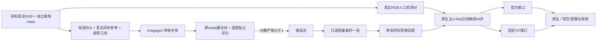

# r52：R001 单例主干微调与有评分的伪标签

唯一任务/运行：`WS-V77-TARGET-PROTECTED-20260929/r52`。主机 `wm-vgpu-1008`，分支 `research/worldsim-v7.7-target-protected-editing`。仅 R001（scene-0290/CAM_FRONT），先处理薄膜、黑影、删除不净；未扩跨 case，未做泛化结论。

## 监督和数据角色

两种监督分开训练，均从官方主干开始，不用生成图冒充真实隐藏 GT。

1. **真实 RGB 合成遮挡**：原 R001 的10个真实时间点作 Y，固定平移矩形洞产生条件。移到真实道路的洞不是原始银色 SUV 的真实去车配对；早帧有少量真实车边缘是该 proxy 分布的一部分。
2. **生成伪标签**：R001 f00–f09 各一次内置 imagegen，局部 RGB + 独立 mask + 同车参考 + 已投影 O/N/U 控制。f00–f03 没有当前 B hull 时明确为空，不复制 f05 hull。灰 U 不等于背景，邻帧参考未对齐，不直接复制整排车辆。

模型生成后，仅用洞外证据估计小配准；保留原候选、未配准及配准硬合成，不扩大 mask。逐张评分针对最终硬合成结果。根据用户最新授权，**严格 score>1 仅为候选池准入，实际采样只取最高质量一张**，没有把旧 0.7/0.9 分改高。

10张新标签分数依次为 `1.2,1.3,1.3,1.3,1.5,1.5,1.4,1.4,1.3,1.4`，均值1.36。用户随后提供的具体 ROI 像素未匹配到已保存生成版本，来源记为 user-provided，prompt/model 未核实，不伪造生成记录。它的 ROI 约2.1是用户转述旧评分；本次最终硬合成独立分数为1.2，主要损伤为矩形明暗接缝、纹理跳变、白线断点及右侧小黑痕。所有11候选均超过准入门槛，但只有一张实际进入本轮主实验。

最终选择 **R001_f04_imagegen（1.5）**：与同分f05相比，后车B更贴合当帧投影范围，右侧小黑残留和接缝较轻；用户优先候选最终质量较低，未替代它。保留全部图像、prompt、分数和理由，见 `best1_candidate_pool.json`、`batch_reviews/best1_selection_review.json` 和 `user_priority_composition/quality_review.json`。原 f04 删除 mask 为32964像素的矩形包络，不能称精准车辆轮廓；不扩大mask。

**采样纠正**：最初误把“score>1可准入”当成“合格项全部入训”，已完成全10张轮转64步；保留该实验及其结果，但不当作正确采样策略，也没有证据证明它优于best1。纠正后从官方权重重新训练唯一f04：来源帧4，10帧输入均为这一帧的静态重复，64步均选同一候选。不是10个独立样本，也不是连续GT视频。训练和推理都用R001，只检验单例可学习性，不是独立测试。

## 训练范围和实际执行

按[官方 DriveEditor](https://github.com/yvanliang/DriveEditor)主模型冻结范围更新主 SVD U-Net：1647张量、1,809,579,626参数；无 LoRA。VAE/CLIP/SV3D及官方 `_3d`、`time_embed`、`label_emb`不更新。r47 step320分支只在推理接入。采用原 EDM loss、AdamW8bit（仅优化器状态压缩）、lr1e-5、BF16前向/FP32可训练权重、梯度检查点。成熟工程参考：[Diffusers 原生参数训练示例](https://github.com/huggingface/diffusers/blob/main/examples/dreambooth/train_dreambooth.py)。

三次训练（真实RGB、历史全10、纠正后的best1）均为10帧、320×576、64步，seed6201起，保留最终64步checkpoint及最后优化器。为腾出空间，已确认未被评估使用后仅删除前两次的32步中间checkpoint，释放13.48GiB，记录在 storage_cleanup_unused_step32.json；其他证据保留。GPU约23.2GiB allocated /24.4GiB reserved，未出现OOM或数值错误；1647个张量均有梯度。训练数据和内容不同，因此两条监督差异不构成严格单变量消融。

真实R001推理固定576×1024、10帧、seed42、25步，官方与r47各接同一主干checkpoint。原权重两臂复用r50/r51同输入同配置产物。另有同训练320×576的真实RGB proxy容量对照。best1独立比较完全同训练输入尺寸的320×576静态容量，以及576×1024的f04静态窗口官方/r47输出；前者和后者分开解释。旧f00静态重复窗来自全10探索。单帧1帧推理出现彩色异常，完整保存但不当作有效视频基线。

## 结果与边界

**真实 RGB proxy 路线**：在真实 R001 f05 的实际DELETE上，独立视觉评分如下。主要灰膜和宽黑影消失，小黑短痕和标线不连续仍在；原生图已经改善，不是仅靠写回。此处训练的是同一R001场景的真实RGB proxy，而非真实去车GT。

| f05 实际DELETE | 原权重 | 真实RGB 64步 |
|---|---:|---:|
| 官方原生 | 0.2 | 1.6 |
| 官方写回 | 0.7 | 1.7 |
| r47原生 | 0.6 | 1.6 |
| r47写回 | 0.8 | 1.7 |

**唯一f04伪标签路线**：独立复评结果：同训练尺寸320×576，原生/写回从0.2/0.3到0.7/0.8；全尺寸576×1024的对应f04静态输入，官方与r47两臂均从原生0.5、写回0.6降至0.2、0.3。薄膜/黑影部分减弱，但被矩形拼接块、白线回卷和车列/建筑纹理熔合取代。单例未过关，r47没有消除这一退化。

旧全10探索的权重和输出继续保留，但没有与best1构成相同源帧、同一评估合同的全面采样比较，因此不声称10张全用或只选1张哪种总体更优。

独立图像review使用用户指定的5.6-sol/xhigh，未启fast；真实RGB路线固定f05，best1路线对应f04静态窗，旧全10另列f00，不用GT像素误差代替视觉分数，不推断整段视频通过。人工verdict始终空。旧Qwen局部候选2.1与硬合成0.8分别保留，不混用分数；按最新用户指令停止其他模型横比，未把Qwen候选加入本批训练。

## 用户复核后的关闭结论

本轮数据全部退出后续训练，只保留failure/工程诊断证据，见 `TRAINING_INPUTS_RETIRED.json`；训练入口拒绝这些退役输入继续训练。历史候选分数和当时的score>1准入不回写篡改，但它们不再代表当前训练可用性。

- 道路矩形proxy本质重复原DriveEditor随机遮挡无物体背景的任务。官方原训练已有2,000条专用inpainting视频。它没有提供“原银车位置的正确隐藏背景”或针对后车/残影的新监督，只能检验原生主干训练工程和观察同场景适配变化。[论文数据构造](https://arxiv.org/html/2412.19458v2#S3)
- 矩形硬拼接伪标签有明确failure价值，但作为训练数据退役。接缝、错接标线与隐藏车身份不确定不能因score>1而忽略；full-resolution退化没有支持扩大此类数据。
- 工程根源之一：`delete_audit/mask_contract.py` 把SAM轮廓膨胀外接框填满为model_mask；f04原SAM面积17,537，最终框洞32,964。升级SAM3必须绕开此矩形化，而不只是换checkpoint。SAM3轮廓仍不能创造正确的隐藏背景GT。

本轮没有继续128步、扫参数或跨case扩量。第一关的输出是否足够好仍由用户审核；即使单例改善，也不能证明隐藏后车身份真实、时序稳定或泛化。

## 复核入口

- 远端完整运行：`/root/autodl-tmp/runs/worldsim_v77/WS-V77-TARGET-PROTECTED-20260929/r52`。
- 本地HTML：`outputs/v77-single-case-r52/index.html`，含全部11张候选分数与入选理由、best1及真实RGB路线的官方/r47原生和写回对照，旧全10保留为历史探索。
- 代码：`scripts/worldsim_v77/target_protected/iteration19/`；轻量执行与QA：`docs/autoresearch/worldsim_v77/target_protected_20260929/r52/`。
- 语法、输入尺寸/洞外像素、评分严格门槛、静态窗标记、权重键集合与梯度有限性检查通过。HTML链接与MP4完整解码另见closeout。

`failure_ledger_refs: [V77-F02]`；`failure_ledger_delta: updated V77-F02`。生成与写回问题分开保留；不新增失败ID。
