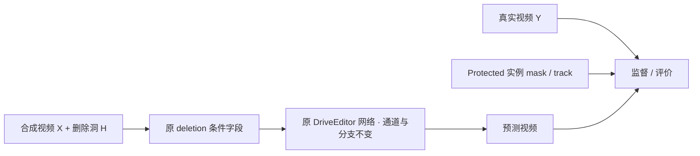

# 保持 DriveEditor 架构的输入与监督合同

`WS-V77-TARGET-PROTECTED-20260929/r1`。当前仅制定并用CPU验证数据接口边界；未启动训练或修改网络。本文与质量协议共同约束后续适配器。

官方[`sgm/data/nus.py::get_blank`](https://github.com/yvanliang/DriveEditor/blob/main/sgm/data/nus.py)将真实视频遮洞作为条件，GT为原视频；目标appearance/position条件无有效实例。新的Target + Protected Actors数据复用这些字段，不能偷偷把多actor reference接进新增网络分支。

| 字段/角色 | 来源与边界 |
|---|---|
| `jpg`（训练监督） | 真实Y的确定性resize/normalize；GT本身不生成、不修补 |
| `cond_frames*` | 从X构造masked RGB并按原接口加噪声；洞内归一化RGB置0；不能直接复用Y未遮挡crop |
| `cond_frames_without_noise` | masked X首帧 + 原deletion的空目标appearance占位 |
| `mask_concat` | 与真实输入H一致，下采样/值域遵循官方接口 |
| 目标3D/object position/appearance | 沿用原deletion的禁用/占位；不把待删A当待生成actor条件 |
| `depth / mask_fuse / valid_mask / obj_ratio` | 保持原deletion约定，不引入B/C的新condition通道 |
| protected masks / IDs / boxes | 数据质量、分组、评价及未来损失区域；不加入网络前向的condition字典 |
| protected refs | 保存合法来源供研究，但当前不自动输入模型；Y中被遮部分不能作为推理可得reference |

官方loss是扩散训练损失；不能把论文草图的RGB L1直接冒称已经落地。后续是否对hole/protected区域加权，应在可运行原训练基线、固定留出和单次显存测试之后明确。这里没有已完成的loss改动。

一个重要边界：若A的全部合成影响域被H覆盖，则masked X与同洞masked Y相同。此时donor纹理/边缘多样性不会进入模型的可见条件；合成X仍可检验mask和数据真实性，但训练主要新增的是**遮住真实B/C的任务分布及对应真实Y监督**。不能用“做了很多贴车外观”替代对实际模型条件的检查，也不故意保留A残边制造shortcut。

每窗还需统计H之后B/C剩余的可见像素，而非只统计alpha遮挡率。H吞掉B/C全部证据的片段不进入首轮well-observed组。源RGB/GT/参考和生成输入均分开保存。

CPU合同测试仅验证规范化masked条件不读Y、洞覆盖时X/Y条件等价，以及人工逐帧准入需全部帧明确通过。不是GPU训练前向或视觉质量验证。
