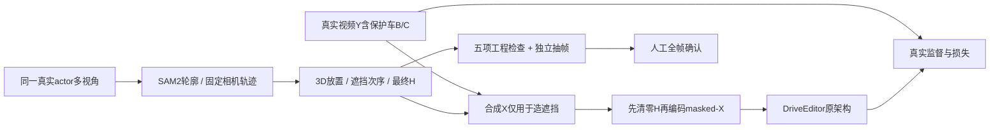

# Target + Protected Actors r2：按模型实际输入修订数据工厂

`WS-V77-TARGET-PROTECTED-20260929/r2`，2026-09-30。仅CPU：归档4份外部AI CSV，核对49例810帧；一个`gpt-6-sol / xhigh / fast=false` subagent按用户最新标准重评37个1分例，主线程核查630帧。重评：**{'train_usable_pending_human': 27, 'uncertain': 9, 'reject': 1}**。`train_usable_pending_human`仅技术可用、待原定人工全检；训练准入0。没有新GPU前向、新合成视频、微调、下载、定时任务或电源操作。

## 规则修订与评分来源

4份CSV是用户明确标注的**外部AI review**。49个case、810条帧记录的ID/时间戳/路径/分数长度全部匹配；原分数为37例1分、11例2分、1例0分。每例帧分均为常数，不能因此声称AI逐帧独立看过。原始文件原样保留，不转换成人工verdict。

用户先要求低分淘汰、不重审，随后因模型输入合同明确改为**重新检查1分例的训练可用性**；本报告采用最新指令。此前低分淘汰快照保留在run的`admission_before_training_contract_review.json`，不再作为当前训练准入。原2分也未自动认证。

五项必要条件：车辆silhouette合理；尺度/位置及ego关系合理；轨迹/尺寸/yaw/mask连续；camera→A→B的几何次序正确；最终条件确实移除全部synthetic影响。已完整遮住的RGB材质、受光、贴片、阴影不单独拒绝。真实空间浮起、压ego、错误尺度、洞泄漏、不合理hole或误遮B仍拒绝。D009按用户明确空间失败保持0分；D006有同类真实hood覆盖证据。P002/P005等的底边疑点按新review保留，不用GT框通过强行抵消视觉不确定。

## DriveEditor真正看到的内容

本地官方代码版本`e67d73a6ffc0a90996331db1e1415ab92b341293`：`sgm/data/nus.py:58`的`get_blank`把RGB归一化后先清零删除区域；`cond_frames`为masked视频+条件噪声；`cond_frames_without_noise[0]`也是已经masked的首帧。`jpg`是完整真实Y，`sgm/models/diffusion.py:201`编码它，loss对其latent加噪；并不是把完整synthetic-X送进条件。删除的目标外观/3D条件使用官方空占位，未增加B/C输入通道，UNet仍9通道。

执行官方`get_blank`未修改AST的CPU控制和新适配器26字段键/形状对比；控制RGB已是目标尺寸，mask按官方nearest缩1/8。更改隐藏X不改变任何条件、更改隐藏Y只改变监督、改可见上下文会改变条件。真实D008前10帧也验证masked-X=masked-Y。大张量整包验证曾被系统杀死，保留日志后改为适配无卡0.5CPU/2GiB的低内存路径；不声称已跑完整训练包、VAE/UNet或反向。

37例630帧全分辨率`X-Y`都被H覆盖，RGB泄漏0，masked-X=masked-Y，清零后resize224仍相等。所有case的nearest latent mask回投都有边界漏标cell；但**RGB已在编码前移除，因此不能把latent标签边界alias误判成露出车身**。记录any-pixel/max-pool覆盖候选及额外覆盖B的比例，没有悄悄更换官方冻结规则。若未来在resize后才清零或先编码完整X，必须重新跑这些因果探针。

本轮新CPU adapter是可复核数据入口，未连接正式训练DataModule运行，不代表已经微调成功。目标训练数据价值来自真实隐藏道路/B/C监督与可见上下文，不来自模型看不见的A车漆。

## 原始贴片问题与新造数入口

用户图用像素特征反查到W029第8帧，供体S045原第28帧。原车下缘紧贴可见ego机盖，右下轮胎/暗部/路面分界不可靠；旧mask把该下缘复制进去。原图/overlay/隔离像素与仿射反查保留。W029原AI为2分，用户明确指出贴片不干净；新的训练判据下仍暂缓，不擅自改成人工训练通过或代打数值分。

新提案与渲染入口均加入供体黑名单、底边/ego近邻与连通分量风险检查，真实W029旧提案被渲染入口在像素写入前挡住。这个保守门槛只用于**新造数来源选择**，不是把S045全部历史训练条件一票否决；后者按实际H与空间证据逐例判断。所有旧资产/视频/评分保留，mask不被硬裁后自动放行。

## 多视角与预算

现有短窗45个供体实例中没有合格跨相机组合；扫描同一实例完整真实track得到1142条几何候选视图、8个跨相机实例。第一次只追求大角度的4实例9图，实图有小目标和前车遮挡，保存但未推理。

全局修订为至少128×72px、弱视角仍够大、保守排除前方GT包络交叠>3%与底边近邻，再选不同实际相机和≥15°角度差。532候选视图中137个因潜在前景包络交叠被保守排除，395保留，最终有限预检选**2实例4图**（T021与S024），RGB从公共盘补齐；包络排除不等价确认像素分割错误。相机曝光异步，不称同步瞬时多目。

整段view选择器要求同一真实instance、同一camera-track、全段角度相容；不逐帧拼最佳图。当前4图只是清洁mask预检，**没有新连续多视角合成片段，也未达50例合格目标**。下一步先4张SAM2；新输出只做一次Sol xhigh检查，通过后才扩连续10帧窗口、共用世界轨迹、多相机独立clip及后续人工全检。

通过机器全帧检查、同源结果复用、单个subagent按需查看首中末来控制额度，不因外观反复看旧case。本轮只有用户明确要求的37例重评；不新增光照生成器。NVIDIA Harmonizer等模型能做重建渲染的外观/光照修复，但不能据此认证真实轮廓或未知视角，且完全遮挡合同会隐藏贴片RGB，本阶段不下载接入。

## 验证与停止点

7项新准入/视角单测、实际渲染入口阻断、Python编译、官方CPU数据合同、630帧工程核查完成。独立抽帧不能替代人工全帧；浏览器交互未实测。数据盘约145GiB空闲，无扩盘需求。已停在需要GPU的SAM2入口，默认命令仅CPU核对队列，必须收到用户开卡通知才执行`--execute`。

运行目录：`/root/autodl-tmp/runs/worldsim_v77/WS-V77-TARGET-PROTECTED-20260929/r2`。入口：`scripts/worldsim_v77/target_protected/iteration2/segment_multiview.py --root /root/autodl-tmp/runs/worldsim_v77/WS-V77-TARGET-PROTECTED-20260929/r2 --execute`（本轮未执行）。[本地报告](C:/Users/dengyunlong/Documents/Codex/2026-09-26/xia/outputs/v77-target-protected-r2/index.html)、[37例新判据逐帧页](C:/Users/dengyunlong/Documents/Codex/2026-09-26/xia/outputs/v77-target-protected-r2/data_review.html)、[证据](../autoresearch/worldsim_v77/target_protected_20260929/r2/summary.json)。failure_ledger_refs: [V77-F02]；failure_ledger_delta: updated V77-F02。

一手来源：[DriveEditor训练loader](https://github.com/yvanliang/DriveEditor/blob/main/sgm/data/nus.py)、[扩散训练目标](https://github.com/yvanliang/DriveEditor/blob/main/sgm/models/diffusion.py)、[SAM2官方](https://github.com/facebookresearch/sam2)、[Harmonizer](https://github.com/NVIDIA/harmonizer)。
