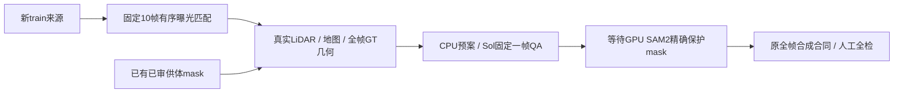

# v77 r4：CPU有序曝光与空间配对

`WS-V77-TARGET-PROTECTED-20260929/r4`；用户明确仅CPU继续。完整run `/root/autodl-tmp/runs/worldsim_v77/WS-V77-TARGET-PROTECTED-20260929/r4`。保持DriveEditor架构、真实Y监督与五项训练合同。

32个未处理窗口、31个scene，26个是新的来源scene；限定现有03/07公共分片、Boston地图。旧30帧外层门槛仅10例通过；本轮实际需要固定网格10:20。修正后最近邻24例、有序唯一曝光匹配29例，通过实际曝光几何29例。匹配误差55ms、间隔180ms未放宽，目标时刻未变；四项控制测试通过。保留原30帧对照，停止不必要的旧提取作业，已提取原件复用。

在真实LiDAR地面/地图/净距/视角/连续性门槛下，28个地面检查通过，4个预案/4个scene，类型{'single_actor': 4}。来源独立单帧{'pass': 4}，GPU队列4个实例，disabled。包络覆盖比例只是CPU规划代理，精确mask未获得，不能宣称密集遮挡训练样本已合格。固定每例第6帧独立检查、全帧机器几何，不认证全视频时序。GPU调用0、新合成0、训练0、人工null。

两分片仅按需解包377个文件，其中复用57个；缺失0。半核/2GB，单线程、流式元数据与8供体mask缓存。GPU后须执行真实SAM2保护mask、原精确遮挡/可见比例与写回合同、独立QA、人工全检。并非改模型或训练的证据。

[轻量证据](../autoresearch/worldsim_v77/target_protected_20260929/r4/summary.json) · [CPU报告](../autoresearch/worldsim_v77/target_protected_20260929/r4/review_link.md)。failure_ledger_refs: [V77-F02]；failure_ledger_delta: updated V77-F02。

供体多样性控制：19/29个receiver的前6个窗口只覆盖1–3个真实实例。相同6供体×35位移预算，按实例去重对照得到3例，原排序4例；去重丢失C012、新增scene为0，不采用替换，保留原排序。两组原始结果均保留。此有限对照未解决密集类缺额，不继续在本轮重复扫格；不能由此否定所有多样性采样。

## 复现与下一步入口

CPU检查：`CUDA_VISIBLE_DEVICES= OPENBLAS_NUM_THREADS=1 /root/autodl-tmp/envs/motionproj/bin/python scripts/worldsim_v77/target_protected/iteration4/test_sampling.py`；GPU队列预检运行同目录`segment_receivers.py --root /root/autodl-tmp/runs/worldsim_v77/WS-V77-TARGET-PROTECTED-20260929/r4`，默认只校验真实RGB、曝光、GT prompt与独立QA，不导入torch或加载模型。

只有用户重新明确开启GPU后，才使用`/root/autodl-tmp/envs/worldsim-v77-sam2/bin/python scripts/worldsim_v77/target_protected/iteration4/segment_receivers.py --root /root/autodl-tmp/runs/worldsim_v77/WS-V77-TARGET-PROTECTED-20260929/r4 --execute`。入口有独占锁、来源字段和全部PNG解码续跑检查。输出`segmented_receivers/`，仍须独立mask检查与原精确合成关卡。此命令本轮未执行。
