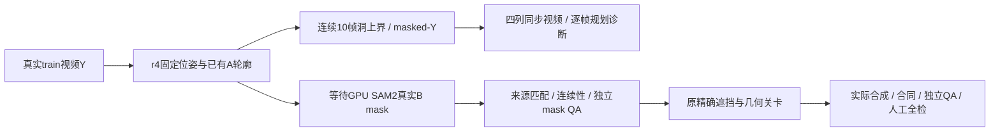

# v77 r5：CPU连续洞规划与精确mask准入入口

`WS-V77-TARGET-PROTECTED-20260929/r5`。沿用r4四个预案、实际曝光、donor与位姿，不追加搜索。用户上一条CPU限制仍有效，本轮GPU调用0；读取到3090可用不视为自动解除限制。完整产物 `/root/autodl-tmp/runs/worldsim_v77/WS-V77-TARGET-PROTECTED-20260929/r5`。

4个scene/40个规划帧，16段MP4/160视频帧实解码。原Y确定性缩放至1024×576；A轮廓来自同一个已审donor连续SAM2；洞采用r4同一6px保守上界。预览四列是原Y+B定位框、A洞上界、归一化0的masked-Y条件规划、米制位姿。绿色GT包络仅定位，不替代精确B mask；中灰条件没有完整synthetic-X，也不是补景输出。逐帧记录真实曝光时间，MP4按10fps诊断播放；不由视频编码完成或已有单帧QA认证时序。

40帧隐藏像素扰动后条件不变，自车底部64px禁入通过。连续A mask统计保存，仅作为规划风险记录，未认证真实B遮挡比例。复用r4已完成的Sol固定一帧来源检查，未重复AI看图；新实际合成0、合格训练对0、人工null。

`admit_exact.py`默认读取r4 SAM2产物及`receiver_mask_reviews.json`。必须来源/实例/prompt/曝光文件相符、10张PNG完整、数值连续性通过、独立mask QA明确pass，才重建原位姿并调用原`build_pairs.evaluate`，保持single/dense遮挡比例、最终洞可见性与ego门槛；规划类别与真实mask类别不同则退出。当前4例全部waiting_inputs，render candidates0。四项准入测试检查缺评审、uncertain、错实例与匹配pass；默认CPU入口实际跑过。GPU模型与完整合成部分未执行，不能把这个入口的实现当作视觉成功。

本地160张逐帧JPEG解码、资源链接、组件图和JS语法检查通过；浏览器交互未实测。独立审核模板只作为空表，不自动产生pass。r4/r3原资产及评分全部保留。

## 入口

CPU：`CUDA_VISIBLE_DEVICES= OPENBLAS_NUM_THREADS=1 /root/autodl-tmp/envs/motionproj/bin/python scripts/worldsim_v77/target_protected/iteration5/admit_exact.py --parent /root/autodl-tmp/runs/worldsim_v77/WS-V77-TARGET-PROTECTED-20260929/r4 --root /root/autodl-tmp/runs/worldsim_v77/WS-V77-TARGET-PROTECTED-20260929/r5`。

GPU来源mask仍通过r4的`segment_receivers.py --execute`。该步骤需用户明确解除CPU限制；完成后先做真实mask独立检查，把审核结果写r4的`receiver_mask_reviews.json`，再执行本轮精确入口。实际合成、模型输入合同及人工全帧检查继续按旧规则推进，未到训练阶段。

[轻量证据](../autoresearch/worldsim_v77/target_protected_20260929/r5/summary.json) · [报告入口](../autoresearch/worldsim_v77/target_protected_20260929/r5/review_link.md)。failure_ledger_refs: [V77-F02]；failure_ledger_delta: none（本轮是工程准备，没有新增模型失败或替换原负对照）。
