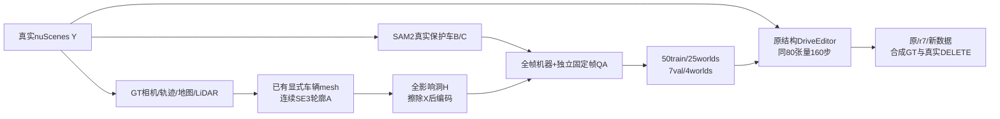

# Target + Protected Actors r8：数据覆盖控制

任务 `WS-V77-TARGET-PROTECTED-20260929/r8`。50训练例扩到25场景、同80张量160步，7合成留出与8真实DEV、三权重共45个窗口全部完成。**新数据版尚未比有效r7获得稳定增量收益，不推广r8权重。** 原权重与有效r7及所有旧结果保留。

## 数据准入

68候选来自三维轮廓工厂；全部680帧实际磁盘X/Y/影响/H重载，验证影响完全遮盖、编码前X和Y遮洞条件相同、真实Y重新解码一致、ego禁入、metric位姿/尺度/yaw/轮廓连续和A前B后的深度合同。所有模板先在真实地面、地图可行驶/停车范围、GT包络间距至少0.3m与地面支撑2.5m内筛选，未知动态包络不允许被洞吞入；真实后方静态道路设施可作为恢复背景。

独立gpt-6-sol xhigh、不用fast，每例固定一帧实看：61pass、5uncertain、2reject。M053/M064落树带/人行道，视觉拒绝保留，不用地图/GT无碰撞或稀疏LiDAR零点抵消。另对所有候选检查3独立扫描的静态占据（每扫至少3个20cm voxels、距拟合地面0.15m以上，GT对象已移除）；未发现满足该保守门槛的正例，零证据不证明空或完整道路合法。

最终50train/25scene，最多3/scene；24背景、23单保护、3密集，密集训练仅scene-0240，未达到原14例密集提案。7val/4scene：3背景、2单保护、2密集。5待定和2拒绝不准入，另4合格备用未采入。所有最终案例技术pass且AI2，human null。固定帧QA不认证时序视觉；机器仅覆盖一秒10帧连续输入。

## 数据改变与边界

旧仿射供体入口在精确mask/物理门槛下不足20场景；有界来源扩展与粗/细metric位置采样后，改用两种已保留DEV显式网格投影轮廓，不调用新生成网络。真实Y从未改写，灰色完整X仅供轮廓/位置示意，其RGB全部被H遮掉，外观假不作为拒绝理由。train/val共用形状，不能声称未见资产泛化；所有真实来源是Boston白天官方train，原模型预训练场景重叠未知。

新增40窗口候选，37有序唯一曝光与几何通过，36完全提取合并，1窗口13成员缺失保留清单；公共RGB/LiDAR仍足够本轮，不补造缺帧。数据覆盖与3D silhouette工厂同时改变，不能把后续差异仅归于scene数量。

## 冻结对照

原DriveEditor、r7修复encoder的160步checkpoint、新数据版三臂；新训练从原权重和官方106目标encoder开始，80空间自attention/49,574,080参数，320×576，160步，AdamW lr1e-5、wd0.01、clip1、seed6201，原StandardDiffusionLoss，无保护加权。推理576×1024/10帧/seed42/25步，三臂同RGB/H/alpha与previous条件关闭；native和局部写回分开。

合成来源场景与所有r7/r8训练receiver/donor隔离，选窗和QA在新数据训练前冻结；真实A022/A041_w10/A013/A048/A007/A034/A042/A061_w08为曝光DEV，不计final。真实无去车GT，不报告恢复MAE；主要验收保住后车/邻车与正确去目标，不能用合成误差代替。旧r6三个真实原模型输出在RGB/H、窗口/seed/步数/previous条件逐项一致后复用原生图，重新以当前alpha写回，保留来源。

两套三臂采样、量化和逐帧人工HTML已完成；只检查预先固定的f5，不把助手观察当人工视频通过。failure_ledger_refs: [V77-F02]；human_verdict: null。

## 同预算训练实际执行

160步完成，80/80张量有限非零梯度；严格0缺失/0额外、官方106目标encoder恢复，峰值10.48GiB；实际清零在resize前，隐藏X/Y变动都不进入条件。配方所有冻结字段逐项等于r7。固定teacher-noised验证loss原0.06826→0.06246（−8.49%），并非采样图像质量。全部checkpoint/optimizer快照保留，不增加步数。

实际1600训练帧按step计：r8洞占画面平均1.62%，被遮真实保护B平均0.294%（r7为0.187%）；真实DEV生成mask平均5.60%、矩形fill=1，48.75%帧触边。合成训练车辆轮廓fill≈0.817、无触边。这是输入差异而非已证因果，继续固定本轮对照。完整[输入盘点](../autoresearch/worldsim_v77/target_protected_20260929/r8/input_distribution.json)。

## 合成恢复结果

MAE使用真实Y与原始PNG，在生成洞内计算，RGB归一化到0–1；按帧、case、scene依次等权，越低越好。不是对JPEG审核代理评分。

| 指标 | 原DriveEditor | 有效r7 | r8新数据 | r8相对r7 |
|---|---:|---:|---:|---|
| 洞内MAE，7case/4scene | 0.08703 | 0.05697 | 0.05637 | −1.05%；仅3/7case下降 |
| 洞内保护车MAE，4case/2scene | 0.13925 | 0.09712 | 0.10176 | +4.78%；仅1/4case下降 |

相对原模型，r8洞内下降35.22%、保护车下降26.92%，但有效r7已有相近或更好收益。case等权的全洞MAE为r7 0.05978/r8 0.05987，略变差；scene等权的小幅下降不能解释为稳定增益。保护车评测仅2个独立来源场景，未做显著性或最终泛化声明。

两种微调都减轻M006/M009原模型明显的洞形灰块，但仍有下沿条带/路缘损伤；M003/M004迎面真实车的左车头仍出现浅灰覆盖；M001/M002后车车尾及洞边仍不完整。M007两种微调固定f5可接受，不能据此认证整段。多轮廓的同scene案例不充当独立世界。工程检查保证合成RGB编码前完全擦除；输出洞形色块不作为隐藏X泄漏证据。

## 真实任务迁移观察

15case均实际查看固定f5五列：8个真实DEV未见明确优于r7的跨例变化；这个描述是单帧观察，**不是视频0/1/2通过率**。A022三臂仍在目标原位补出深色车；A013真实白客车前部仍箱状/断开；A048真实停车车体恢复仍有错接与涂抹。A041_w10边缘目标仍有车形/涂抹；A007/A034/A042/A061_w08的后方实体无去车GT，不能把所有车形直接判幻觉或正确恢复。

真实每例10帧与原生整帧输出全部保留，原始生成范围/写回范围不按结果调节。洞外原像素保持来自写回合同，不能当模型保护能力。A041_w10和A061_w08分别使用预先冻结的最早非空10帧窗口；旧空mask首窗另保留。来源较小、截边、雨天等难度未隐藏，当前并非仅well-observed的充分覆盖评测。

## 决策与下一控制

本轮只收口数据覆盖控制，不加步数、不扩大模块、不重复相同配方；r8保留诊断，不替代有效r7或原模型默认。扩到25scene解决了33/48来自同scene的问题，却未解决保护车损伤，也未证明微调模块选错。

优先做一个输入分布控制：保持真实评测和同80张量/160步/原loss，把训练hole的形状、面积、边缘截断与实际真实生成mask合同对齐，同时保持真实GT、物理A-before-B、完整遮盖和ego禁入；不能仅把洞扩大到不合法位置，也不能改评测mask去救个别输出。当前训练与真实的面积/矩形/触边差异仅是可检验假设，不是因果结论。密集train只有3例/1scene、保护车val只有4例/2scene，也须继续补覆盖，避免将一个停车世界当充分密集监督。

若同分布后保护车仍在合成和真实两套任务损伤，再按用户次序单独测试保护区域损失加权，随后才扩大可训练模块；不同时改数据、loss和模块。本轮未执行这些后续臂。final未曝光场景保持隔离。

## 交付与恢复入口

本地 `outputs/v77-target-protected-r8/index.html` 提供15例五列同步视频（GT/原视频、输入范围、原模型、r7、r8），原生输出另链、10帧滑块、空白人工评分及CSV/JSON导出；`data_review.html`提供68候选四列完整审核，包括拒绝/待定/备用。AI输入2分与输出效果分分开；人工始终空。完整媒体、160步权重、优化器、全部原始PNG在远端run，轻量Git证据不是完整备份。

[结果](../autoresearch/worldsim_v77/target_protected_20260929/r8/results_summary.json)、[固定帧观察](../autoresearch/worldsim_v77/target_protected_20260929/r8/assistant_effect_reviews.json)、[交付核验](../autoresearch/worldsim_v77/target_protected_20260929/r8/delivery_validation.json)、[恢复入口](../autoresearch/worldsim_v77/target_protected_20260929/r8/review_link.md)。failure_ledger_delta: updated V77-F02（r8无稳定增量收益、保护车损伤与输入分布差异）；不新增ID。
