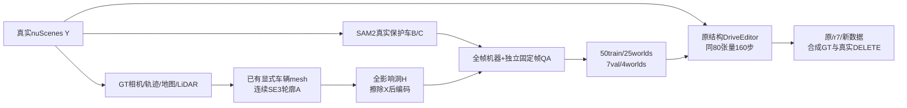

# Target + Protected Actors r8：数据覆盖控制

任务 `WS-V77-TARGET-PROTECTED-20260929/r8`。用户要求只改变数据，暂保持当前模块范围和首轮预算。模型效果尚待完整采样。

## 数据准入

68候选来自三维轮廓工厂；全部680帧实际磁盘X/Y/影响/H重载，验证影响完全遮盖、编码前X和Y遮洞条件相同、真实Y重新解码一致、ego禁入、metric位姿/尺度/yaw/轮廓连续和A前B后的深度合同。所有模板先在真实地面、地图可行驶/停车范围、GT包络间距至少0.3m与地面支撑2.5m内筛选，未知动态包络不允许被洞吞入；真实后方静态道路设施可作为恢复背景。

独立gpt-6-sol xhigh、不用fast，每例固定一帧实看：61pass、5uncertain、2reject。M053/M064落树带/人行道，视觉拒绝保留，不用地图/GT无碰撞或稀疏LiDAR零点抵消。另对所有候选检查3独立扫描的静态占据（每扫至少3个20cm voxels、距拟合地面0.15m以上，GT对象已移除）；未发现满足该保守门槛的正例，零证据不证明空或完整道路合法。

最终50train/25scene，最多3/scene；24背景、23单保护、3密集，密集训练仅scene-0240，未达到原14例密集提案。7val/4scene：3背景、2单保护、2密集。5待定和2拒绝不准入，另4合格备用未采入。所有最终案例技术pass且AI2，human null。固定帧QA不认证时序视觉；机器仅覆盖一秒10帧连续输入。

## 数据改变与边界

旧仿射供体入口在精确mask/物理门槛下不足20场景；有界来源扩展与粗/细metric位置采样后，改用两种已保留DEV显式网格投影轮廓，不调用新生成网络。真实Y从未改写，灰色完整X仅供轮廓/位置示意，其RGB全部被H遮掉，外观假不作为拒绝理由。train/val共用形状，不能声称未见资产泛化；所有真实来源是Boston白天官方train，原模型预训练场景重叠未知。

新增40窗口候选，37有序唯一曝光与几何通过，36完全提取合并，1窗口13成员缺失保留清单；公共RGB/LiDAR仍足够本轮，不补造缺帧。数据覆盖与3D silhouette工厂同时改变，不能把后续差异仅归于scene数量。

## 冻结对照

原DriveEditor、r7修复encoder的160步checkpoint、新数据版三臂；新训练从原权重和官方106目标encoder开始，80空间自attention/49,574,080参数，320×576，160步，AdamW lr1e-5、wd0.01、clip1、seed6201，原StandardDiffusionLoss，无保护加权。推理576×1024/10帧/seed42/25步，三臂同RGB/H/alpha与previous条件关闭；native和局部写回分开。

合成来源场景与所有r7/r8训练receiver/donor隔离，选窗和QA在新数据训练前冻结；真实A022/A041_w10/A013/A048/A007/A034/A042/A061_w08为曝光DEV，不计final。真实无去车GT，不报告恢复MAE；主要验收保住后车/邻车与正确去目标，不能用合成误差代替。旧r6三个真实原模型输出在RGB/H、窗口/seed/步数/previous条件逐项一致后复用原生图，重新以当前alpha写回，保留来源。

下一步训练后完成两套三臂采样、量化和人工HTML。若真实无稳定收益，保留原权重默认，不机械增加训练步数或模块。failure_ledger_refs: [V77-F02]；human_verdict: null。
