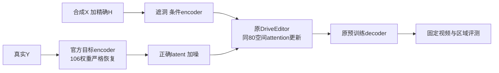

# v77 r7：r6无改善的根因排查与同配方修复

2026-10-01；`WS-V77-TARGET-PROTECTED-20260929/r7`。**首要确定问题是训练infra：推理checkpoint不含目标encoder，106个权重随机初始化后被冻结。不能用旧r6结果否定造数或更新模块。** 本轮恢复官方encoder并保持同数据、同80张量、同320×576/160步重跑。原权重仍默认，人工评分空。

## 确定的工程错误

查原始r6日志：`logs/train_pilot.log:47`为106 missing / 0 unexpected，全部`first_stage_model.encoder.*`；`evaluate_pilot.log:15`才0 missing。之前报告把推理加载错误引用为训练加载，现已纠正，并保留原值/视频/权重。官方sample.yaml以Identity代替目标encoder，训练train.yaml需要真实Encoder；同一个推理checkpoint不能直接假设完整训练初始化。不是Y标签被生成，真实Y仍正确；错误在Y→latent的监督编码空间。

只从[官方SVD checkpoint](https://huggingface.co/stabilityai/stable-video-diffusion-img2vid/blob/main/svd.safetensors)读取106个目标encoder张量，总136,654,368 bytes；不拿相似的条件encoder未经验证替代，也没有下载全SVD。恢复后严格加载0 missing /0 unexpected；缺encoder、缺其他网络权重、shape错均拒绝。旧r6训练入口新增缺encoder拒绝，新入口保留原架构/StandardDiffusionLoss/原decoder。独立CPU合同与旧准入共12测试通过。

独立codec闭环使用同一个真实Y（R014）、同一个decoder和posterior mode：原尺寸随机encoder控制保护车MAE0.23020，官方encoder0.01958，原图结构恢复。随机控制是重新初始化的同结构encoder，不声称字节恢复r6未保存的随机权重。此clean-Y是oracle诊断，不进入DELETE条件或造GT；mode只用于控制，训练沿用官方sample=True。

## 最小强控制与效果

修复臂`encoder_fixed_lowres`除目标encoder权重外与r6相同：同52 catalog /48train4val /68窗口、同160步、同seed6201、AdamW1e-5、weight_decay.01、clip1、同80个49,574,080参数，train320×576；160步实际case/window顺序逐项完全相同。没有增加模块/输入、重造数据或改loss。训练峰值10.48GiB。

原尺寸空间臂在发现错误后第3步停止留证，扩大条件/时空模块臂取消；不将这3步或未执行臂当科学对照。原始计划及发现错误后的修订全部保存。原尺寸修复训练尚未执行。

四例合成留出共享scene-0245，另两例来自train作容量诊断。所有窗口10帧、seed42、25采样步、同洞/写回；4例原/r6的8窗在逐帧核对X/Y/H相同后明确复用，其余实际新采样10窗。原生整帧输出保留，指标只测H内B，不把H外原像素粘回计为恢复收益。

| 留出4例平均 | 原模型 | 错误r6 | 只修encoder |
|---|---:|---:|---:|
| H内保护车MAE | 0.083564 | 0.113375 | 0.071305 |
| 洞整体MAE | 0.046301 | 0.052824 | 0.031755 |

修复相对原模型保护车MAE -14.67%，相对错误r6 -37.11%；0/4例仍差于原模型。正确空间下验证loss 0.072323→0.064990，旧0.544→0.165不可同口径比较。损失及数值改善不自动认证视觉/身份或时序；见逐窗原生和写回对照。单场景不是泛化验证，final未用。

## 数据和模块仍有哪些问题

52例技术输入全帧重新核对合成影响在洞内，masked-X=masked-Y，无合成RGB泄漏；完整X不作为条件，真实Y作恢复监督。没有发现能够解释r6模糊的X泄漏/错GT。技术AI2只证明五项入口合同，不证明统计覆盖足够。

48训练例中29背景、19单保护车、0密集；33例来自scene-0228，仅16个receiver来源窗口。按r6实际160步采样，洞平均占画面3.238%，需要恢复的B占0.188%。官方blank的mask_fuse全0，reweight5经过空间均值归一化仍均匀1；并不专门强调删除洞或B。像素占比是监督稀疏代理，VAE局部混合后不等于准确latent梯度比例。覆盖偏窄和loss任务错配是下一步可检验的候选，不认定为这次单一根因。

r6更新49.57M只占官方主分支可训练1.81B约2.74%，条件交叉attention、时序attention、输入/输出层等冻结。范围偏窄可能限制适配，但本轮没有扩大模块的科学对照，因此不能说“模块选错”。DELETE valid_mask全0时SV3D实际跳过；微调SV3D并非当前补景的直接入口。优先用修复后的有效基线定位残留，再在同数据/同目标下只改变一个候选变量，不继续用错误r6解释网络或数据。

## 交付与边界

本地`outputs/v77-target-protected-r7/index.html`提供GT、条件、原模型、错误r6、encoder修复五列视频，指定第5帧放大、原生链接、人工空分和CSV；另提供codec真实Y/随机/官方encoder三视频。60视频/600帧完整解码、静态链接与同训练顺序核验通过；浏览器播放未实际检查。所有旧失败和权重保留，无自动化、无电源操作、无Ω/GLB。

run `/root/autodl-tmp/runs/worldsim_v77/WS-V77-TARGET-PROTECTED-20260929/r7`；补丁`encoder_fixed_lowres/training/attention_step_0160.safetensors`。failure_ledger_refs: [V77-F02]；failure_ledger_delta: updated V77-F02（训练/推理checkpoint错配、错误latent监督与原报告纠正）。
