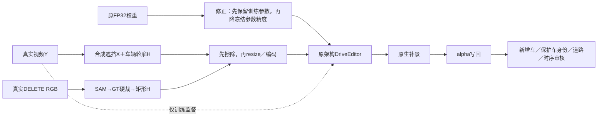

# v77 工程与合成数据诊断

2026-10-02。WS-V77-TARGET-PROTECTED-20260929/r19（CPU合同）＋r20（两例四窗零训练精度控制），failure_ledger_refs [V77-F02]。

**已确认工程问题与数据问题同时存在；现有证据不足以判定“微调模块选错”是主因。** 用户最新要求先排查，因此已停止持续训练迭代，r18在160步完成、0新评价窗时中止后续推理，保留权重。收到本次人工review后没有新增训练；仅运行了事前登记的四个零步诊断窗口。

## 1. 真实DELETE入口存在可见的目标覆盖问题

当前冻结mask代码先取 `core = largest(SAM & GT_hull_pad3)`，膨胀后的write mask再与GT投影相交，随后用其外包矩形作为模型H。GT投影在这里成了硬裁边界。A022的f0有1314个原SAM像素落在H外，接触图中可见目标车头边缘仍在条件图里。十帧累计1501个原SAM像素在H外，2693个像素的写回alpha不为1。原车边缘可能既进入条件，也在写回时保留。

这不是把所有SAM输出都当真值：A042等例的未覆盖像素可能含误分；必须看具体实例。A041_w10十帧原SAM全被H覆盖、写回alpha均为1，仍然被用户判失败，因此漏mask不能解释所有失败。

应先核准目标实例mask，再检查H完整覆盖、目标像素alpha=1及保护对象冲突。GT作为提示和一致性证据，避免直接截断可见车身。本次没有改写旧70例冻结mask或偷偷重新生成结果。

## 2. 初始化混入了非训练造成的参数变化，已修代码

旧训练入口先对全模型 `.to(bfloat16)`，再将可训练参数 `.float()`。原FP32精度在第一步已经丢失。r7与r14的80个训练张量全部受影响。r7舍入差的L2范数0.855，实际训练相对舍入初值的差为0.969；r14分别0.398与0.941。范数不能换算成画面损伤百分比。

已将两个有效训练入口改成：先保存选中参数的原FP32值，再转换冻结权重，最后恢复FP32训练参数。两组真实80张量逐值验证通过，冻结参数BF16、可训练参数FP32且梯度可用。旧权重与旧代码备份保留，尚未使用修复入口重训。

r20固定P019和A061，分别只对r7范围与r14范围的80张量执行FP32→BF16→FP32，优化0步，其余输入/seed42/25采样步完全不变，共4新窗口。P019的0–9帧接触图中，两种round-only仍接近原模型的块状残留，没有复现实际r7/r14新增的深色车。因此这个工程偏差需要修，但它本身不足以解释该幻觉。A061的固定f5也未显示round-only复现训练版的全部道路/边缘改动；不以这个单帧替代用户视频排序。

## 3. 存在重复训练任务和重复验证任务

按真实Y、完整H和实际遮后条件比较，50个train只有46个不同任务；11个合成验证只有10个。四个训练重复对是M018/M036、M041/M056、M042/M057、M013/M031。M006/M009为验证重复，X/Y/H与五臂原生输出的十帧全部完全相同。

这会改变训练采样权重，也夸大独立case分母。已保留原统计并另存去重统计。旧七个合成验证变为六个；本次按scene等权MAE恰好未改变，但按case均值及胜例数改变。没有跨train/val的相同任务。

## 4. 当前训练任务与真实删除入口未对齐

| 实际输入 | 合成训练50例／500帧 | 真实开发8例／80帧 |
|---|---:|---:|
| H平均画面占比 | 1.82% | 5.60% |
| H形状 | 车辆轮廓，外包框填充率0.814 | 矩形，填充率1.000 |
| 触及画面边缘 | 0/500 | 39/80 |
| 模型分辨率 | 320×576训练 | 576×1024推理 |

训练中最大洞仅5.08%；A022平均21.57%，范围7.55%–28.21%。A061平均9.15%也超过训练范围，却获人眼局部收益，所以大小差是覆盖缺口，不能单独作为失败判据。真实保护区域来自邻车GT投影包络，合成B标签主要是实例SAM，两种面积不能直接当同口径车身像素占比比较。

目前50个训练case实际只有4个扫过例、来自3个world；验证仅1个扫过例、1个world。世界静止A＋运动ego已有11例。所有这些训练窗实际只有0.85–0.90秒。准入检查了连续性和每帧保留一部分B，却未保证“当前被遮的车身部分在其它输入帧真实出现”。GT视频Y里看得到，不能推出遮后的条件里也看得到。

GT cuboid表面格的近似对应统计提示，P006其它帧支持均值约60.5%；P019仅15.8%；P012两个B约47.0%与11.4%。这只是几何代理，不是真实纹理可见性证明。应把有证据恢复、证据不足生成、未知证据分开；不能只用连续/无漏mask的AI2代替任务覆盖。

实际160步按样本计，被遮保护车像素平均仅占画面0.344%。旧blank损失全图均匀，保护区域监督稀疏。它是值得检查的训练目标问题，尚未证明是唯一瓶颈。r17另有“训练调用未传B标签”错误，已在87步隔离；旧uniform训练仍通过Y监督B，不因此作废。r18修正该路由后100/160步启用B项，但用户要求中止评价，不能宣称新损失有效。

## 5. 已排除哪些明显工程错误

当前61个合成case的610帧全部重新解码：Y精确等于原始真实RGB；X的变化全部在H内；先遮再resize后masked-X与masked-Y完全一致。当前首帧CLIP图像、latent H、空物体参考、depth、valid mask等八项字段在同尺寸下与实际DELETE入口一致。没有证据表明完整synthetic-X或其材质/光照伪影泄漏进条件。

r7/r14的80个权重都实际更新且有限，patch路径及键集合匹配；106个目标encoder权重严格恢复、0缺失/0额外。更新并非没有执行。nearest latent mask边界存在单点采样遗漏（训练触洞格中7850/34002），但这是官方nearest语义，不能直接等同合成RGB泄漏或擅自改成maxpool。

另外，r7与r14的数据并不相同，二者人眼排序不能单独归因更新模块；同数据的r10与r14才是模块范围控制。文档中“epsilon MSE”的旧用词应纠正为官方sigma加权的去噪latent MSE，源码监督的是clean Y latent，公式未因此变化。

## 人工review如何改变判断

人工原文14条完整保存在human_review.json：真实A061明确r7>r14>原模型，五例没明显区别，A022/A041全失败。这是局部真实收益，不能再笼统说完全无收益。P006说明某些遮挡过程可改善；P019说明路面误差下降与新增车幻觉可以同时发生；P012两辆车融合仍失败。MAE必须与新增车、保护身份损坏分开报告。

M009原文写“有效r9”，原样保存。实际r14页面的权重只有base/r7/r8/r10/r14，r9是造数阶段，没有独立微调checkpoint，因此没有擅自把该词改成r8或据此制造r9成绩。

## 下一步的最短顺序

先修真实目标覆盖和alpha写回、加入目录去重准入；再使合成训练覆盖实际模型H的形状、大小、截边及遮挡—显露过程，并明确跨帧证据。之后保持更新模块范围，使用固定对照判断收益。先不扩大网络范围，也不继续堆同配方步数。

本轮停在诊断交付。r18仍保留但未纳入效果排名；r20仅零步工程控制。人工0/1/2未代填，未曝光final未用。真实跨例DELETE＋补景收益条件仍未达到，因此未执行关机。
