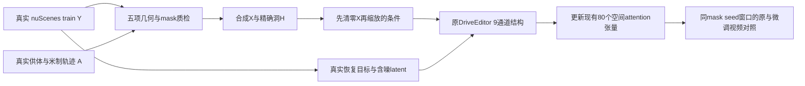

# Target + Protected Actors r6：技术准入、原结构微调与固定效果对照

2026-10-01；`WS-V77-TARGET-PROTECTED-20260929/r6`。完成有界160步微调；**此配方未获稳定DELETE收益，原DriveEditor仍为默认**。数据AI技术2分和模型效果评分分开，人工verdict全部null。

## 数据与身份准入

SAM2新分割4个保护实例，独立gpt-6-sol xhigh非fast检查通过；实际像素遮挡门槛只允许C012，其余C010/C014/C018因`single_visibility_ratio`退出。C010实际遮挡9–12%，证明GT包络预案不能当实例像素准入。阈值、位姿和来源未因结果改动。C012实际10帧合成通过工程验证及独立抽帧2分。

按照用户2026-10-01最新授权，以技术AI2分准入：r2先前五项重评27例+r3先前24例+本轮C012一例，共**52case / 10个receiver scene**，并非52场景或全部新造。29纯背景、23单保护车，密集多车仍0。拒绝、待定、D006/D009空间硬失败与原分数保留。720帧重新解码，X-Y影响都在H内、masked-X=masked-Y。独立视觉仍是抽帧，工程是全帧，不宣称人工全检。

receiver与donor scene入图，整连通分量分割48train / 4validation，双来源scene均无跨集合重叠。4个留出case共享一个receiver scene，属于有限开发验证。过去70例val只作已曝光真实DELETE开发对照，final未用。

## 实际训练合同与资源

完整synthetic-X不送条件；先在原尺寸清零H，再缩放清零后的浮点条件。Y只作为扩散恢复目标及标准含噪target latent，不作为干净条件。实际合同及4个新回归测试验证：改洞内X不改任何batch字段，改洞内Y只改jpg目标，可见上下文进入条件，洞外合成影响被拒绝。protected标签仅作准入/评价，不增加输入通道。

原官方完整已训练`model.safetensors`初始化，CLIP也由此恢复，0 missing / 0 unexpected；沿用原StandardDiffusionLoss。AdamW 1e-5、weight_decay .01、梯度clip1、seed6201，batch1、10帧、68训练窗口、160步。仅更新主分支空间self-attention Q/K/V/out的80张量、49,574,080参数，其余权重冻结；不是官方8卡全参数训练或LoRA。冻结权重bf16、训练参数fp32，nonreentrant checkpoint只改计算重算API，架构/公式不变。

训练320×576，推理576×1024；这个差异明确保留，尚未做原分辨率控制，不能称为已证实失败原因。真实反向80张量有有限非零梯度，训练峰值10.48GiB，训练与验证阶段约534秒（不含提取/初始化），生成峰值约21.86GiB。权重合并4077键保持一致，只有80张量更新，完整权重约12.06GB；原权重不改写。

CLIP train配置试图联网初始化的失败已保留，随后用和本地sample一致的version=null及完整checkpoint恢复解决。CPU编码使用已有imageio-ffmpeg；这些是工程错误，不是模型科学否定。

## 效果与分母

固定留出4case×2个噪声draw：latent去噪loss **0.543791 → 0.165422（-69.58%）**。然而洞内真实保护车平均MAE **0.08356 → 0.11338（+35.67%）**，4/4例变差；洞整体MAE3/4变差。每帧等权平均，不把洞外原像素直接写回算恢复收益。

四个合成例独立第5帧粗评原模型1分、微调0分：硬边有所软化，但真实后车主体更模糊。A022车形减少却变大片模糊；A013/A048真实后车仍受损。没有真实clean GT，不能用“出现车”本身判幻觉，抽帧也不认证时序。

A041首窗0–9帧的洞全为空。原助手该帧2分只说明原图未变，**不计DELETE成功**。入口检查后，仅按输入mask最早连续10帧非空规则选择10–19帧，原与微调同条件补跑；旧空窗和旧评分保留并注明N/A。8个有效任务对照+1个保留空窗，18次实际单窗采样（含2次空窗）；这次修正不是根据模型效果挑窗口。

全部对照采用seed42、25采样步、10Hz单秒窗口、同mask/alpha写回，原生整帧输出另留链接。没有训练集逐例参数或多套生成器。单场景留出变差不否定整个数据路线，但足以停止推广本轮权重。

## 工程与交付

8项训练合同/准入回归通过；完成状态拒绝重复训练、评测按已完成窗口恢复。训练增加未来optimizer/RNG快照入口；r6实际训练早于该后续infra补充，没有旧optimizer快照，不能声称已验证本轮中断恢复。完整权重及attention补丁都保留。静态链接与215段H264完整解码、2750帧通过；浏览器播放未检查，不绕过既有file URL工具限制。

本地`outputs/v77-target-protected-r6/index.html`：真实/GT、条件洞、原权重、微调四列，真实目标带冻结实例core包络黄框，人工分数留空，可导出CSV。`data_review.html`提供52例真实Y/遮洞条件/synthetic-X视频和准入依据。组件图、负结果、原生输出和空窗都保留。

远端root：`/root/autodl-tmp/runs/worldsim_v77/WS-V77-TARGET-PROTECTED-20260929/r6`。完整微调权重：`training/model_step_0160.safetensors`；补丁：`training/attention_step_0160.safetensors`。本轮无电源操作授权，没有关机或定时任务。

下一轮先以同数据/同更新范围做训练与推理分辨率一致的有界控制，排除工程变量后再决定保护区域监督；密集多车与新场景覆盖仍需造数。当前未执行该控制，不靠重复同配方步数或低loss宣布有效。failure_ledger_refs: [V77-F02]；failure_ledger_delta: updated V77-F02。
