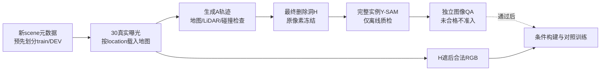

# r37–r41：新来源与完整实例标签的有界检查

task `WS-V77-TARGET-PROTECTED-20260929`，wm-3090-1001，v77。旧Q060合法条件QA2保留；本轮没有新增DriveEditor训练或真实DELETE效果结论。

## 来源和工程修复

旧池主要受03/07两个分片限制。本轮事前固定新02/04分片18个scene，按真实B的清晰尺寸、至少16m深度和投影变化筛选，剔除旧83scene/旧r7训练scene；全部为nuScenes官方train，按seed3701划分收集train/DEV。不是最终测试，也不按生成效果挑场景。

逐目标最近曝光可能重复使用同一张图；新入口改为已有有序一对一曝光匹配，维持55ms误差/180ms间隔限制。旧14条已可用窗口像素和时间戳不变，恢复F013；另2条无合法30曝光，F003未过完整几何。最终15scene、450实际解码帧、1028文件含105份LiDAR。提取约169MB，没有整包解压或重新下载数据。

实际来源含Boston、Singapore-onenorth及Hollandvillage。修掉默认Boston地图假设：按source location选择已有v1.3地图，混合城市禁止旧`.road`隐式调用。Holland官方文件有两条道路`[null]`多边形引用，明确记账并不给道路支持；其他悬空引用报错。Boston道路/停车区合并几何与旧版差面积0。空LiDAR返回直接拒绝，不制造地面平面。回归见[r37工程检查](../autoresearch/worldsim_v77/target_protected_20260929/r37/infra_validation.json)。

初始17条真实Y-SAM轨迹15条技术连续性通过。完整Y仅作离线标签与监督，不进入条件；技术mask合格仍不表示新遮挡任务可用。

## r38：空间规则不是图像空间正确性的充分条件

固定旧24位置×0/3/6m/s规则，只换新来源并保留r32主B/邻车角色修复。得到21条空间轨迹、6scene，最终洞H触及39个不同实例标签（6复用、33新增SAM）；逐个检查空标签、两ID同mask、非车辆或不完整位姿及其他帧显露证据。

技术结果：`{"nonvehicle_or_incomplete_protection": 7, "instance_identity_or_visibility_uncertain": 7, "insufficient_actual_occlusion": 1, "static_foreground": 1, "ordinary_background": 3, "actual_size": 2}`。3条普通背景技术候选全部同scene，按事前每scene每family一例选S016。独立QA给0：图像看起来A位于安全岛/草地区域并重叠信号杆，未准入；S017/18没有独立QA，也不放行。

追加空间诊断保留矛盾：S016脚印约96.7%在地图lane内、100%在一条connector内，地图walkway交叠0；真实车框投影与RGB基本对齐。不能据此覆盖图像中的落点疑点，也不能草率断言全局相机错误。地图/稀疏点云通过不等于完整道路语义正确。原图、A脚印投影和独立意见全部保留。

审核页本地`outputs/v77-target-protected-r38/index.html`，三列是真实Y、A与H位置、实际带洞X。灰色是输入，不是补景失败，也不是新模型输出。独立AI分与空白human verdict分开。

## r39：唯一过去位姿对照，停止该无效尝试

不追加地图位置/速度网格，只用当前主B在2秒前真实标注过的位姿提出A：一条世界静止、一条按过去轨迹回放。历史GT仅用于被删A的合成位置，不读取历史RGB，不作为保护车状态证据；无外推/补位姿，Z仍来自当前真实地面。

15来源中5缺前置地面或主分割，10来源共20次位姿检查，仅F006两条空间可行。复用3条完全同源Y评价标签，无新GPU分割。两条分别因不完整保护几何、其他帧证据不足被拒绝：`{"nonvehicle_or_incomplete_protection": 1, "insufficient_other_frame_evidence": 1}`。本次唯一2秒对照关闭，不继续搜索时间差。

## r40：提示帧与标签实际溯源

r38中多例不同GT实例的SAM结果大幅重叠。固定r38+r39共23条保存像素/轨迹/H/质量门，仅将提示帧改为GT框光线first-return可见像素最多的帧（256×144排名，0.05m容差；其次可见比例、中点距离、帧序），仍只box prompt，不加点、不调阈值、不后处理mask。几何可见性是选帧代理，不能代替视觉身份判断。

对照前发现6条复用Y-SAM的元数据写的是“新队列计划提示帧”，实际标签却来自旧源f15，而且旧源JPEG质量96，新评价队列质量98。修复复用标签的实际frame/box/输入路径/权重记录，并使新对照读取同一批JPEG字节；未改动旧mask，未把元数据修复计为模型改善。错误计划与第一次队列备份在r40/before_provenance_fix。

原分母：{"nonvehicle_or_incomplete_protection": 8, "instance_identity_or_visibility_uncertain": 7, "insufficient_actual_occlusion": 1, "static_foreground": 1, "ordinary_background": 3, "actual_size": 2, "insufficient_other_frame_evidence": 1}；新分母：{"nonvehicle_or_incomplete_protection": 8, "instance_identity_or_visibility_uncertain": 6, "insufficient_actual_occlusion": 1, "insufficient_other_frame_evidence": 2, "static_foreground": 1, "ordinary_background": 3, "actual_size": 2}。身份疑点7→6，但该例仍缺显露依据；无新增技术候选或训练准入，关闭提示帧对照，不推广为全局策略。

旧mask的逐像素溯源检查覆盖6条轨迹180帧，均与原r37标签一致；仅修正元数据，证据见r40/reuse_provenance_validation.json。

## r41：先按过程找来源

在旧440候选池中排除旧scene后203个actor窗口，固定静止B、清楚尺寸、至少16m深度等要求筛至9条，7条有合法30曝光，2条抽样失败。7条相机三秒累计行程仅0.002–0.375m，均不满足预定1–8m运动要求，最终0来源。没有提新RGB、运行SAM或降低阈值；这是既有候选池的缺口，不能推断整个nuScenes不存在该过程。

## 当前边界

新数据准入仍0，约50条完整配方未形成。正式A/B/C新增训练0步，身份分支/完整surfel未启动，既有真实DELETE对照保持。用户已允许清可恢复旧物，但盘余约44–45GB，未删除原始数据、权重、失败对照或其他文件。真实DELETE两侧跨scene收益仍未证明，未执行关机。
